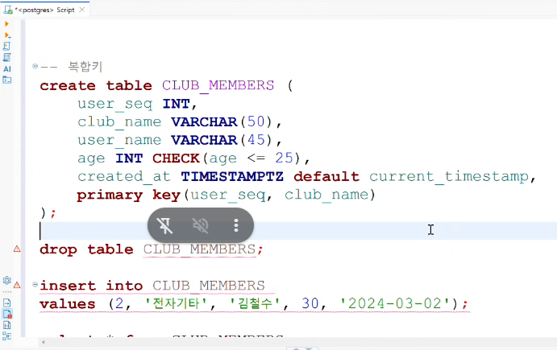

# SQL & DATABASE

> 📅 DATE: 2026-09-02 Mittwoch

## 📑 목차

## Review
1. 데이터 무결성 3가지
    - 도메인 무결성
    - 개체 무결성
    - 참조 무결성

2. (어제 스터디 중) 여러 다른 툴로도 데이터를 합치고 수정하고 사용할 수 있는데, 왜 별도의 언어를 사용하면서 다른 툴을 사용하는걸까?
- SQL의 목적, DB의 목적


## LECTURE NOTE
### 개요
1. DDL (DATA DEFINITION LANGUAGE) 데이터 정의어
- CREATE
- ALTER
- DROP
- TRUNCATE : 테이블의 구조는 유지하고 초기화

2. DML (DATA MANIPULATION LANGUAGE) 데이터 조작어 ✔️
- INSERT 추가
- UPDATE 수정
- DELETE 삭제
- SELECT 조회 ("DQL - 질의어"라고 별도로 부르기도 함)

3. DCL (DATA CONTROL LANGUAGE) 데이터 제어어
- 권한 관련
    - GRANT 권한 부여
    - REVOKE 권한 취소

- 트랜젝션 (TCL - 트랜젝션 제어어)
    - COMMIT : 데이터를 DB에 영구 반영
    - ROLLBACK : COMMIT 전 반영 내용을 되돌리기

### DDL - 데이터 정의어
1. CREATE
- 테이블 생성 (예)
```
CREATE TABLE 테이블명(
    컬럼명1 데이터타입 [제약조건 제약조건...],
    컬럼명2 데이터타입 [제약조건],
    ...
);
``` 
[제약조건] => 선택
- 기본키 제약조건 [PRIMARY KEY]
    - 중복 허용 X
    - NULL 허용 X

    > 여러 컬럼의 조합으로 기본키를 만드는 경우: 복합키; 맨 마지막 줄에 다음과 같이  추가하기 `PRIMARY KEY (컬럼명1, 컬럼명2, ...)`

- [NOT NULL]
    - 빈 값 X
    - 필수항목(컬럼)
- [UNIQUE] 
    - 중복 허용 X
    - NULL은 중복 가능!
        - NULL도 허용하지 않는경우/.....?

- 체크 제약조건 [CHECK]
    - 특정 조건에 해당하는지 체크하는거
    = 비교 논리 연산자 등등 사용 가능 "AND, OR,NOT"

- DEFAULT 기본값 - 직접 정하기
기본값 (직접 지정, 내각 함수호출. 내장함수)
예: 현재 날짜 시간



2. DROP
- 대상 예: 테이블, 인덱스
```
DROP TABLE 테이블명
```

* SQL에서 주석은 -- (빼기 기호 두번)

### DML - 데이터 조작어
1. INSERT
```
INSERT INTO 테이블명 (컬럼명 ...,...) VALUES(값,...);
```
> 데이터 타입 정할때, **자동증감** 설정하기
1. 표준 방법: INT GENERATED ALWAYS AS IDENTITY
2. POSTGRESQL 방식 : 
    - SERIAL (4byte)
    - BIGSERIAL (8byte)

---
### KEY
1. PRIMARY KEY (PK)
`개체 무결성 제약 조건 적용`
2. FOREIGN KEY (FK) - 외래키
`참조 무결성 제약 조건 적용`

> 참고: 도메인 무결성 제약조건은 자료형에 대한 제약!

```
CREATE TABLE 테이블명 (
    컬럼명 자료형 [제약조건] REFERENCES 테이블명(컬럼명), 
    ...
)
```
- 부모쪽 테이블에 없는 참조값을 자식테이블이 사용x
- 부모쪽 레코드에 자식 레코드가 있으면 부모 레코드를 삭제x

    - ON DELETE CASCADE : 부모레코드가 삭제 -> 자식레코드도 함께 삭제

    - ON DELETE SET NULL : 부모레코드가 삭제 -> 자식레코드의 참조 컬럼이 값을 NULL로 교체

| 옵션                   | 부모 삭제          | 자식 레코드    | FK 값      |
| -------------------- | -------------- | --------- | --------- |
| 기본 설정                | ❌ 참조 중이면 삭제 거부 | 유지        | 유지        |
| `ON DELETE CASCADE`  | ✅              | **같이 삭제** | 레코드 자체 삭제 |
| `ON DELETE SET NULL` | ✅              | **유지**    | `NULL`    |


&rarr; 이러한 제약 조건은 DB를 무결하게 유지관리 하기 위해서이다.

> 참고: 외래키가 있는 곳이 자식 테이블

### 데이터 베이스 정규화
- 데이터 중복과 이상현상을 개선하기 위해서 테이블의 구조를 단계적으로 개선하는 과정: NORMALIZATION

- 핵심 목적: 데이터 중복(Redundancy)을 줄이고, 삽입·수정·삭제할 때 생기는 이상 현상(Anomaly)을 방지하는 것

```
DB가 어느 게 맞는지 알 수 없게 돼.

이런 문제를 이상 현상(Anomaly)이라고 해.

대표적으로:

삽입 이상(Insertion Anomaly): 필요한 정보를 원하는 방식으로 추가하기 어려움
갱신 이상(Update Anomaly): 중복된 값 중 일부만 수정되어 데이터가 불일치
삭제 이상(Deletion Anomaly): 하나를 삭제했는데 필요한 다른 정보까지 사라짐

그래서 표를 역할별로 나누는 거야.

```
```
학생 테이블
학생번호 | 이름 | 전화번호

동아리 테이블
동아리번호 | 동아리명 | 장소

가입 테이블
학생번호 | 동아리번호
```

1. 제 1 정규형 (First Normal Form; 1NF) - Atomic Value(원자값) 유지
    - 한 Column의 한 칸에는 하나의 값만 들어가도록 만든다고 생각하면 돼.

2. 제 2 정규형 (2NF) - 
    - Partial Dependency(부분 함수 종속)을 제거해.
    - 복합키(Composite Key)가 있을 때 중요해.
    - 2NF = 키의 일부에만 기대는 컬럼을 떼어내자!

> 예를 들어서 내가 기업데이터를 받았는데 산업을 구분하는 키로 어떤걸 쓸지 몰라서 SIC, GCIS, SIC industry name, GCIS industry name 등 너무 많이 받은거야. 이 경우에는 물론 테이블을  분리할 필요 없이 필요한 키만 남기고 삭제하면 되는거지만, 이런 경우를 말하는건가 ?

3. 제 3 정규형 (3NF) - 
- Transitive Dependency(이행 함수 종속)를 제거해.

> 참고: BCNF → 결정자는 후보키
       Determinant → Candidate Key

- 정규화의 문제: 테이블이 너무 많이 분리되면 의존성이 높아지고, MSA?에서는 ,,,안하는게 일반적...?
- 정규화가 꼭 정답은 아니다,.,!


### 교안에 대한 보충 설명 (참고)
#### 1. postgreSQL docker container 내부 명령 프롬프트
> docker exec -it postgres bash
*bash : 리눅스의 명령프롬프트 (Bash Shell)

#### 2. postgreSQL 터미널 접근
> psql -U postgres

*postgres -> 계정

#### 3. 테이블 명세 확인 
\d 테이블명;