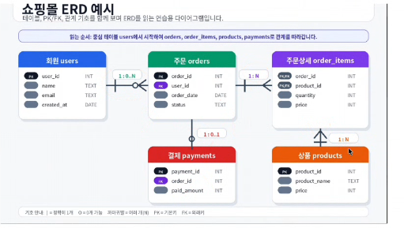
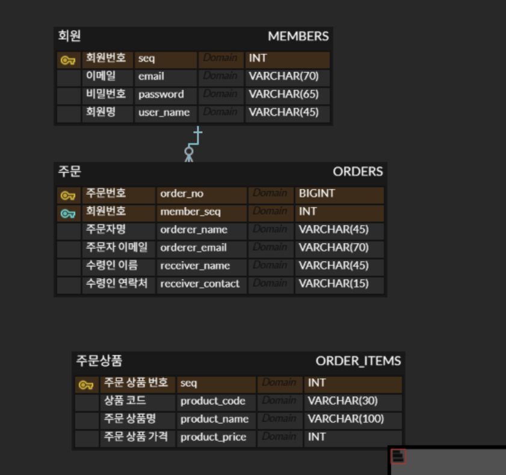

# Database & SQL - DDL, DML과 테이블 관계

> 📅 DATE: 2026-09-04 Freitag

<a id="top"></a>

## 😊 SUMMARY

이번 수업에서는 PostgreSQL에서 `CREATE`, `ALTER`, `DROP`, `TRUNCATE`를 이용해 **테이블 구조를 직접 변경**하고, PK·FK·제약조건을 설정하며 테이블 간 **1:N, N:M 관계**를 구성했다. ERD 실습에서는 데이터 변경 시 서로 영향을 주어야 하는 정보와 과거 상태를 별도로 보존해야 하는 정보를 구분했고, 마지막으로 `INSERT`, `UPDATE`, `DELETE`를 이용한 데이터 조작과 SQL Injection의 위험까지 학습했다.

**Keywords:** `DDL`, `DML`, `ALTER TABLE`, `Constraint`, `Primary Key`, `Foreign Key`, `1:N`, `N:M`, `Junction Table`, `Normalization`, `SQL Injection`

---

## 🔄 REVIEW

이전 TIL과 겹치는 내용은 핵심만 정리한다.

- **무결성**
  - 개체 무결성 → `Primary Key`
  - 도메인 무결성 → 자료형·범위·조건
  - 참조 무결성 → `Foreign Key`

- **정규화**
  - `1NF` → 하나의 컬럼에 하나의 값
  - `2NF` → 복합키의 일부에만 종속되는 컬럼 제거
  - `3NF` → 일반 컬럼 간 이행적 종속 제거
  - 항상 정규화가 최선은 아니며 필요에 따라 반정규화 고려

- **SQL 분류**
  - `DDL` → 구조 정의
  - `DML` → 데이터 조작
  - `DCL` → 권한 제어
  - `TCL` → `COMMIT`, `ROLLBACK`

---

## 📚 LECTURE NOTE

### 1. PostgreSQL 기본 규칙

```text
'작은 따옴표' → 문자열 리터럴
"큰 따옴표"   → 테이블명·컬럼명 등의 식별자
```

큰 따옴표는 주로 다음과 같은 경우 사용한다.

- 특수 문자가 포함된 경우
- 대소문자를 구분해서 사용하는 경우
- 예약어를 식별자로 사용하는 경우

---

### 2. 데이터베이스 실습 환경

> 우선 Docker → Container → 사용할 PostgreSQL Server 실행  
> DBeaver & ERD Cloud 열기

```text
Docker
  ↓
PostgreSQL Container
  ↓
PostgreSQL Server
  ↓
DBeaver
  ↓
ERD Cloud
```

---

### 3. DDL - 데이터 구조 정의

DDL은 테이블 등 **데이터베이스 객체의 구조를 생성·수정·삭제**하는 명령어다.

> ⚠️ PostgreSQL에서는 대부분의 DDL도 Transaction 안에서 실행한 경우 `ROLLBACK`이 가능하다.

#### 3-1. CREATE - 생성

대상: `TABLE`, `INDEX`, `TYPE` 등

```sql
CREATE TABLE 테이블명 (...);
```

#### 3-2. DROP - 삭제

```sql
DROP TABLE 테이블명;
```

```text
DROP → 구조 + 데이터 삭제
```

#### 3-3. TRUNCATE - 비우기

```sql
TRUNCATE TABLE 테이블명;
```

테이블 구조는 유지하고 내부 데이터를 비운다.

#### 3-4. ALTER - 구조 수정

**컬럼 추가**

```sql
ALTER TABLE 테이블명
ADD COLUMN 컬럼명 자료형 [제약조건];
```

**컬럼 이름 변경**

```sql
ALTER TABLE 테이블명
RENAME COLUMN 기존컬럼명 TO 변경컬럼명;
```

**컬럼 삭제**

```sql
ALTER TABLE 테이블명
DROP COLUMN 컬럼명;
```

**데이터 타입 변경**

```sql
ALTER TABLE 테이블명
ALTER COLUMN 컬럼명 TYPE 자료형;
```

기존 데이터를 변환해야 하는 경우:

```sql
ALTER TABLE 테이블명
ALTER COLUMN 컬럼명 TYPE INT
USING 컬럼명::INT;
```

**제약조건 / 기본값 설정**

```sql
ALTER TABLE 테이블명
ALTER COLUMN 컬럼명 SET NOT NULL;

ALTER TABLE 테이블명
ALTER COLUMN 컬럼명 SET DEFAULT 값;
```

---

### 4. ALTER TABLE - 제약조건

**PRIMARY KEY**

```sql
ALTER TABLE 테이블명
ADD CONSTRAINT 제약조건명
PRIMARY KEY (컬럼명);
```

**UNIQUE**

```sql
ALTER TABLE 테이블명
ADD CONSTRAINT 제약조건명
UNIQUE (컬럼명);
```

**CHECK**

```sql
ALTER TABLE 테이블명
ADD CONSTRAINT 제약조건명
CHECK (조건식);
```

**FOREIGN KEY**

```sql
ALTER TABLE 테이블명
ADD CONSTRAINT 제약조건명
FOREIGN KEY (현재테이블컬럼)
REFERENCES 참조테이블(참조컬럼);
```

필요한 경우 삭제 동작을 추가한다.

```sql
ON DELETE CASCADE
ON DELETE SET NULL
```

- `CASCADE` → 부모 삭제 시 관련 자식 데이터도 삭제
- `SET NULL` → 부모 삭제 시 자식 FK 값을 `NULL`로 변경
- `ON DELETE`는 필수가 아닌 옵션

**Constraint 삭제**

```sql
ALTER TABLE 테이블명
DROP CONSTRAINT 제약조건명;
```

[⬆️ 처음으로](#top)

---

### 5. 실습 코드 - DBeaver

#### MEMBERS

```sql
CREATE TABLE MEMBERS (
    seq SERIAL PRIMARY KEY,
    user_id VARCHAR(50) NOT NULL UNIQUE,
    password VARCHAR(65) NOT NULL,
    cellphone VARCHAR(15),
    age VARCHAR(2),
    created_at TIMESTAMPTZ
);

ALTER TABLE MEMBERS ADD COLUMN user_name VARCHAR(45) NOT NULL;

ALTER TABLE MEMBERS ADD COLUMN mobile VARCHAR(15);

ALTER TABLE MEMBERS RENAME COLUMN mobile TO cellphone;

-- age VARCHAR -> INT
ALTER TABLE MEMBERS
ALTER COLUMN age TYPE INT USING(age::INT);

-- cellphone + NOT NULL
ALTER TABLE MEMBERS
ALTER COLUMN cellphone SET NOT NULL;

-- created_at + 기본값 CURRENT_TIMESTAMP
ALTER TABLE MEMBERS
ALTER COLUMN created_at SET DEFAULT CURRENT_TIMESTAMP;
```

#### CLUB_MEMBERS

```sql
CREATE TABLE CLUB_MEMBERS (
    seq SERIAL,
    club_name VARCHAR(40)
);

-- seq 기본키 설정
ALTER TABLE CLUB_MEMBERS
ADD CONSTRAINT pk_club_members PRIMARY KEY(seq);

-- user_seq 필드 추가, 외래키 부여
ALTER TABLE CLUB_MEMBERS ADD COLUMN user_seq INT;

ALTER TABLE CLUB_MEMBERS
ADD CONSTRAINT fk_club_members
FOREIGN KEY (user_seq) REFERENCES MEMBERS(seq);
```

관계는 다음과 같다.

```text
MEMBERS
  PK seq
    │
    │ 1
    │
    │ N
    ▼
CLUB_MEMBERS
  FK user_seq
```

---

### 6. 실습 화면 - ERD Cloud

정규화하기 전에 **데이터가 변경되었을 때 서로 영향을 미쳐도 되는지 아닌지**를 고려해서 설계한다.



> **주문상세와 상품의 관계**
>
> 상품의 현재 정보가 변경되더라도 과거 주문 당시의 정보까지 함께 변경되면 안 되는 경우가 있다. 따라서 주문상세에는 주문 당시의 가격·수량·상품명 등 필요한 정보를 별도로 저장할 수 있다.
>
> 즉, 상품 테이블의 모든 정보를 무조건 복제하는 것이 아니라 **과거 주문 상태를 보존하는 데 필요한 정보를 Snapshot 형태로 저장**한다.



> **주문서 정보와 상품 정보는 역할이 다르므로 하나의 테이블에 모두 넣기보다 관계를 고려해 분리한다.**

---

### 7. 테이블 간 관계

#### 7-1. 1:N 관계

한쪽 데이터 하나가 다른 쪽의 여러 데이터와 연결되는 관계다.

```text
MEMBER 1 ───── N ORDER
```

1:N 관계 안에서도 **필수 관계 / 선택 관계**를 구분할 수 있다.

```text
ORDER_DETAIL은 반드시 ORDER가 필요
→ 필수 관계

MEMBER는 아직 ORDER가 없을 수도 있음
→ 선택 관계
```

#### 7-2. N:M 관계

예:

```text
학생 ↔ 강의
게시글 ↔ 해시태그
```

관계형 데이터베이스에서는 일반적으로 **Junction Table(중간 테이블)** 을 이용해 두 개의 `1:N` 관계로 분리한다.

```text
POST
 │ 1
 │
 │ N
POST_TAG
 │ N
 │
 │ 1
TAG
```

예를 들어 게시글과 태그의 중간 테이블은:

```text
POST_TAG
----------------
post_id   PK, FK
tag_id    PK, FK
```

두 FK를 묶어 **Composite Primary Key(복합 기본키)** 로 사용할 수도 있다.

```sql
PRIMARY KEY (post_id, tag_id)
```

따라서:

```text
게시글 1:N 게시글_태그 N:1 태그
```

구조를 통해 N:M 관계를 표현한다.

[⬆️ 처음으로](#top)

---

### 8. DML - 데이터 조작어

#### 8-1. INSERT - 추가

```sql
INSERT INTO 테이블명 (컬럼1, 컬럼2)
VALUES (값1, 값2);
```

모든 컬럼에 순서대로 값을 입력하는 경우 컬럼명을 생략할 수 있다.

여러 행을 한 번에 추가할 수도 있다.

```sql
INSERT INTO 테이블명 (컬럼1, 컬럼2)
VALUES
    (값1, 값2),
    (값3, 값4),
    (값5, 값6);
```

#### 8-2. UPDATE - 수정

```sql
UPDATE 테이블명
SET 컬럼1 = 변경값1,
    컬럼2 = 변경값2
WHERE 조건식;
```

조건식에는 비교·논리 연산자를 사용할 수 있다.

```text
>, <, =

AND
OR
NOT
```

> ⚠️ `WHERE`를 생략하면 전체 행이 수정될 수 있으므로 반드시 확인한다.

#### 8-3. DELETE - 삭제

```sql
DELETE FROM 테이블명
WHERE 조건식;
```

> ⚠️ `WHERE`를 생략하면 테이블의 모든 행이 삭제될 수 있다.

```text
UPDATE / DELETE
        ↓
WHERE 확인
        ↓
실행
```

---

### 9. SQL Injection

**SQL Injection(SQLi)** 은 사용자 입력을 이용하여 공격자가 의도하지 않은 SQL문을 실행하도록 만드는 보안 취약점이다.

```text
사용자 입력
    ↓
SQL문에 검증 없이 직접 연결
    ↓
SQL 명령으로 해석
    ↓
DB에 비정상적인 접근 가능
```

로그인 폼, 검색창, URL Parameter 등의 사용자 입력을 SQL 문자열에 그대로 연결하면 위험할 수 있다.

따라서 사용자 입력을 SQL문에 직접 이어 붙이지 않고 **Prepared Statement / Parameterized Query** 등을 사용한다.

---

## 📝 DAILY QUEST

1. **N:M 관계** → 학생-강의처럼 양쪽 모두 여러 데이터를 가질 수 있는 관계는 **Junction Table을 사용하여 두 개의 1:N 관계로 분리**한다.

2. **Normalization** → 데이터 중복과 이상 현상을 줄이고 무결성을 높이기 위해 **테이블을 체계적으로 분리하는 과정**이며, 상황에 따라 성능과 목적을 고려하여 반정규화를 선택할 수도 있다.

---

## 🔗 오늘의 흐름

```text
DDL
CREATE / DROP / TRUNCATE / ALTER
        ↓
Constraint
PK / FK / UNIQUE / CHECK
        ↓
ERD
1:N / N:M
        ↓
데이터 변경 관계 판단
        ↓
정규화 / Snapshot / 관계 설계
        ↓
DML
INSERT / UPDATE / DELETE
        ↓
SQL Injection 주의
```

[⬆️ 처음으로](#top)

---

## PT내용 + 질의응답 
### 발표조: 5조
질문: FOLD EPOCH BATCH ...?
질문2: 
설명에서 삭제와 입력 기억을 골라서 저장이랑 삭제한다고 하셨는데, 그 기억들이 어디서 온거죠 다 같은 시점인가요

보충: 
1. 로지스틱 회귀 (단층 퍼셉트론)
분류 모델 입력층에 특성, 가중치(GRADIENT) 출력층에서 절편까지 만나고, 활성화 함수 통과 (시그모이드 0-1), 이후 확률 출력

2. 전처리: MinMaxScaler vs StandardScaler (데이터 정규화)
MinMaxScaler (0~1 범위로 압축)
가장 작은 값 → 0, 가장 큰 값 → 1로 변환
데이터의 범위가 명확할 때 유용
공식: (x - 최솟값) / (최댓값 - 최솟값)
StandardScaler (평균 0, 표준편차 1)
데이터를 평균 중심으로 정렬, 퍼진 정도를 1로 정규화
이상치(극단값)에 더 강함
공식: (x - 평균) / 표준편차

> 비유: MinMaxScaler는 키를 cm 단위로 정확히 나열하는 것, StandardScaler는 평균 키를 기준으로 '평균보다 얼마나 크거나 작은지'를 표준점수로 나타내는 것이에요.

3. 순환신경망 (RNN)
- 시계열 데이터, 문장(자연어)
- 기억한다 = 가중치! -> 은닉상태
- 은닉상태 -> 맥락 벡터
- 장기 의존성  문제와 순차처리의 느린 속도
- 여기서 임배딩: 의미 있게 기억하기 위해 벡터화
- 가장 유사한 토큰을 찾음 그래서 임배딩의 역할이 중요함

4. 어텐션과 트랜스포머
- 트랜스포머는 여기서 "의미"에 더 중점을 두고있다. (멀티 헤드 어텐션)
