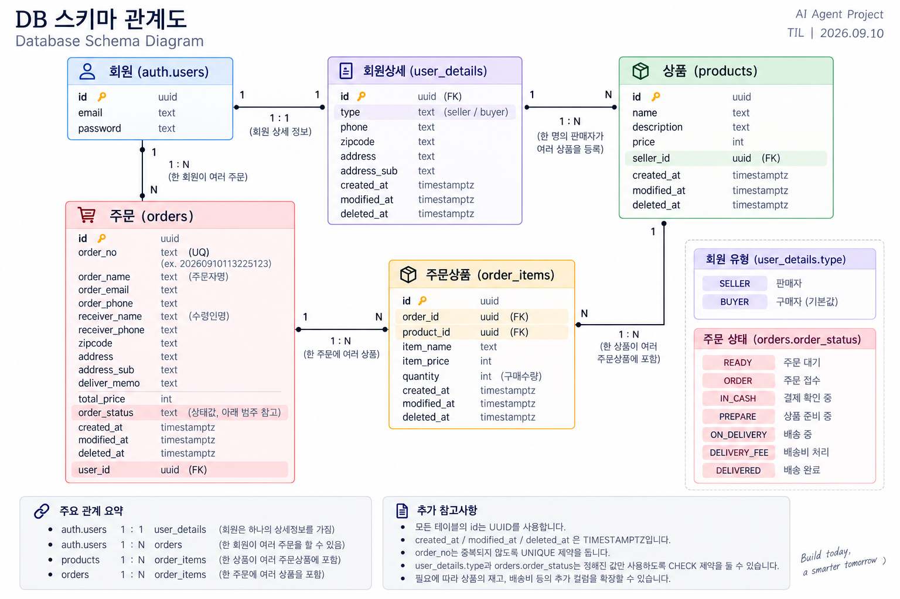

# DB & Supabase - 동시성 제어, RLS와 Shopping Project

> 📅 DATE: 2026-09-10 Donnerstag

<a id="top"></a>

## 📑 CONTENTS

1. [REVIEW](#-review)
2. [Transaction 동시성 제어](#1-transaction-동시성-제어)
3. [RLS - Row Level Security](#2-rls---row-level-security)
4. [TEAM PROJECT - Shopping Project](#3-team-project---shopping-project)
5. [DB Schema 설계](#4-db-schema-설계)
6. [Shopping Project 구현](#5-shopping-project-구현)
7. [Problem Solving](#-problem-solving)
8. [DAILY QUEST](#-daily-quest)
9. [Q&A](#-qa)

---

## 😊 SUMMARY

오늘은 어제 학습한 Transaction과 Supabase의 기본 사용법에서 한 단계 더 나아가, **동시에 같은 데이터를 수정할 때 발생하는 Concurrency Problem을 어떻게 제어하는지** 학습했다. Isolation을 구현하기 위한 방법으로 **Pessimistic Lock과 Optimistic Lock**을 비교하고, 원자적 조건부 갱신과 분산 락의 개념까지 살펴봤다.

이후 Supabase의 **RLS(Row Level Security)**를 이용해 로그인한 사용자별로 DB Row에 대한 접근 권한을 통제하는 방법을 학습했다. 수업 후반에는 팀 프로젝트인 **Shopping Project**를 시작하여 GitHub, Kanban Template, Supabase를 이용해 협업 환경을 구성하고, 회원·상품·주문을 중심으로 DB Schema와 CRUD 구현을 진행했다.

**Keywords:** `Concurrency`, `Isolation`, `Pessimistic Lock`, `Optimistic Lock`, `FOR UPDATE`, `RLS`, `USING`, `WITH CHECK`, `CRUD`, `Supabase`, `GitHub`, `Branch`, `Kanban`, `Shopping Project`

---

## 🔄 REVIEW

어제 학습한 내용 중 오늘 학습과 직접 연결되는 부분만 정리한다.

- **Transaction / ACID** → 오늘은 `Isolation`을 실제로 구현하기 위한 동시성 제어 방법으로 확장
- **Supabase Auth / Authorization** → 오늘은 `RLS`를 이용한 Row 단위 접근 제어로 확장
- **Supabase SDK** → 오늘은 Shopping Project에서 실제 CRUD 구현에 적용

---

# 📚 LECTURE NOTE

# 1. Transaction 동시성 제어

## 1-1. Concurrency Problem

여러 Transaction이 동시에 같은 데이터를 읽고 수정하면 **Concurrency Problem(동시성 문제)**이 발생할 수 있다.

예를 들어 통장에 10만 원이 있는데 두 Transaction이 거의 동시에 7만 원씩 출금하면, 둘 다 변경 전 잔액을 읽은 상태에서 수정하면서 처리 순서에 따라 값이 덮어써지는 등의 문제가 발생할 수 있다.

이러한 동시 Transaction 간 간섭을 제어하는 것이 ACID의 **Isolation(격리성)**과 관련된다.

---

## 1-2. Pessimistic Lock - 비관적 락

> "다른 사람이 이 데이터를 수정할 수도 있으니 일단 잠그자."

먼저 DB Row에 Lock을 걸고 작업하는 방식이다.

```sql
BEGIN;

SELECT stock
FROM products
WHERE id = 1
FOR UPDATE;

UPDATE products
SET stock = stock - 1
WHERE id = 1;

COMMIT;
````

`FOR UPDATE`를 사용하면 해당 Row에 충돌하는 다른 Transaction의 변경을 기다리게 할 수 있다. Lock은 단순히 `UPDATE`가 끝나는 순간이 아니라 일반적으로 **Transaction이 COMMIT 또는 ROLLBACK되어 종료될 때 해제**된다.

충돌 가능성이 높은 재고 차감이나 좌석 예약 등에 적합하지만, 다른 Transaction이 기다려야 하므로 처리량이 낮아질 수 있고 Deadlock이 발생할 가능성도 있다.

---

## 1-3. Optimistic Lock - 낙관적 락

> "동시에 수정할 가능성이 낮으니 먼저 잠그지 않고, 수정할 때 충돌 여부를 확인하자."

일반적으로 `version` 값을 이용해 내가 조회한 이후 다른 사용자가 데이터를 변경했는지 확인한다.

```sql
SELECT stock, version
FROM products
WHERE id = 1;
```

예를 들어 조회 당시 `version = 3`이었다면:

```sql
UPDATE products
SET stock = 9,
    version = version + 1
WHERE id = 1
  AND version = 3;
```

다른 Transaction이 먼저 수정하여 `version = 4`가 되었다면 조건이 일치하지 않아 수정되는 Row가 없고, 이를 통해 충돌을 감지할 수 있다. 이후에는 데이터를 다시 읽어 **Retry(재시도)** 등의 처리를 한다.

DB Lock을 오래 유지하지 않아 동시 처리에 유리하지만, 충돌이 자주 발생하면 재시도가 반복되어 오히려 비효율적일 수 있다.

---

## 1-4. Pessimistic vs Optimistic

| 구분    | Pessimistic       | Optimistic   |
| ----- | ----------------- | ------------ |
| 생각    | 충돌 가능성이 높음        | 충돌이 드물다고 가정  |
| 방법    | 먼저 Lock           | 수정 시 충돌 확인   |
| 대표 방식 | `FOR UPDATE`      | `version`    |
| 충돌 시  | 다른 Transaction 대기 | 실패 후 재시도     |
| 적합    | 재고·좌석 등           | 일반적인 정보 수정 등 |

---

## 1-5. 다른 동시성 제어 방법

### 원자적 조건부 갱신

재고 차감처럼 비교적 단순한 작업은 조회와 수정을 나누지 않고 하나의 SQL로 처리할 수도 있다.

```sql
UPDATE products
SET stock = stock - 1
WHERE id = 1
  AND stock > 0;
```

조건을 포함한 `UPDATE`를 하나의 연산으로 처리하고, 실제로 수정된 Row 수를 확인하는 방식이다.

### Distributed Lock

여러 Server나 Process가 하나의 Resource를 공유하는 분산 환경에서는 **Distributed Lock(분산 락)**을 사용할 수도 있다. 대표적으로 Redis를 활용할 수 있으며 Java 환경에서는 Redisson 같은 Redis Client/Library를 이용해 분산 락을 구현하기도 한다.

[⬆️ 처음으로](#top)

---

# 2. RLS - Row Level Security

## 2-1. RLS란?

**RLS(Row Level Security)**는 Database에서 **Row 단위로 접근 권한을 통제**하는 기능이다.

Supabase에서는 Auth를 통해 현재 사용자를 식별하고, RLS Policy를 이용해 해당 사용자가 특정 Row를 `SELECT`, `INSERT`, `UPDATE`, `DELETE`할 수 있는지 제한할 수 있다.

---

## 2-2. CRUD 접근 통제

예를 들어 로그인한 사용자가 본인의 문서만 관리하도록 설정할 수 있다.

```sql
CREATE POLICY "본인 문서 전체 관리"
ON documents
FOR ALL
TO authenticated
USING (auth.uid() = user_id)
WITH CHECK (auth.uid() = user_id);
```

핵심 조건은 다음과 같다.

```sql
auth.uid() = user_id
```

`auth.uid()`는 현재 로그인한 사용자의 ID이고, `user_id`는 해당 Row의 사용자 ID이다.

---

## 2-3. USING vs WITH CHECK

| 구분           | 역할                                 |
| ------------ | ---------------------------------- |
| `USING`      | 기존 Row에 접근할 자격이 있는지 확인             |
| `WITH CHECK` | 새로 생성되거나 수정된 Row가 Policy를 만족하는지 확인 |

```sql
USING (auth.uid() = user_id)
WITH CHECK (auth.uid() = user_id);
```

특히 `INSERT`는 기존 Row가 없으므로 새로 들어갈 데이터가 허용되는지 확인하기 위해 `WITH CHECK`가 중요하다.

`UPDATE`에서는 `USING`으로 **기존 Row를 수정할 권한이 있는지**, `WITH CHECK`로 **수정된 결과 역시 허용되는 값인지** 확인한다고 이해할 수 있다.

[⬆️ 처음으로](#top)

---

# 3. TEAM PROJECT - Shopping Project

## 3-1. 프로젝트 시작

오늘부터 수업에서 설명받은 **Shopping Project**를 팀 단위로 구현하기 시작했다.

프로젝트에서는 지금까지 개별적으로 배운 도구를 하나의 서비스 안에서 연결한다.

* **GitHub** → Source Code 및 Branch 기반 협업
* **Kanban Template** → Task와 진행상황 관리
* **Supabase** → PostgreSQL Database, Authentication, RLS
* **Python** → Supabase SDK를 이용한 기능 구현

---

## 3-2. 구현 단위

Shopping Project에서는 회원, 상품, 주문 기능을 나누어 구현한다.

```text
shopping-project/
├── users.ipynb
├── products.ipynb
└── orders.ipynb
```

* `users.ipynb` → 회원 CRUD
* `products.ipynb` → 상품 CRUD
* `orders.ipynb` → 주문 관련 기능

---

# 4. DB Schema 설계

> **Shopping Project DB Schema 이미지 첨부**



[⬆️ 처음으로](#top)

---

# 5. Shopping Project 구현

## 5-1. Supabase 연결

Python에서 Supabase를 사용하기 위해 `.env`의 환경변수를 불러온 뒤 Client를 생성한다.

```python
import os
from supabase import create_client
from dotenv import load_dotenv

load_dotenv()

url = os.getenv("API_URL")
key = os.getenv("API_KEY")

supabase = create_client(url, key)
```

`.env`에는 API Key와 같이 GitHub에 직접 올리지 않아야 하는 환경별·민감한 정보를 저장한다.

---

## 5-2. 회원 CRUD

회원 기능은 `Create`, `Read`, `Update`, `Delete`를 기준으로 구현한다.

### Soft Delete

회원 데이터를 DB에서 즉시 삭제하지 않고 `deleted_at`에 삭제 시간을 기록하는 **Soft Delete** 방식을 사용할 수 있다.

정상 데이터는:

```sql
WHERE deleted_at IS NULL
```

삭제된 데이터는:

```sql
WHERE deleted_at IS NOT NULL
```

로 구분할 수 있다.

> 기존 Notebook 메모의 `deleted_at IS NOT NULL`은 삭제된 데이터 조회에 해당하며, **정상 회원을 조회하려면 `IS NULL`을 사용해야 한다.**

---

# 🛠️ PROBLEM SOLVING

오늘은 기능 구현뿐 아니라 **Git Branch, 가상환경, 환경변수 등 프로젝트 개발환경을 구성하는 과정**에서 발생한 문제를 직접 해결했다.

## 1. Git Branch 확인 및 원격 Branch 가져오기

팀 프로젝트를 시작하면서 GitHub에 생성된 **원격 Branch를 로컬로 가져와 해당 Branch로 이동한 뒤 작업하는 방법**을 익혔다. 처음에는 원격 Branch를 어떻게 로컬로 가져오는지 몰랐지만, `fetch → Branch 확인 → switch/checkout`의 흐름으로 작업할 수 있다.

```bash
# 원격 Repository의 최신 Branch 정보 가져오기
git fetch origin

# 원격 Branch 확인
git branch -r

# 로컬 + 원격 Branch 확인
git branch -a

# 현재 Branch 확인
git branch
```

원격에만 존재하는 Branch는 로컬 Branch를 생성하면서 이동한다.

```bash
# switch 방식
git switch -c 브랜치명 --track origin/브랜치명

# checkout 방식
git checkout -b 브랜치명 origin/브랜치명
```

이미 로컬에 존재하는 Branch는 다음과 같이 이동한다.

```bash
git switch 브랜치명

# 또는
git checkout 브랜치명
```

`git fetch`는 **원격의 최신 Commit과 Branch 정보를 가져오는 명령**, `switch`와 `checkout`은 **작업할 Branch로 이동하는 명령**, `git pull`은 **현재 Branch에 원격 변경사항을 가져와 반영하는 명령**으로 구분한다.

또한 Git의 Branch와 Terminal의 현재 Directory는 서로 다른 개념이므로 작업 전 `git branch`와 현재 경로를 함께 확인한다.

**Windows PowerShell (= macOS Terminal)**

```ps1
pwd
ls
cd 경로
```

Git 명령어 자체는 Windows와 macOS에서 동일하다.

> **처음 원격 Branch에서 작업:** `fetch → branch 확인 → switch/checkout`
> **현재 Branch의 원격 변경사항 반영:** `pull`

---

## 2. 가상환경 실행 문제

프로젝트 코드를 실행하기 전에 **현재 어떤 Python 환경을 사용하고 있는지** 확인해야 한다. 가상환경이 활성화되지 않았거나 다른 Python Interpreter를 사용하면 이미 설치한 Package를 찾지 못하는 문제가 발생할 수 있다.

확인은 **현재 프로젝트 경로 → 가상환경 → Python Interpreter → Dependency → Jupyter 실행** 순으로 진행한다.

**Windows PowerShell**

```powershell
.\.venv\Scripts\Activate.ps1
where.exe python
python --version
```

**macOS / Linux**

```bash
source .venv/bin/activate
which python
python --version
```

> **코드 오류처럼 보여도 실제 원인은 실행 환경일 수 있으므로 현재 경로와 가상환경을 먼저 확인한다.**

---

## 3. `.env` 파일과 환경변수 관리

Supabase Client를 생성할 때는 다음과 같이 환경변수를 불러와 사용한다.

```python
url = os.getenv("API_URL")
key = os.getenv("API_KEY")
````

API Key처럼 **보안이 필요한 값은 소스코드에 직접 작성하거나 GitHub에 올리지 않는 것이 원칙**이다. 실제 서비스에서는 운영체제나 배포 환경의 환경변수로 등록해 관리할 수 있다.

이번 Shopping Project는 임시 실습 프로젝트이므로 별도의 `.env` 파일을 생성해 필요한 Key를 저장해 사용했다.

```env
API_URL=...
API_KEY=...
```

Python에서는 `load_dotenv()`로 `.env` 파일의 값을 불러온다.

```python
from dotenv import load_dotenv
import os

load_dotenv()

url = os.getenv("API_URL")
key = os.getenv("API_KEY")
```

`.env` 파일은 Secret 정보를 포함하기 때문에 `.gitignore`에 등록하여 **Git에 추적되지 않도록 한다.**

```gitignore
.env
```

따라서 GitHub Repository에는 코드만 올라가고 `.env` 파일은 의도적으로 제외된다. 다른 PC에서 Repository를 Clone하거나 팀원이 프로젝트를 실행하는 경우에는 **각자의 환경에서 `.env` 파일을 생성하고 필요한 Key를 다시 설정해야 한다.**

> **핵심:** `.env`가 GitHub에 없는 것은 파일 누락이 아니라, **Secret 정보를 Repository에 올리지 않기 위한 보안 설정**이다.

---

## 4. 오늘 에러에서 배운 점

협업 프로젝트를 다른 환경에서 처음 실행할 때는 코드만 받아오면 끝나는 것이 아니라 **Git Branch, 실행 환경, Dependency, 환경변수 설정**까지 함께 구성해야 한다.

**`Git Branch → 현재 작업 경로 → 가상환경 → Python Interpreter → Dependency → .env / 환경변수 → Supabase 연결 → 코드`**

특히 `.env`처럼 Git에서 의도적으로 제외되는 파일은 Repository를 Clone한 뒤 별도로 생성해야 한다.

> **오늘의 핵심:** 프로젝트 실행 문제는 코드 오류뿐 아니라 **Branch, 가상환경, Package, Secret 환경변수 설정** 등 개발환경 구성 과정에서도 발생할 수 있다.

---

## 📝 DAILY QUEST

1. **PostgREST** → Supabase가 PostgreSQL 테이블을 기반으로 **REST API를 자동 생성**하는 데 사용하는 도구. ✅

2. ❌ **UPDATE / DELETE 조건 누락** → `.eq()` 같은 조건 없이 실행하면 **테이블의 모든 행이 변경되거나 삭제될 수 있다.**

   * 내 답: RLS 정책이 자동 활성화
   * 정답: 조건이 없으면 전체 행에 영향을 줄 수 있음

3. **RLS (Row Level Security)** → `.eq()` 같은 코드 수준 Filter와 달리, **DB 차원에서 사용자별 Row 접근 권한을 통제**한다. ✅

4. **LCEL `|`** → `Prompt Template → Model → Parser`처럼 LangChain Component를 순서대로 연결하여 **앞 단계의 Output을 다음 단계의 Input으로 전달**한다. ✅

5. ❌ **`response.data`** → Supabase Client의 `select` 요청에서 실제 조회 데이터는 **`response.data`**에 담긴다.

   * 내 답: `response`
   * 정답: `response.data`

> **오답 복습:** `UPDATE / DELETE` 실행 전에는 Filter 조건을 반드시 확인하고, `response`는 응답 객체 전체 / `response.data`는 실제 데이터라는 차이를 기억한다.

---

## 🔗 오늘의 흐름

**Transaction / Isolation → 동시성 제어 → Pessimistic·Optimistic Lock → RLS → Shopping Project → GitHub·Kanban·Supabase → CRUD 구현 → Git Branch·가상환경·`.env` Debugging**

### 오늘의 핵심

> **오늘은 SQL과 Supabase를 개별적으로 배우는 단계에서 실제 Shopping Project 안에서 연결해 사용하는 단계로 넘어갔다. 동시성은 Lock 등을 이용해 제어하고, 사용자별 접근 권한은 RLS로 제한하며, GitHub·Kanban·Supabase·Python을 연결해 실제 서비스 구조의 기능을 구현하기 시작했다.**

