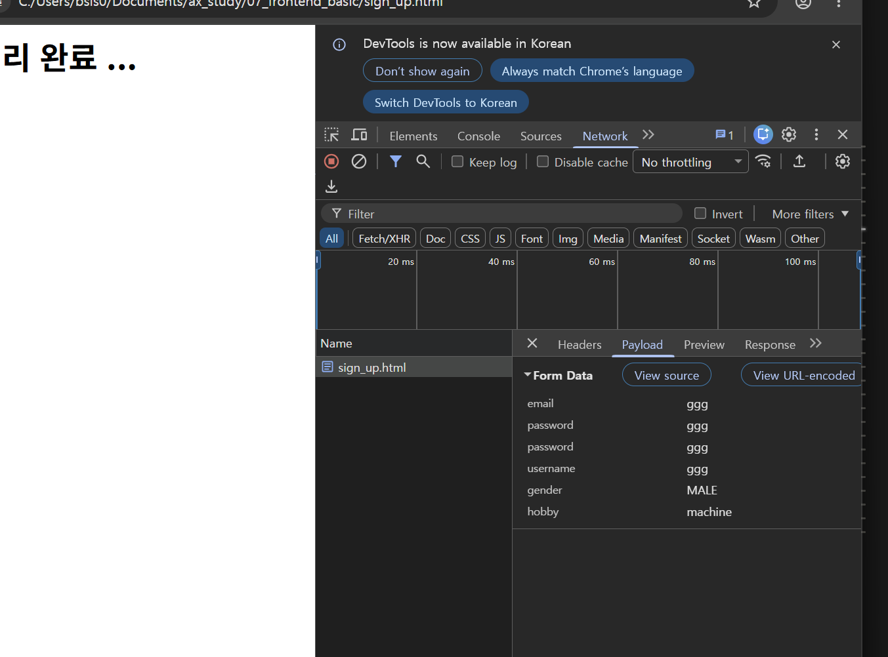

# Frontend

DATE: 2026-09-15 Tue.

## review
- Block 요소와 Inline 요소는 서로 포함 가능
    - 서식에서 공간의 유무로 차이가 생길 수 있다는 점 유의

## LETURE NOTE
### 멀티미디어 및 폼 태그
#### 입력 폼 태그
0. **target** _self, _parent 등 사용 가능
1. **action** 제출 처리 URL (server url)
2. **method** 전송 방식
    - GET (default) 자원 조회 / 검색
        - 전송할 데이터는 URL에 포함 
        ```url
        ...?이름=값&이름=값 ...
        ```
        - Query String (쿼리 스트링)
    - POST 서버에 변경을 가하는 요청 / 자원 작성 
        - 회원가입, 글 작성, 상품등록 등
        - 요청 전문의 body에 실려 전송

> URL encoding or JSON 문자열로 url에 전송을  많이  함




- 요청과 응답
    - 구성: 헤더와  바디
        - 헤더 : 요청쪽 정보 / 응답 쪽 정보, 명령
        - 바디 : 전송할 / 응답 데이터

1. `<input>`
    1. **type** 입력 유형
        - email, number, color, range, date, time, datetime
    2. **name** 전송할 값, 선택 그룹 명칭이로 이용
    3. **value** 선택된 값의 명칭으로 이용
    4. **required** 필수 입력 항목

    > min, max, step (숫자값일때 설정 항목)

    5. placeholder 안내문구
    6. readonly 읽기 전용 (데이터 전송 o)
    7. disabled 기능 무력화(데이터 전송 x)

2. button
    1. type : 
        - submit -> 양식 제출
        - reset
        - button


    2. `<button>`

3. 태그와 입력 요소를 연결
    - 입력 요소를 태그로 감싼다 (`<label>`)
    - for id 속성을 연결
    (`<label>` + 입력요소)

4. textarea 여러줄 텍스트 입력
    - input과 비슷함. (단, 차이는 있음...)
5. select 여러개 중 한 개 또는 여러개
    - option => 선택 항목
        - selected 선택
    - multiple 여러개 선택
    - size 한번에 보일 갯수

### 시멘틱 태그의  구조화
- semantic tag 의미를 갖는 태그
- 예: `<form>`, `<table>`, `<video>`,`<nav>`
- 비시멘틱 태그: `<div>`,`<span>`

필요한 이유
1. 검색엔진 최적화
2. 웹접근성 (베리어프리)
3. 코드 가독성 향상