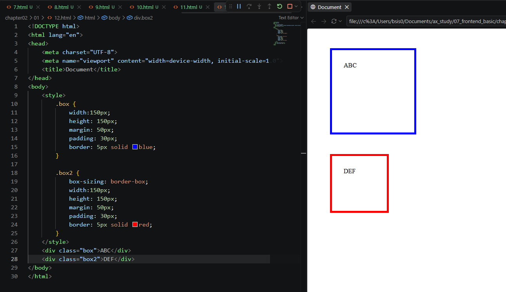
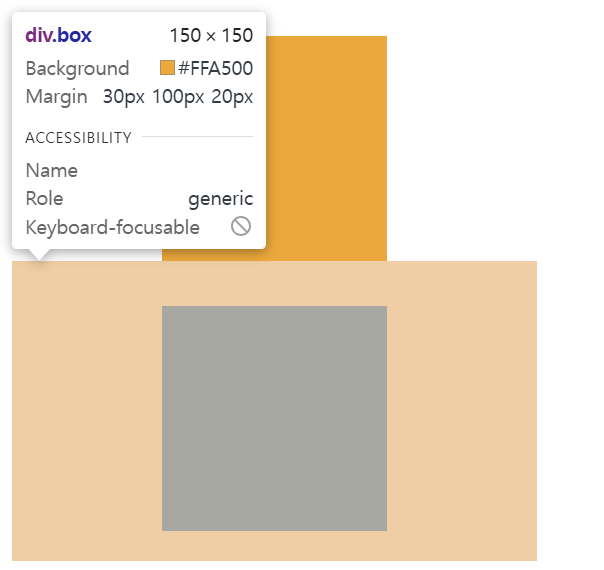
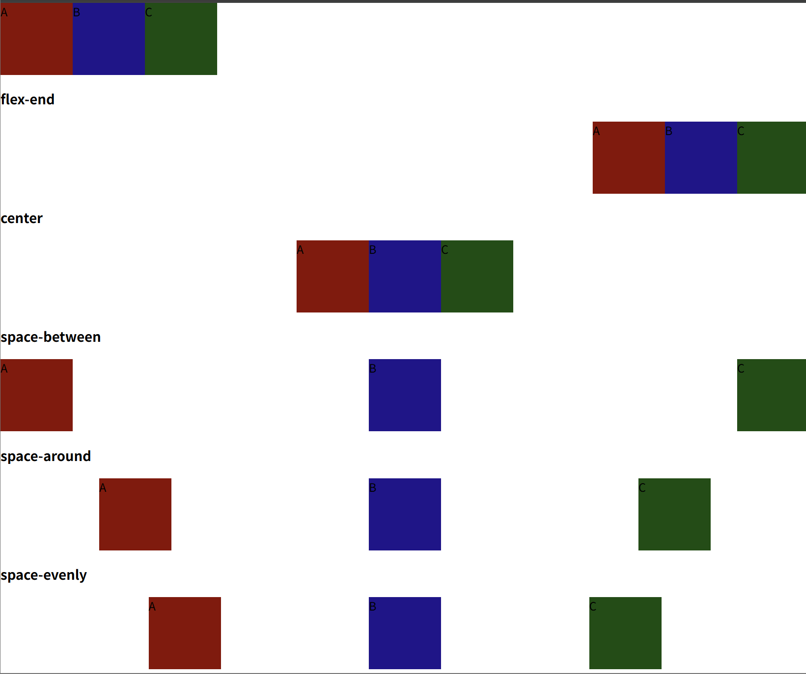
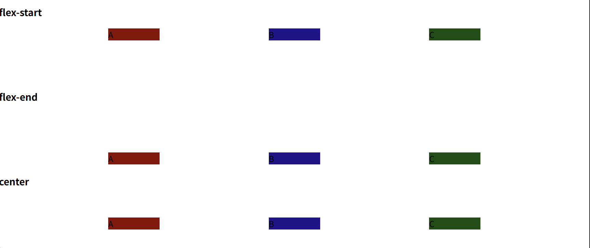

# Frontend - CSS Selector, Box Model & Flexbox

> 📅 DATE: 2026-09-16 Mittwoch

<a id="top"></a>

## 📑 CONTENTS

1. [REVIEW](#-review)
2. [CSS 선택자](#1-css-선택자)
3. [CSS 텍스트 및 폰트 속성](#2-css-텍스트-및-폰트-속성)
4. [CSS Box Model](#3-css-box-model)
5. [Display](#4-display)
6. [Flexbox](#5-flexbox)
7. [EXERCISE & MORE](#-exercise--more)
8. [DAILY QUEST](#-daily-quest)
9. [Q&A](#-qa)

---

## 😊 SUMMARY

오늘은 CSS에서 **원하는 HTML 요소를 선택하는 방법**을 확장하여 학습했다. 기본 선택자에서 시작해 관계·속성·가상 클래스·가상 요소 선택자를 살펴보고, CSS의 텍스트와 크기 단위를 학습했다.

이후 **Content → Padding → Border → Margin**으로 구성되는 Box Model과 `box-sizing`, `display`의 차이를 정리하고, 마지막으로 `Flexbox`를 이용해 자식 요소의 **방향과 정렬을 제어하는 방법**을 학습했다.

**Keywords:** `Selector`, `Specificity`, `Pseudo-class`, `Pseudo-element`, `Box Model`, `box-sizing`, `Display`, `Flexbox`, `justify-content`, `align-items`

---

# 🔄 REVIEW

- `id` → 한 문서에서 고유하게 사용하는 식별자, `#id`로 선택
- `class` → 여러 요소에 사용할 수 있으며 `.class`로 선택

### `<form>`의 `method`

| Method | 주요 목적 | Form 데이터 |
|---|---|---|
| `GET` | 조회 | URL의 Query String |
| `POST` | 등록·처리 등 | Request Body |

> GET과 POST 외에도 HTTP Method에는 여러 종류가 있다.

### Semantic Tag를 사용하는 이유

- **검색 최적화 (SEO)** → `<h1>` 등 의미 있는 문서 구조가 검색엔진의 콘텐츠 이해에 도움
- **웹 접근성** → `<nav>` 등의 의미를 보조 기술이 파악하는 데 도움
- **코드 가독성** → `<header>`, `<footer>` 등으로 영역의 역할을 쉽게 파악

---

# 📚 LECTURE NOTE

## 1. CSS 선택자

### 1-1. 기본 선택자 (Selector)

> **"어떤 것부터 색칠할 거야?"**

- 전체 선택자 `*`
- 태그 선택자 `태그명`
- 클래스 선택자 `.class`
- 아이디 선택자 `#id`

### 적용 우선순위

```text
전체 선택자 < 태그 선택자 < 클래스 선택자 < 아이디 선택자 < style 속성
```

> ⚠️ 필기의 `범위가 넓을수록 우선순위가 높음`은 반대로 정리해야 한다. 기본적인 **명시도(Specificity)**는 위와 같이 이해한다.

---

### 1-2. 복합 관계 선택자 (Compound Selectors)

| 종류 | 문법 | 의미 |
|---|---|---|
| 하위 선택자 | `ul span` | `ul` 내부의 모든 후손 `span` |
| 자식 선택자 | `부모 > 자식` | 바로 한 단계 아래 자식 |
| 일반 형제 선택자 | `형 ~ 동생` | 기준 요소 뒤의 형제 요소 |
| 인접 형제 선택자 | `형 + 동생` | 기준 요소 바로 다음 형제 |
| 그룹 선택자 | `A, B` | 여러 선택자를 함께 선택 |

> **하위(자손)**는 내부의 모든 단계, **자식(`>`)**은 바로 한 단계 아래만 선택한다.

---

### 속성 선택자

지정된 속성이나 속성값을 기준으로 요소를 선택한다.

```css
[속성명]
선택자[속성명]
[속성명="값"]
[속성명^="값"]
[속성명$="값"]
[속성명*="값"]
```

| 문법 | 의미 |
|---|---|
| `[속성명]` | 해당 속성이 있는 요소 |
| `선택자[속성명]` | 다른 선택자와 조합 |
| `[속성명="값"]` | 값이 정확히 일치 |
| `[속성명^="값"]` | 해당 값으로 시작 |
| `[속성명$="값"]` | 해당 값으로 끝남 |
| `[속성명*="값"]` | 해당 값이 포함됨 |

> 수업 실습 코드: `\ax_study\07_frontend_basic\chapter02\01\5.html`

---

### 1-3. 가상 클래스 선택자 (Pseudo-class Selector)

```css
선택자:상태
선택자:조건
선택자:위치
```

#### 위치 선택자

자식의 **위치**를 기준으로 선택한다.

```css
:first-child
:last-child
:nth-child(...)
```

- `:first-child` → 첫 번째 자식 요소
- `:last-child` → 마지막 자식 요소
- `:nth-child(n)` → n번째 자식 요소
- 숫자는 `1`부터 시작

```css
:nth-child(2n+1)  /* 홀수 */
:nth-child(2n)    /* 짝수 */
:nth-child(3n+1)  /* 1, 4, 7, ... */
```

> `:nth-child()`는 자식의 **타입이 달라도 전체 자식 중 위치**를 기준으로 판단한다.

#### 같은 타입을 기준으로 선택

```css
:first-of-type
:last-of-type
:nth-of-type(...)
:only-of-type
```

- `:first-of-type` → 같은 타입 중 첫 번째
- `:last-of-type` → 같은 타입 중 마지막
- `:nth-of-type()` → 같은 타입 중 n번째
- `:only-of-type` → 같은 타입의 형제가 하나뿐인 경우

---

#### 조건 선택자

```css
:not(선택자)
:is(선택자1, 선택자2, ...)
```

- `:not()` → 지정된 선택자가 아닌 요소 선택
- `:is()` → 여러 선택자를 하나의 그룹처럼 묶어 표현

예:

```css
:is(header, main, footer) p {
    color: blue;
}
```

→ `header`, `main`, `footer` 내부의 `p`를 선택

---

#### 상태 선택자

| 선택자 | 상태 |
|---|---|
| `:hover` | 마우스가 요소 위에 올라간 상태 |
| `:focus` | 요소가 Focus된 상태 |
| `:checked` | 체크된 상태 |
| `:read-only` | 읽기 전용 상태 |
| `:disabled` | 비활성화 상태 |
| `:enabled` | 활성화 상태 |

---

### 1-4. 가상 요소 선택자 (Pseudo-element)

```css
선택자::가상요소
```

| 선택자 | 역할 |
|---|---|
| `::before` | 요소 내부의 첫 부분에 가상 요소 생성 |
| `::after` | 요소 내부의 마지막 부분에 가상 요소 생성 |
| `::placeholder` | 입력창의 안내 텍스트 선택 |
| `::selection` | 사용자가 선택한 영역 |

`::before`, `::after`로 내용을 생성할 때는 `content` 속성을 사용한다.

```css
.title::before {
    content: "★";
}

.title::after {
    content: "!";
}
```

> `::before`, `::after`는 기본적으로 생성된 **Inline 요소처럼 동작**한다.

### 가상 클래스 vs 가상 요소

```text
:   → 상태·조건·위치 (Pseudo-class)
::  → 가상의 요소 (Pseudo-element)
```

[⬆️ 처음으로](#top)

---

## 2. CSS 텍스트 및 폰트 속성

### 2-1. `color`

폰트 색상을 지정한다.

#### 색상명

```css
color: red;
```

#### RGB

```css
color: rgb(255, 0, 0);
```

RGB 각 채널은 일반적으로 `0 ~ 255` 값을 사용한다.

#### HEX CODE

```text
rgb(255, 0, 0)
→ #ff0000
→ #f00
```

#### RGBA

```css
color: rgba(255, 0, 0, 0.5);
```

마지막 값은 **Alpha Channel(투명도)**이다.

```text
0 → 완전 투명
1 → 완전 불투명
```

> 필기의 `rgbn`은 `rgba`로 수정.

---

### 2-2. `font-size`

글자 크기를 지정한다.

#### 절대 크기

- `px` → Pixel, 화면의 픽셀 단위
- `pt` → Point, 인쇄 환경에서 주로 사용하는 단위

#### 상대 크기

- `em` → 해당 요소의 계산된 폰트 크기와 부모로부터 상속된 크기 등의 영향을 받는 상대 단위
- `rem` → Root Element인 `<html>`의 `font-size`를 기준으로 하는 상대 단위

예:

```css
html {
    font-size: 16px;
}

.title {
    font-size: 2rem;
}
```

```text
1rem = 16px
2rem = 32px
```

> ⚠️ `rem`은 **`html`에 설정된 글자 크기**를 기준으로 계산한다.

---

## 3. CSS Box Model

CSS의 요소는 기본적으로 **박스(Box)** 형태의 영역을 가진다.

```text
Margin
└─ Border
   └─ Padding
      └─ Content
```

| 영역 | 의미 |
|---|---|
| `content` | 실제 내용이 들어가는 영역 |
| `padding` | Content와 Border 사이의 내부 여백 |
| `border` | 요소의 경계선 |
| `margin` | 요소 바깥쪽의 외부 여백 |

브라우저 DevTools에서도 Box Model을 확인할 수 있다.

---

### `box-sizing`

`width`, `height`를 어떤 영역까지 포함하여 계산할지 결정한다.

#### `content-box` - 기본값

```css
box-sizing: content-box;
```

`width`, `height`가 **Content 영역만**을 기준으로 한다.

따라서 Padding과 Border를 추가하면 실제 박스 전체 크기가 커질 수 있다.

#### `border-box`

```css
box-sizing: border-box;
```

지정한 `width`, `height` 안에 **Content + Padding + Border**가 포함된다.

따라서 Padding이나 Border가 커지면 전체 크기를 유지하기 위해 Content 영역이 줄어든다.

> **Box 크기를 계산할 때 중요한 설정이다.**



---

### Margin

외부 여백을 설정한다.

```css
margin: 상 우 하 좌;
margin: 상 좌우 하;
margin: 상하 좌우;
margin: 모든면;
```

시계 방향:

```text
Top → Right → Bottom → Left
```

개별 지정:

```css
margin-top: 50px;
padding-top: 50px;
```

가운데 정렬에 자주 사용하는 형태:

```css
margin: 100px auto;
```

```text
상하 → 100px
좌우 → 남은 여백을 자동 분배
```

---

### Margin Collapse

Block 요소의 위·아래 Margin이 맞닿는 경우 **Margin Collapsing(마진 상쇄)**이 발생할 수 있다.

예:

```text
위 요소 margin-bottom: 20px
아래 요소 margin-top: 30px

→ 일반적인 수직 마진 상쇄 상황에서는 30px
```

즉, 단순히 `20 + 30 = 50px`이 되는 것이 아니라 큰 Margin이 적용되는 경우가 있다.



> Inline 요소는 일반적인 문서 흐름에서 좌우 Margin은 적용되지만 상하 Margin은 레이아웃 간격에 Block 요소처럼 작용하지 않는다. Padding은 상하좌우 지정할 수 있다.

[⬆️ 처음으로](#top)

---

## 4. Display

`display`는 요소가 화면에서 **어떤 방식으로 배치되는지**를 지정한다.

### `block`

```css
display: block;
```

요소를 Block 형식으로 표시한다.

### `inline`

```css
display: inline;
```

요소를 Inline 형식으로 표시한다.

### `inline-block`

```css
display: inline-block;
```

```text
줄바꿈 X
width / height O
상하좌우 Margin O
```

Inline처럼 한 줄에 배치되면서 Block처럼 크기를 지정할 수 있다.

나란히 있는 두 `inline-block` 요소에 각각 Margin이 있다면 **각 요소의 Margin이 각각 적용**된다.

### `none`

```css
display: none;
```

요소를 화면에서 감추며 **공간도 차지하지 않는다.**

반면:

```css
visibility: hidden;
```

화면에서는 보이지 않지만 **공간은 유지한다.**

```text
display: none       → 안 보임 + 공간 X
visibility: hidden  → 안 보임 + 공간 O
```

---

## 5. Flexbox

**Flexbox**는 요소를 한 방향을 중심으로 배치하는 **1차원 Layout 방식**이다.

부모 요소에 설정한다.

```css
.container {
    display: flex;
}
```

```text
부모 → Flex Container
자식 → Flex Item
```

---

### 5-1. `flex-direction`

자식 요소가 배치되는 **주축(Main Axis)의 방향**을 결정한다.

| 값 | 방향 |
|---|---|
| `row` | 좌 → 우 (기본값) |
| `row-reverse` | 우 → 좌 |
| `column` | 위 → 아래 |
| `column-reverse` | 아래 → 위 |

```css
.container {
    display: flex;
    flex-direction: row;
}
```

---

### 5-2. `justify-content`

**주축(Main Axis)**을 기준으로 Flex Item을 정렬한다.

| 값 | 의미 |
|---|---|
| `flex-start` | 시작점 정렬 |
| `flex-end` | 끝점 정렬 |
| `center` | 가운데 정렬 |
| `space-between` | 양 끝에 요소를 배치하고 사이 간격을 균등 분배 |
| `space-around` | 각 요소 주변에 동일한 여백을 배분 |
| `space-evenly` | 요소 사이와 양 끝의 간격을 동일하게 배분 |



> `row`일 때는 주축이 가로이므로 `flex-start`가 왼쪽, `flex-end`가 오른쪽이다. `flex-direction`이 바뀌면 주축 방향도 함께 바뀐다.

---

### 5-3. `align-items`

**교차축(Cross Axis)**을 기준으로 Flex Item을 정렬한다.

| 값 | 의미 |
|---|---|
| `stretch` | 교차축 방향으로 늘림 (기본값) |
| `flex-start` | 교차축 시작점 |
| `flex-end` | 교차축 끝점 |
| `center` | 교차축 가운데 |



### Flexbox 핵심

```text
display: flex
    ↓
flex-direction
    ↓
Main Axis 결정
    ↓
justify-content → Main Axis 정렬
align-items     → Cross Axis 정렬
```

> `justify-content = 가로`, `align-items = 세로`로 고정해서 외우기보다 **주축과 교차축**으로 이해한다.

[⬆️ 처음으로](#top)

---

# 🧪 EXERCISE & MORE

## 스터디 2조

### 이론

### 프론트엔드 - 클론코딩


---

# 📝 DAILY QUEST

1. **외부 스타일 시트 (External Style Sheet)** → HTML과 CSS를 별도 파일로 분리하여 **재사용성과 유지보수성이 높다.** ✅

2. **상속 (Inheritance)** → 부모 요소의 일부 CSS 속성이 별도의 선언 없이 **자식 요소에 전달되는 현상**이다. ✅

3. ❌ **자식 선택자 `>`** → 부모의 **바로 한 단계 아래 자식만 선택**한다.
   - 내 답: A문단과 B문단 모두
   - 정답: **A문단만 선택**
   - `.parent > p`에서 B문단은 `.parent`의 직계 자식이 아니라 손자 요소이다.

4. ❌ **CSS 명시도 (Specificity)** → 기본적인 명시도는 다음 순서로 높다.
   - 내 답: `Class > ID > Inline > Tag`
   - 정답: `Inline > ID > Class/Pseudo-class > Tag/Pseudo-element > *`

5. **가상 요소 선택자 (Pseudo-element)** → `::before`, `::after`처럼 `::`를 사용하여 가상의 요소를 생성하거나 특정 부분을 선택한다. ✅

> **오답 복습:** `A B`는 모든 후손, `A > B`는 직계 자식만 선택한다. CSS 우선순위는 **Inline > ID > Class > Tag > 전체 선택자** 순서로 기억한다.

---

## 🔗 오늘의 흐름

```text
CSS Selector
→ 원하는 요소 선택
→ Pseudo-class / Pseudo-element
→ Font & Size
→ Box Model
→ Display
→ Flexbox
→ 요소의 크기와 배치 제어
```

---

## ❓ Q&A