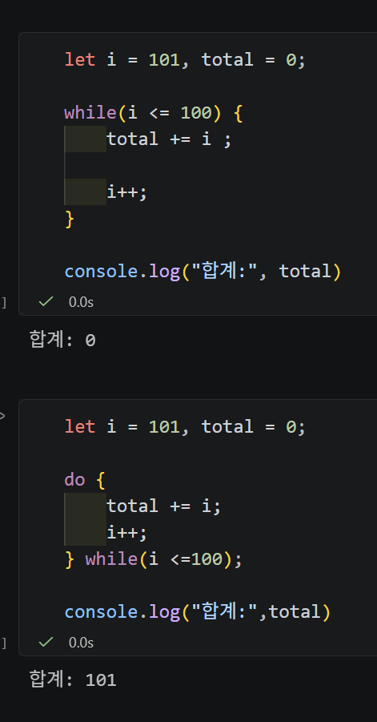
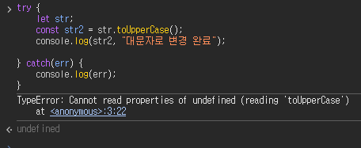
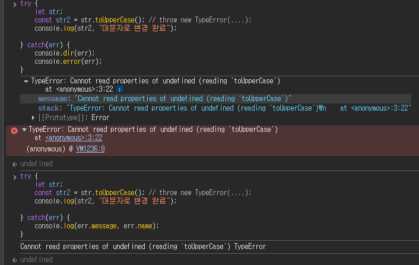

# Frontend - JavaScript 기초 문법 & 객체 ⭐⭐⭐

> 📅 DATE: 2026-09-22 Dienstag  
> 📖 프론트엔드 개발 4장 2강 · 3강

<a id="top"></a>

## 😊 SUMMARY

JavaScript의 **연산자 → 조건문 → 반복문 → 예외 처리**를 통해 코드의 실행 흐름을 제어하는 방법을 학습했다.  
이후 **객체(Object) → 객체 리터럴(Object Literal) → 참조(Reference)**로 이어지는 흐름을 통해 여러 데이터를 하나의 대상으로 묶고 다루는 방법을 학습했다.

**Keywords:** `Operator`, `Equality`, `Identity`, `Truthy/Falsy`, `??`, `switch`, `Fall-through`, `for`, `while`, `do-while`, `Exception`, `Object`, `Object Literal`, `Reference`

---

## 🔄 REVIEW

### Node.js

- JavaScript를 브라우저 밖에서도 실행할 수 있게 해주는 **Runtime Environment**
- 내부적으로 JavaScript Engine인 **V8**을 사용
- 브라우저와 달리 파일 시스템 접근 등 Node.js 환경에서 제공하는 기능이 있음
- OS에 따라 경로나 일부 동작 방식에 차이가 있을 수 있음

> `V8 = JavaScript Engine` / `Node.js = V8 등을 기반으로 구성된 Runtime`  
> Node.js 자체가 하나의 Engine인 것은 아니다.

### `var`

- 과거에 많이 사용된 변수 선언자 → 현재는 주로 Legacy Code에서 확인
- 주요 문제
  - Hoisting으로 선언 전 접근 시 `undefined`가 나타날 수 있음
  - **Function-level Scope**
  - 중복 선언 가능
  - 선언 키워드를 생략한 대입은 실행 환경에 따라 **암묵적 전역 변수** 문제를 만들 수 있음
- ES6 이후에는 주로 `let`, `const` 사용
  - `let` → 재할당 가능
  - `const` → 재할당 불가능

### `typeof null`

```javascript
console.log(typeof null);
```

→ `"object"`

- `null`이 일반적인 객체라는 의미는 아님
- JavaScript 초기 설계에서 비롯된 오래된 특이 동작이며 하위 호환성을 위해 유지됨

### Falsy

조건식에서 `false`로 평가되는 대표적인 값:

`false`, `0`, `""`, `null`, `undefined`, `NaN`

> 빈 배열 `[]`, 빈 객체 `{}`는 비어 있어도 **Truthy**이다.

---

## 💬 경험담(이야기)

> **이용교 튜터님**

- 3년 차까지도 실력이 늘지 않아 고민했지만, 결국 **기초가 부족하면 성장할 기반도 부족하다**는 점을 알게 됨.
- Vibe Coding도 유용하지만 생성된 코드를 이해하지 못하면 오류나 보안 문제를 직접 판단하기 어려움.
- JavaScript는 실무에서 많이 사용되며 **React, Next.js 등의 기반 언어**이기 때문에 기본기를 학습할 필요가 있음.
- 실제 회사에서는 내 주력 언어와 다른 언어를 사용해야 할 수도 있음. 하지만 프로그래밍 기본기가 잡혀 있으면 새로운 언어를 배우는 데 연결할 수 있음.
- 모든 것을 배울 수는 없지만 **하나를 배우더라도 기본 원리를 제대로 이해하는 것이 중요**.
- AX 트랙에서는 UX까지 고려하여 개발 → 서비스 런칭 → 유지보수까지 전체 과정을 이해하는 것을 목표로 함.

### 알아두면 코드를 읽을 수 있는 기능

`Object.seal()`과 `Object.freeze()`처럼 당장 자주 사용하지 않더라도 기존 코드를 읽고 문제를 파악하기 위해 알아둘 필요가 있다.

- `Object.seal()` → 기존 Property 수정 O / 추가·삭제 X
- `Object.freeze()` → 기존 Property 수정·추가·삭제 X

> 둘 다 기본적으로 **Shallow(얕은) 수준**으로 적용되므로 중첩 객체까지 자동으로 모두 동결되는 것은 아니다.

---

## 📚 LECTURE NOTE

### 프론트엔드 개발 - 자바스크립트

#### 1. 변수

지난 시간 내용:

- 초기 JavaScript에서는 `var`를 사용했지만 Hoisting, Function-level Scope, 중복 선언 등의 문제가 있음
- 이를 보완하기 위해 ES6에서 `let`, `const` 등장
- `let` → 재할당 가능
- `const` → 재할당 불가능
- 현재는 **기본적으로 `const`를 사용하고 재할당이 필요할 때 `let` 사용**

> 브라우저의 전통적인 일반 `<script>` 환경에서 최상위 `var`나 함수 선언은 `window`와 연결될 수 있다.  
> 하지만 `let`, `const`를 포함한 모든 선언이 `window`의 Property가 되는 것은 아니다.

---

#### 2. 연산자

기본적인 연산자는 Python과 유사하지만 JavaScript에서 주의할 부분이 있다.

##### 2-1. 증가·감소 연산자 `++`, `--`

값을 `1`씩 증가하거나 감소시킨다.

```javascript
let num = 10;
let num2 = ++num;
```

→ **증가 후 대입**

```text
num = 11
num2 = 11
```

반대로:

```javascript
let num = 10;
let num2 = num++;
```

→ **현재 값을 먼저 대입한 후 증가**

```text
num2 = 10
num = 11
```

> `++num` → 증가 후 사용  
> `num++` → 현재 값 사용 후 증가

<a id="equality-identity"></a>

##### 2-2. 동등성(Equality)과 동일성(Identity)

**동등성**과 **동일성**은 구분해서 이해해야 한다.

- **동등성(Equality)** → 두 값이 같은지를 비교
- **동일성(Identity)** → 두 대상이 실제로 같은 객체를 가리키는지 비교

Python에서는 이 구분이 비교적 명확하다.

| 언어 | 연산자 | 의미 |
|---|---|---|
| Python | `==` | 값이 같은지 비교 |
| Python | `is` | 같은 객체인지 비교 |
| JavaScript | `==` | 타입 변환을 허용한 동등 비교 |
| JavaScript | `!=` | `==`의 반대 |
| JavaScript | `===` | 타입 변환 없는 엄격한 동등 비교 |
| JavaScript | `!==` | `===`의 반대 |

**`==` vs `===`**

`==`는 두 피연산자의 타입이 다르면 **암묵적 타입 변환(Type Coercion)** 규칙을 적용한 뒤 비교한다.

```javascript
1 == "1"           // true
0 == false         // true
null == undefined  // true
```

`===`는 비교를 위해 암묵적 타입 변환을 하지 않는 **Strict Equality(엄격한 동등 비교)** 연산자이다.

```javascript
1 === "1"           // false
0 === false         // false
null === undefined  // false
1 === 1             // true
```

**`!=` vs `!==`**

`!=`, `!==`는 각각 `==`, `===`의 반대 결과를 반환한다.

```javascript
1 != "1"    // false
1 !== "1"   // true

0 != false  // false
0 !== false // true
```

```text
==   → 타입 변환 규칙이 적용될 수 있는 동등 비교
!=   → == 의 반대

===  → 타입 변환 없는 엄격한 동등 비교
!==  → === 의 반대
```

> ⚠️ JavaScript의 `===` 자체를 Python의 `is`와 동일한 연산자로 이해하면 안 된다.

객체를 비교할 때는 **Reference**가 중요하다.

```javascript
const a = { name: "서인" };
const b = a;
const c = { name: "서인" };

console.log(a === b); // true
console.log(a === c); // false
```

- `a`와 `b` → 같은 객체를 참조 → `true`
- `a`와 `c` → 내용은 같지만 서로 다른 객체 → `false`

##### 2-3. 논리 연산자

- NOT → `!`
- AND → `&&`
- OR → `||`

---

#### 3. 제어문

##### 3-1. 조건문

**`if`**

```javascript
if (조건식) {
    // 조건식이 참일 때 실행
}
```

**`if - else if - else`**

```javascript
if (조건1) {
    // 조건1이 참
} else if (조건2) {
    // 조건2가 참
} else {
    // 모든 조건이 거짓
}
```

**삼항 조건 연산자**

간단한 조건에 따라 두 값 중 하나를 선택할 때 사용한다.

```javascript
const result = 조건식 ? 참일_때_값 : 거짓일_때_값;
```

```javascript
const age = 25;
const result = age >= 20 ? "성인" : "미성년자";
```

→ `"성인"`

**`||`와 Nullish 연산자 `??`**

기본값을 지정할 때 `||`를 사용할 수 있다.

```javascript
let num = 0;
num = num || 10;

console.log(num);
```

→ `10`

하지만 `0`은 Falsy이기 때문에 정상적인 값인 `0`까지 없는 값처럼 처리될 수 있다.

`??`는 왼쪽 값이 **`null` 또는 `undefined`일 때만** 오른쪽 값을 사용한다.

```javascript
let num = 0;

console.log(num ?? 10);
```

→ `0`

```text
|| → Falsy이면 오른쪽 값 사용
?? → null / undefined일 때만 오른쪽 값 사용
```

> `0`, `false`, `""`도 정상적인 값으로 인정해야 한다면 `??`가 유용하다.

---

##### 3-2. 선택문 `switch-case`

여러 경우 중 값과 일치하는 `case`를 찾아 실행한다.

```javascript
switch (value) {
    case 1:
        console.log("1");
        break;

    case 2:
        console.log("2");
        break;

    default:
        console.log("해당 없음");
}
```

- `case` → 비교할 값
- `break` → `switch` 종료
- `default` → 일치하는 `case`가 없을 때 실행


switch-case 선택문 : 매칭된 `case`를 기점으로 `break`가 없다면 그 뒤의 `case` 코드도 순서대로 실행된다. 이를 **Fall-through(폴스루)**라고 한다.

---

##### 3-3. 반복문 (`for`, `while`, `do-while`)

**`for`**

주로 반복 횟수나 순서가 명확할 때 사용한다.

1. 초기화식 → 반복문에서 사용할 초기값
2. 조건식 → 반복을 유지하는 조건
3. 증감식 → 반복할 때마다 값을 변화

```javascript
for (let i = 0; i < 10; i++) {
    console.log(i);
}
```

`i = 0`부터 `i < 10`까지라면:

```text
0, 1, 2, 3, 4, 5, 6, 7, 8, 9
└────────── 총 10회 ──────────┘
```

- 반복문의 변수로 관례적으로 `i`를 많이 사용
- `i`는 흔히 Index의 의미로 사용
- 중첩 반복에서는 `j`, `k` 등을 사용할 수 있음

**`while`**

```javascript
while (조건식) {
    // 반복
}
```

조건을 **먼저 확인하고 실행**하므로 처음부터 조건이 `false`이면 한 번도 실행되지 않을 수 있다.

**`do-while`**

- 

do-while 조건문은 `while`과 다르게 **실행 이후 조건을 확인**한다. 따라서 조건이 처음부터 `false`여도 최소 한 번은 실행된다.

---

##### 3-4. 예외 처리

**`try-catch-finally`**

```javascript
try {
    // 오류가 발생할 수 있는 코드
} catch (error) {
    // 오류 발생 시 처리
} finally {
    // 오류 여부와 관계없이 실행
}
```

- `try` → 실행을 시도
- `catch` → 발생한 오류 처리
- `finally` → 오류 여부와 관계없이 마지막에 실행

직접 예외를 발생시킬 때는 `throw`를 사용한다.

```javascript
throw new Error("잘못된 값입니다.");
```

- `throw` → 예외 발생
- `new` → 객체를 생성하는 연산자
- `new Error()` → 새로운 Error 객체 생성





예외 처리 예시 - 기존 `console.log()` 외에도 `console.dir()`, `console.error()` 등을 활용할 수 있다.

- `console.log()` → 일반적인 값 확인
- `console.dir()` → 객체 구조 확인에 활용
- `console.error()` → 오류 메시지 출력

---

#### 4. 객체 Object

JavaScript의 데이터는 크게 **원시 타입(Primitive Type)**과 **객체 타입(Object Type)**으로 나누어 생각할 수 있다.

- **Primitive Type** → 하나의 값을 나타내는 기본 데이터
- **Object Type** → 여러 값과 기능을 하나의 대상으로 묶어 관리

객체는 대상의 **특성(Property)**과 그 대상이 수행하는 **행위(Method)**를 함께 표현할 수 있다.

```text
Object
├─ Property → 객체가 가진 특성·데이터
└─ Method   → 객체가 수행할 수 있는 기능
```

```javascript
const user = {
    name: "서인",
    age: 25,
    greet: function () {
        console.log("Hello");
    }
};
```

- `name`, `age` → Property
- `greet()` → Method

---

#### 5. 객체 리터럴 Object Literal

중괄호 `{}` 안에 **Key : Value** 형태로 객체를 직접 만드는 방법이다.

```javascript
const card = {
    suit: "하트",
    rank: "A"
};
```

기본 구조:

```text
{
    key: value,
    key: value
}
```

객체의 Property에는 `.` 또는 `[]`를 이용해 접근할 수 있다.

```javascript
card.suit
card["suit"]
```

**객체는 Reference Type ⭐**

객체를 다른 변수에 대입하면 두 변수가 **같은 객체를 참조할 수 있다.**

```javascript
const card = {
    suit: "하트",
    rank: "A"
};

const a = card;
```

```text
card ─────┐
          ↓
      { suit: "하트",
        rank: "A" }
          ↑
a ────────┘
```

따라서:

```javascript
a.suit = "스페이드";

console.log(card.suit);
```

→ `"스페이드"`

`a`와 `card`가 **같은 객체를 가리키고 있기 때문에** `a`를 통해 수정한 값이 `card`에서도 확인된다.

[⬆️ 처음으로](#top)

---

## 🔄 LLM PROMPT ENGINEERING REVIEW

지난 LLM Prompt Engineering 수업의 **Runnable** 개념을 간단히 복습했다.

```text
prompt | model | parser
        ↓
Runnable을 기준으로 Chain 구성
```

- **Runnable** → LangChain에서 Chain을 구성하는 공통 실행 Interface

### 동기식

- `invoke()` → 하나의 입력 실행
- `stream()` → 결과를 Chunk 단위로 순차 처리
- `batch()` → 여러 입력 처리

### 비동기식

- `ainvoke()`
- `astream()`
- `abatch()`

비동기 방식은 기다리는 동안 다른 작업을 진행할 수 있어 **I/O 대기가 많은 LLM 호출에서 유용**하다.

### `RunnableLambda`

일반 Python 함수를 Runnable 형태로 감싸 Chain에 연결할 수 있도록 한다.

```text
Python 함수
    ↓
RunnableLambda
    ↓
Runnable처럼 Chain에 연결
```

---

## 📝 EXERCISE & MORE

### DQ

1. **`var`의 결함** → Hoisting으로 선언 전 접근 시 `undefined`, 암묵적 전역 변수 위험, Function-level Scope, 중복 선언 허용.

2. **`typeof`** → 피연산자의 데이터 타입을 **문자열 형태로 반환**하는 단항 연산자.
   - 반환(Return) → 연산 결과를 돌려주는 것
   - 변환(Convert) → 값을 다른 형태로 바꾸는 것
   - `typeof 10` → `"number"`를 반환하지만 숫자 `10` 자체를 문자열로 변환하지는 않음.

3. **Falsy** → `false`, `0`, `""`, `null`, `undefined`, `NaN`
   - 빈 배열 `[]`, 빈 객체 `{}`는 **Truthy**

4. **Fall-through** → `switch`에서 `break`를 생략하면 일치한 `case` 이후 코드가 이어서 실행되는 현상.

5. **객체 Reference**

```javascript
const card = { suit: "하트", rank: "A" };
const a = card;

a.suit = "스페이드";

console.log(card.suit);
```

- 내가 고른 답 → `undefined` ❌
- 정답 → `"스페이드"` ✅

**내가 잘못 이해한 부분:** `card`를 문자열 `"card"`처럼 생각하여 `a` 안에 `suit`이 없다고 판단했다.

**정리:** `card`는 문자열이 아니라 **객체를 가리키는 변수**이며, `const a = card`를 실행하면 `a`와 `card`가 같은 객체를 참조한다.

```text
card ─┐
      ├──→ { suit: "하트", rank: "A" }
a ────┘
```

따라서 `a.suit = "스페이드"`로 Property를 수정하면 `card.suit`에서도 `"스페이드"`가 확인된다.

---

### 오늘 질문 메모

#### Template Literal

**Q. 지역 함수/변수 정의가 안 되어서 사용하는 것이 Template Literal인가?**  
→ ❌ 아니다. Template Literal은 **문자열 안에 JavaScript 표현식을 편하게 삽입하기 위한 문법**이다.

```javascript
const name = "서인";

console.log(`안녕하세요, ${name}님!`);
```

```text
`문자열 ${표현식} 문자열`
           │
           ├─ 변수      → ${name}
           ├─ 연산      → ${price * count}
           ├─ 함수 호출 → ${getName()}
           └─ 조건식    → ${age >= 20 ? "성인" : "미성년자"}
```

- `{ }` → 문맥에 따라 Block Scope를 만드는 중괄호
- `${ }` → Template Literal 안에 **표현식을 삽입**하는 문법

> **Template Literal** → 백틱(`)으로 문자열을 만들고 `${표현식}`으로 변수·연산·함수 실행 결과 등을 문자열 안에 삽입하는 문법.

---

### 헷갈린 개념 메모

#### [동등성 · 동일성 / `==` · `!=` · `===` · `!==` ↗](#equality-identity)

| 연산자 | 명칭 | 타입 변환 | 핵심 |
|---|---|---|---|
| `==` | Equality | O | 타입 변환 규칙 적용 후 동등한지 비교 |
| `!=` | Inequality | O | `==`의 반대 |
| `===` | Strict Equality | X | 타입 변환 없이 엄격하게 비교 |
| `!==` | Strict Inequality | X | `===`의 반대 |

```javascript
1 == "1"   // true
1 != "1"   // false

1 === "1"  // false
1 !== "1"  // true
```

**한 줄 기억**

> `==` · `!=` → **타입 변환 규칙이 적용될 수 있음**  
> `===` · `!==` → **타입 변환 없이 엄격하게 비교**

그리고 별개로 기억할 개념:

```text
동등성(Equality)
→ 값이 같은가?

동일성(Identity)
→ 같은 객체인가?
```

> ⭐ `===`를 무조건 **동일성 연산자**라고 외우지 말 것.  
> JavaScript에서 `===`의 정확한 명칭은 **Strict Equality**이고, 객체끼리 비교할 때는 같은 객체를 참조해야 `true`가 된다.

---

#### 반환 vs 변환

```text
반환(Return)
→ 계산한 결과를 돌려줌

변환(Convert)
→ 값을 다른 형태의 값으로 바꿈
```

---

#### 객체 대입

```text
const a = card;

card라는 글자를 a에 넣는 것 X
card가 가리키는 객체를 a도 가리키게 되는 것 O
```

[⬆️ 처음으로](#top)