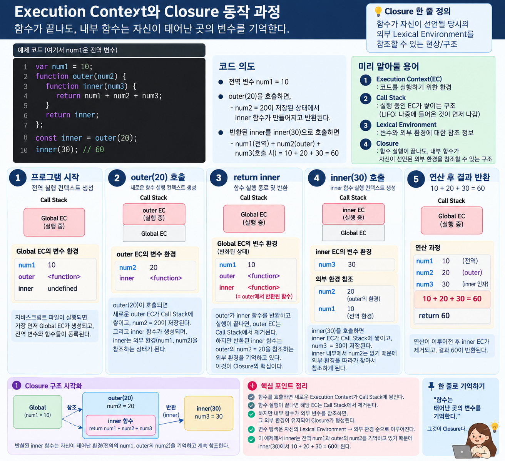
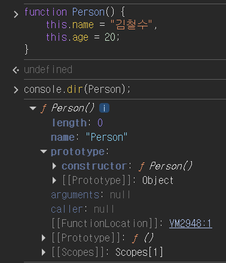

# Frontend - JavaScript 객체 · 함수 · Prototype ⭐⭐⭐

> 📅 DATE: 2026-09-23 Mittwoch  
> 📖 프론트엔드 개발 4장 3강 · 5장 1강 · 5장 2강

<a id="top"></a>

## 😊 SUMMARY

객체 리터럴의 Property 구조를 보충하고, **함수를 값으로 다루는 JavaScript의 특징 → 함수 호출과 Execution Context → Closure**의 흐름을 학습했다.  
이후 객체를 반복 생성하고 기능을 공유하기 위해 **`this` → 생성자 함수 → Prototype Chain → Class**로 확장되는 구조를 이해하고, Property Descriptor와 객체 잠금, JSON 직렬화·복사까지 학습했다.

**Keywords:** `Object Literal`, `Property`, `Function`, `First-class Object`, `Execution Context`, `Call Stack`, `Closure`, `this`, `Constructor`, `Prototype`, `Prototype Chain`, `Class`, `Property Descriptor`, `Getter/Setter`, `Serialization`, `JSON`

---

## 📚 LECTURE NOTE

### 프론트엔드 개발 - JavaScript

#### 1. 객체 리터럴 `{ }`

지난 시간에 이어 객체 리터럴의 구조와 Property 접근 방법을 보충했다.

```javascript
const person = {
    name: "김철수",
    age: 20,
    "my-info": "내 정보..."
};
```

##### 1-1. Key

- 일반적으로 JavaScript 식별자 규칙에 맞는 이름 사용
- 규칙에 맞지 않는 Key도 문자열 형태로 작성 가능
- 이 경우 대괄호 `[]`로 접근

```javascript
person["my-info"]; // "내 정보..."
```

> `person.my-info`는 `"my-info"`라는 하나의 Property 접근으로 해석되지 않는다.

##### 1-2. Value

Property의 Value에는 다양한 값이 들어갈 수 있다.

- **Primitive Type** → Number, String, Boolean, `undefined`, `null` 등
- **Object Type** → 객체, 배열, 함수 등

##### 1-3. Property

```javascript
person.name;        // 조회
person["my-info"];  // 대괄호 접근

person.job = "개발자"; // 추가
person.age = 21;       // 수정
delete person.job;     // 삭제
```

- `.` → 일반적인 Property 접근
- `[]` → 동적인 Key 또는 식별자 규칙에 맞지 않는 Key 접근

> 객체 변수에는 객체 자체가 통째로 들어간다고 보기보다 **객체를 가리키는 참조(Reference)**가 저장된다고 이해하면 이후 Prototype과 객체 복사를 이해하기 쉽다.

---

#### 2. 함수 Function

함수는 특정 동작을 하나의 코드 단위로 묶어 **호출하고 재사용**하기 위한 객체이다.

##### 2-1. 함수 선언

```javascript
function add(num1, num2) {
    return num1 + num2;
}

add(10, 20); // 30
```

- 함수 이름 → `add`
- 매개변수(Parameter) → `num1`, `num2`
- 인수(Argument) → `10`, `20`
- 반환값(Return Value) → `30`

> 함수 이름만 사용하면 함수 객체를 가리키고, `()`를 붙이면 함수를 호출한다.

##### 2-2. 함수는 일급 객체 First-class Object

JavaScript에서는 **함수도 하나의 값처럼 다룰 수 있다.**

따라서 함수를:

- 변수에 할당할 수 있음
- 다른 함수의 인수로 전달할 수 있음 → Callback
- 함수의 반환값으로 사용할 수 있음
- 함수 내부에서 정의할 수 있음

```javascript
const add = function (a, b) {
    return a + b;
};
```

> **일급 객체** → 함수를 다른 값처럼 변수에 저장·전달·반환할 수 있다는 의미.

##### 2-3. 대표적인 함수 정의 방식

```javascript
// 함수 선언문
function add(a, b) {
    return a + b;
}

// 함수 표현식
const subtract = function (a, b) {
    return a - b;
};

// 화살표 함수
const multiply = (a, b) => a * b;

// 메서드 축약 표기
const calculator = {
    divide(a, b) {
        return a / b;
    }
};
```

---

#### 3. 함수 실행과 Execution Context

함수 객체 자체는 **실행할 코드와 정보를 가진 대상**이고, `()`로 호출해야 실제 실행이 시작된다.

```javascript
function outer(num1, num2) {
    return num1 + num2;
}

outer(10, 20); // 30
```

함수가 실행되면 해당 실행에 필요한 정보를 관리하는 **Execution Context(실행 컨텍스트)**가 생성되고 Call Stack에서 관리된다.

```text
프로그램 시작
    ↓
Global Execution Context
    ↓
outer(10, 20) 호출
    ↓
outer Execution Context 생성
    ↓
Call Stack에 Push
    ↓
함수 실행
    ↓
return
    ↓
outer Execution Context Pop
```

> **Call Stack** → 현재 어떤 함수가 실행 중인지 Execution Context를 스택 구조로 관리한다.

---

#### 4. Closure

**Closure**는 외부 함수 실행이 끝난 뒤에도 내부 함수가 자신이 선언될 당시의 외부 Lexical Environment에 접근할 수 있는 구조이다.

```javascript
function outer() {
    let count = 0;

    return function inner() {
        count++;
        return count;
    };
}

const counter = outer();

counter(); // 1
counter(); // 2
```

`outer()` 실행은 끝났지만 `inner()`가 `count`를 계속 참조하고 있으므로 해당 상태를 사용할 수 있다.

 

> 단순히 "자유변수가 속박된다"라고만 외우기보다  
> **내부 함수가 선언 당시의 외부 변수 환경을 기억한다**고 이해하면 된다.

---

<a id="this-prototype"></a>

#### 5. `this`

`this`는 함수가 정의된 위치만으로 항상 결정되는 것이 아니라 **함수가 어떻게 호출되었는지에 따라 참조 대상이 달라질 수 있는 값**이다.

대표적으로 객체의 메서드로 호출하면 호출한 객체를 가리킨다.

```javascript
const person = {
    name: "김철수",

    showName() {
        console.log(this.name);
    }
};

person.showName(); // 김철수
```

생성자 함수에서 `new`와 함께 사용하면 `this`는 **새로 생성되는 인스턴스**를 가리킨다.

> `this`와 Prototype은 오늘 직접 정리한 노트 참고:  
> [이해하고 내 말로 설명하기: this & prototype](https://app.notion.com/p/this-prototype-3e4b0c8b69098050ab78e914937688c6)

##### `call` · `apply` · `bind`

함수의 `this`를 명시적으로 지정할 때 사용할 수 있다.

- `call()` → `this` 지정 후 즉시 호출, 인수를 개별 전달
- `apply()` → `this` 지정 후 즉시 호출, 인수를 배열 형태로 전달
- `bind()` → 지정된 `this`를 사용하는 **새 함수 반환**

---

#### 6. 객체 상속과 Prototype

JavaScript 객체는 **Prototype 기반 상속**을 사용한다.

객체에서 Property나 Method를 찾을 때:

```text
현재 객체에서 찾기
    ↓ 없으면
[[Prototype]]이 가리키는 객체에서 찾기
    ↓ 없으면
상위 Prototype에서 계속 찾기
    ↓
Object.prototype
    ↓
null
```

이 탐색 구조가 **Prototype Chain**이다.

> 모든 객체에 `prototype`이라는 Property가 있는 것은 아니다.  
> 객체는 내부적으로 `[[Prototype]]` 링크를 가지며, 일반 함수는 별도로 `prototype` Property를 가진다.

---

#### 7. 생성자 함수 Constructor Function

같은 구조의 객체를 반복해서 생성하기 위한 함수이다.

관례적으로 첫 글자를 대문자로 작성한다.

```javascript
function Person(name, age) {
    this.name = name;
    this.age = age;
}

const p1 = new Person("김철수", 20);
```

##### `new`를 사용하면

개념적으로 다음 과정이 진행된다.

1. 새로운 객체 생성
2. 새 객체의 `[[Prototype]]`을 `Person.prototype`과 연결
3. 생성자 함수 내부의 `this`가 새 객체를 가리키도록 호출
4. 특별한 객체 반환이 없다면 생성된 객체 반환

```text
new Person(...)
      ↓
새 객체 생성
      ↓
Person.prototype과 연결
      ↓
this = 새 객체
      ↓
Person 실행
      ↓
인스턴스 반환
```



> `Person()`을 그냥 호출했다고 해서 `this`가 항상 `window`가 되는 것은 아니다.  
> 실행 환경과 strict mode 등에 따라 달라지므로 생성자 용도의 함수는 `new Person()`처럼 호출한다.

또한 다음 비교가 정확하다.

```javascript
Person.prototype.constructor === Person; // true
```

`Person()`은 함수 **호출 결과**이므로 `constructor`와 비교하는 대상이 아니다.

---

#### 8. Prototype을 통한 Method 공유 ⭐

생성자 내부에 메서드를 직접 만들면 인스턴스를 생성할 때마다 **새로운 함수 객체**가 만들어진다.

```javascript
function Person(name) {
    this.name = name;

    this.showInfo = function () {
        console.log(this.name);
    };
}
```

공통 기능은 Prototype에 한 번 정의하여 여러 인스턴스가 공유할 수 있다.

```javascript
function Person(name) {
    this.name = name;
}

Person.prototype.showInfo = function () {
    console.log(this.name);
};

const p1 = new Person("김철수");
const p2 = new Person("이영희");

p1.showInfo();
p2.showInfo();

p1.showInfo === p2.showInfo; // true
```

```text
p1 ─┐
    ├──→ Person.prototype ──→ showInfo()
p2 ─┘
```

즉, `p1`과 `p2`는 서로 다른 인스턴스지만 **Prototype의 동일한 Method를 공유**한다.

배열도 같은 원리로 이해할 수 있다.

```javascript
const fruits = [];
const fruits2 = [];

fruits.concat === fruits2.concat; // true
```

두 배열은 서로 다른 객체지만 `concat()`은 Prototype Chain을 통해 **`Array.prototype`의 동일한 메서드**를 사용한다.

> **왜 Prototype을 사용하는가?**  
> 공통 기능을 인스턴스마다 중복 생성하지 않고 **공유하여 재사용**할 수 있기 때문.

---

#### 9. Class

ES6에서 객체 생성과 상속 구조를 더 읽기 쉽게 작성하기 위해 `class` 문법이 도입되었다.

```javascript
class Person {
    constructor(name, age) {
        this.name = name;
        this.age = age;
    }

    showInfo() {
        console.log(this.name, this.age);
    }
}

const p1 = new Person("김철수", 20);
```

Class는 JavaScript의 Prototype 기반 구조를 없앤 것이 아니라 **Prototype 기반 동작을 더 편리하게 작성할 수 있도록 제공하는 문법**이다.

> **Syntactic Sugar** → 기존 동작 원리를 더 편리하고 명확한 문법으로 표현하도록 만든 것.

- `constructor()` → 인스턴스 초기화
- 일반 Method → Prototype을 통해 인스턴스들이 공유
- `static` Method → 인스턴스가 아니라 Class 자체에서 호출

```javascript
class Person {
    static hello() {
        console.log("Hello");
    }
}

Person.hello();
```

상속에서는 `extends`를 사용하고, 자식 Class의 `constructor`에서는 부모 초기화를 위해 `super()`를 호출한다.

```javascript
class Student extends Person {
    constructor(name, age, major) {
        super(name, age);
        this.major = major;
    }
}
```

---

#### 10. Data Property

객체의 Property에는 값뿐만 아니라 **Property의 동작을 결정하는 Descriptor**가 존재한다.

| Descriptor | 의미 |
|---|---|
| `value` | 실제 저장된 값 |
| `writable` | 값 변경 가능 여부 |
| `enumerable` | 열거 가능 여부 |
| `configurable` | 삭제 및 Descriptor 재설정 가능 여부 |

```text
person.name
     │
 Property
     │
 ┌───┼───────────┬──────────────┐
 ↓   ↓           ↓              ↓
value writable enumerable configurable
 값   수정?       열거?          재설정/삭제?
```

Descriptor는 다음과 같이 확인할 수 있다.

```javascript
Object.getOwnPropertyDescriptor(person, "name");
```

Property를 직접 정의하거나 Descriptor를 설정할 때는:

```javascript
Object.defineProperty(person, "name", {
    value: "김철수",
    writable: true,
    enumerable: true,
    configurable: true
});
```

---

#### 11. Accessor Property

값을 직접 저장하는 대신 **Getter / Setter 함수로 Property 접근을 제어**한다.

- `get` → 읽기
- `set` → 쓰기
- `enumerable` → 열거 여부
- `configurable` → 재정의·삭제 가능 여부

```javascript
const person = {
    _name: "김철수",

    get name() {
        return this._name;
    },

    set name(value) {
        this._name = value;
    }
};
```

---

#### 12. IIFE와 Closure를 이용한 상태 은닉

**IIFE(Immediately Invoked Function Expression)**는 정의와 동시에 실행되는 함수 표현식이다.

```javascript
(function () {
    console.log("즉시 실행되나요?");
})(); // 즉시 실행되나요?
```

인수도 전달할 수 있다.

```javascript
(function (n1, n2) {
    console.log(n1, n2);
})(10, 20);
```

Closure와 함께 사용하면 외부에서 직접 접근하기 어려운 상태를 만들 수 있다.

```javascript
const person = (function () {
    let name = "김철수";
    let age = 20;

    return {
        get name() {
            return name;
        },

        set name(value) {
            name = value;
        },

        get age() {
            return age;
        },

        set age(value) {
            age = value;
        }
    };
})();
```

여기서 `name`, `age`는 외부에서 직접 Property로 접근하는 값이 아니라 Closure에 의해 유지되는 변수이고, Getter/Setter를 통해 접근한다.

---

#### 13. 객체 수정 방지를 위한 3단계

| Method | 추가 | 수정 | 삭제 | 의미 |
|---|:---:|:---:|:---:|---|
| `Object.preventExtensions()` | ❌ | ⭕ | ⭕ | 확장 방지 |
| `Object.seal()` | ❌ | ⭕ | ❌ | 구조 변경 방지 |
| `Object.freeze()` | ❌ | ❌ | ❌ | 동결 |

```text
preventExtensions
        ↓
      seal
        ↓
     freeze

제한이 점점 강해짐
```

> `Object.freeze()`도 기본적으로 **Shallow**하므로 중첩 객체까지 자동으로 모두 동결하지는 않는다.

---

#### 14. 직렬화 Serialization

**Serialization**은 메모리에 있는 객체 데이터를 저장하거나 네트워크로 전송할 수 있는 형태로 변환하는 과정이다.

JavaScript에서는 JSON을 많이 사용한다.

```javascript
const person = {
    name: "김철수",
    age: 20
};

const json = JSON.stringify(person);
```

```text
JavaScript Object
       ↓ JSON.stringify()
JSON String
       ↓ JSON.parse()
JavaScript Object
```

- `JSON.stringify()` → JavaScript 값 → JSON 문자열
- `JSON.parse()` → JSON 문자열 → JavaScript 값

JSON에서는 Key를 큰따옴표로 표현한다.

```json
{
    "name": "김철수",
    "age": 20
}
```

> 객체 Property의 함수나 `undefined` 등은 `JSON.stringify()` 과정에서 객체 속성으로 존재할 경우 일반적으로 결과에서 제외된다. `null`은 JSON에서 표현 가능하다.

---

#### 15. 객체 복사

##### 참조 공유

```javascript
const original = {
    name: "김철수"
};

const copy = original;
```

이 경우 새로운 객체를 만든 것이 아니라 **같은 객체를 참조**한다.

```text
original ─┐
          ├──→ Object
copy ─────┘
```

##### 얕은 복사 Shallow Copy

새로운 최상위 객체를 만들지만 **중첩된 객체는 참조를 공유할 수 있다.**

```javascript
const copy = { ...original };
```

> 따라서 단순히 **"주소만 복사 = 얕은 복사"**라고 정의하면 부정확하다.  
> `const copy = original`은 복사라기보다 **동일 객체의 참조 공유**에 가깝다.

##### 깊은 복사 Deep Copy

중첩 객체까지 독립적으로 복사한다.

교안에서는 JSON 직렬화·역직렬화를 이용한 방법을 학습했다.

```javascript
const deepCopy = JSON.parse(JSON.stringify(original));
```

다만 JSON으로 표현할 수 없는 값이나 특수 객체 등이 손실될 수 있으므로 모든 JavaScript 객체에 사용할 수 있는 범용 복사법은 아니다.

---

## 🔗 THIS & PROTOTYPE 정리

오늘 직접 이해하고 작성한 별도 정리:

[**this & prototype - 내 말로 설명하기**](https://app.notion.com/p/this-prototype-3e4b0c8b69098050ab78e914937688c6)

핵심 흐름만 다시 연결하면:

```text
같은 구조의 객체를 여러 개 만들고 싶다
            ↓
       생성자 함수
            ↓
new → 새로운 인스턴스 + this 연결
            ↓
공통 Method까지 인스턴스마다 만들면 중복
            ↓
       prototype에 정의
            ↓
여러 인스턴스가 공통 Method 공유
            ↓
      Prototype Chain
            ↓
ES6 class가 이를 더 편리한 문법으로 표현
```

[⬆️ 처음으로](#top)