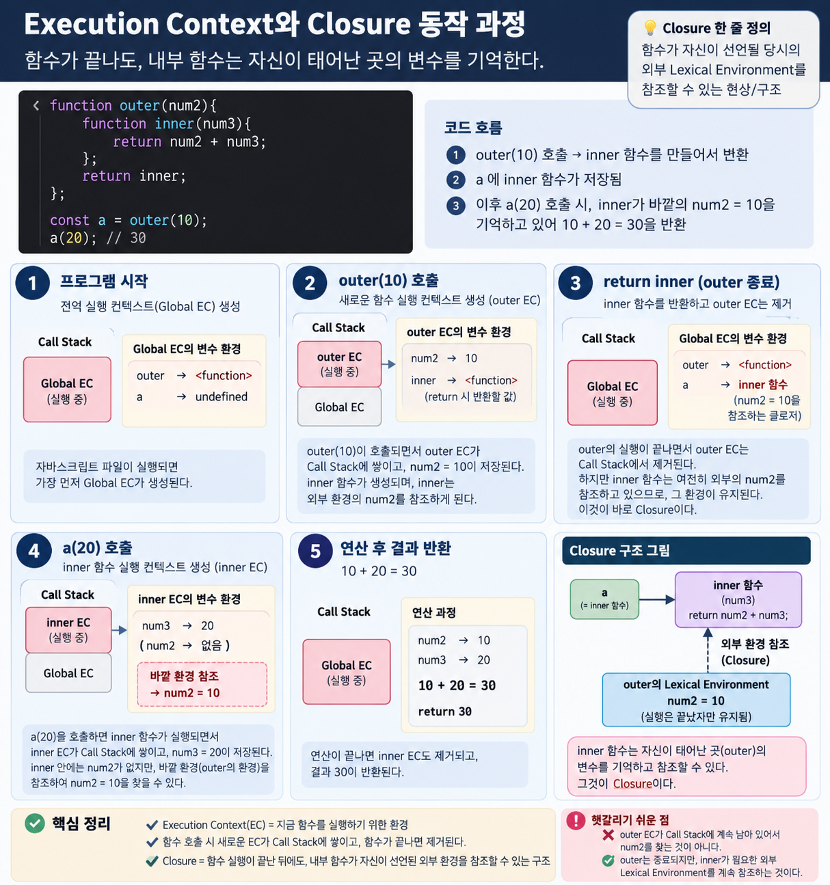

# Frontend - JavaScript 기초 문법 & 함수 ⭐⭐⭐

> 📅 DATE: 2026-09-23 Mittwoch  
> 📖 프론트엔드 개발 4장 3강 , 5장 1강

<a id="top"></a>

## SUMMARY


**Keywords:** 


---

## LECTURE NOTE

### 프론트엔드 개발 - 자바스크립트

#### 1. 객체 리터럴 `{ }`

(지난 시간에 이어서 보충하기)
```
{ 
    key : value,
    key : value,
    key : value
    }
```
1. key
- 변수명 규칙
- 규칙 외 형태는 따옴표로 감싸서 사용은 가능함. 단, 마침표 연산자로 내부 속성에 접근 불가능. 대괄호 연산자만 가능.
```
const person = {
    name: "김철수",
    age: 20,
    `my-info`: "내 정보..."
};

person.my-info -> x
person['my-info'] -> o "내 정보..." 
```

2. value
- 원시타입 값 : 재료가 되는 값 (숫자, 문자, 논리값, undefined, null, 등등)
- 객체타입 값 : 원시 타입 외 모든 타입의 객체 (함수 등; 키-값 쌍 형태로 되어 있음)

3. property (속성)
- 속성 접근하기: 
    1. 마침표(`.`) 연산자 : 속성명이 변수명 규칙을 따르는 경우
    2. 대괄호(`[]`) 연산자 : 속성명이 변수명 규칙을 따르지 **않은** 경우
- 속성 추가하기: 새로운 속성명으로 값을 대입
- 속성 수정하기: 이미 있는 속성의 값을 대입
- 속성 삭제하기: `delete 객체참조변수.속성명`

* heap과 stack : stack의 변수명으로 heap의 함수나 변수 값을 사용할때 참조함...?

#### 2. 함수

1. function 선언자
```
function 함수명 (매개변수, ...) {
    //수향할 코드;
    return 반환값;
};
```
- 함수명 : 함수 객체의 이름표 (변수와 같음!)

> 1급 객체 : 변수와 함수를 동등하게 대하겠다. 즉 함수를 값으로 쓰임. 매개변수나 반환값... 함수 안에 함수를 정의할 수  있은 이유는 변수와 동등한 형태로 보기 때문에 함수 안의 함수는 지역변수와 동일하다.

2. 함수의 실행 평가 과정
- 실행 가능한 객체로 함수를 번역하는 과정
- `EC (Execution Context; 실행 문맥) 객체`
```
function outer(num1, num2){
    return num1 + num2;
};
 > undefined

outer(10,20);
 > 30
```
- 함수 자체는 객체로 `명세서`에 불과함. (function outer(...){...};)
- 함수에 인수(argument)를 넣어서 실행 명령을 넣는다. (outer(10,20);)
- 그러면 평가 후 `outer EC` 생성 -> 실행 -> 스택영역(call stack) global EC위에 outer EC 생김. 
- 실행 종료 후 outer EC는 스택 영역에서 제거됨.

#### 3. Closure : 자유변수가 함수 내에서 접근하여 속박되는 현상
- Execution Context와 Closure 동작 과정
 

#### 4. this
1. 

#### 5. 객체 상속
1. 프로토타입 (prototype) 기반 객체간의 상속 (**프로토타입 체인**)
- 모든 객체에는  프로토타입이라는 속성?이 존재함 : 객체의 상속 관계를 보여줌
- 가장 상위 객체는 Object (최종 수렴)

2. 생성자 함수
- 파이썬의 클래스처럼 객체를 생성하기 위해 쓰는 함수: **생성자 함수**
- 네이밍 관례 : 첫글자를 대문자
- new 연산자

```
function Person() {
    this.name = "김철수",
    this.age = 20;
}

Person();
```
- 위 함수를 실행시키면 this는 window가 된다. 왜냐, 저 함수는 쉽게 말해 name과 age 변수를 선언하는 것이고 그건 결국 window객체 생성이기 때문
- 만약 위 함수를 변수에 할당을 해주면 this는 해당 변수 하에서 설정된다. 
```
p1 = Person();
```
- 이런 경우 this.name은 p1.name으로 생성된다.

3. 생성자 함수가 객체를 생성하는 과정 (new ...)
    1. 생성자 함수의 prototype 객체 상속
    2. 생성자 함수의 this를 생성된 객체의 주소로 변경(`값 할당`)하고 호출
    
    `prototype` 속성 아래 `[[Prototype]]: Object`는 상속 상태를 보여주는 **체인**, `constructor`는 **초기화** 작업을 하는 속성이다. 

    ```
    Person.prototype.constructor === Person(); //true
    ```

**함수 리터럴**
> this.showInfo = function () {...}; //함수 리터럴 방식; 함수명을 앞으로 빼서 선언함

4. **생성자.prototype.메서드**
- 객체가 생성이 되면 공유하는 메서드 (**인스턴스 메서드**)
5. 생성자 메서드
- 객체의 생성 없이 공유하는 메서드 (**정적 메서드**)

> 자원 낭비, 메모리 낭비를 예방하기 위해 상속 활용
> ES5 까지 쓰던 내용, 이제 ES6 그리고 ES6+

함수 내부의 this 주체를 런타임에 인위적으로 결정하고 싶을 때 사용
- call 메서드
- apply 메서드
- bind 메서드

#### 6. 클래스?
매서드 단축 표기법

클래스는 실질적으로 없지만 생성자 함수에 약간 설탕을 뿌려서 클래스처럼 사용 가능(?)

#### 7. 데이터 프로퍼티 (Data Property)

객체의 property에는 값뿐만 아니라
property의 동작을 결정하는 descriptor가 존재한다.

① value
→ 실제 저장된 값

② writable
→ value 변경 가능 여부

③ enumerable
→ 열거 가능 여부
→ false이면 Object.keys(), for...in 등의
   열거 대상에서 제외됨
→ 단, 직접 접근이 막히는 것은 아님

④ configurable
→ property descriptor 재설정 및 삭제 가능 여부
→ false이면 삭제 불가 + 대부분의 descriptor 변경 제한

```
            person.name
                 │
       ┌─────────┴─────────┐
       │    Property       │
       └─────────┬─────────┘
                 │
     ┌───────────┼───────────┐
     ↓           ↓           ↓
   value      writable   enumerable   configurable
     │           │           │             │
   값은?      바꿀까?     목록에?       설정/삭제?
```

#### 8. 접근자 프로퍼티
- get 함수 : 읽기
- set 함수 : 쓰기
- enuerable : 열거 가능여부
- configurable : 재정의 가능

- 즉시 실행 함수
```
(function()) {
    console.log("즉시 실행되나요?");
}(); //즉시 실행되나요?
```

```
(function(n1,n2) {
    console.log("즉시 실행되나요?", n1, n2);
})(10,20); //즉시 실행되나요? 10 20
```

```
const person = (function() {
    let name = "김철수";
    let age = 20;

    return {
        get name() {
            return name;
        },
        set name(value) {
            name = value;
        },
        get age() {
            return age;
        },
        set age() {
            age = value;
        }
    }

})();
```
- property에 `(...)`으로 표기되거나 get, set이 정의되어 있음 - 은닉되어서 바로 접근은 불가능함을 알 수 있다.

#### 객체 수정 방지를 위한 3단계 잠금 메서드

1. Object.seal(...); : 객체 밀봉
    - 조회와 수정 가능 (추가, 삭제 불가)
    - 즉, 구조 변경 방지

2. Object.freeze(...); : 객체 동결
    - 조회만 가능 (추가, 삭제, 수정 불가)
    - 즉, 모든 수정 방지

2. Object.preventExtensions(...) 적용 -> 속성 추가 방지

#### 직렬화 (serialization)
- 전송 가능한 형태로 변환 (문자열)
(JSon 문자열)
- 함수, undefined -> 변환 불가
- null

JSON 객체
- 자바스크립트 객체 JSON 문자열(직렬화)
- JSON 문자열에서  
JS객체 (역직렬화)
>parse(...)

#### 복사
- 주소만 복사 = 얕은 복사
- 새로운 객체 메서드 생성 = 깊은 복사
```

```

