# Frontend - JavaScript 함수 · 내장 객체 · Array ⭐⭐⭐

> 📅 DATE: 2026-09-29 Dienstag  
> 📖 프론트엔드 개발 4장 3강 · 5장 1강

<a id="top"></a>

## 🗂️ CONTENTS

1. [함수의 매개변수와 인수](#function-params)
2. [일급 객체와 Callback](#first-class)
3. [화살표 함수](#arrow-function)
4. [명시적 this 바인딩](#this-binding)
5. [JavaScript 객체의 종류](#js-object)
6. [Wrapper Object와 주요 내장 객체](#wrapper-object)
7. [Symbol](#symbol)
8. [Array](#array)
9. [추가 개념](#additional)
10. [Exercise & More](#exercise)

## 🧭 오늘의 전체 흐름

```text
[ 함수 ]
매개변수와 인수
   │
   ├─ Default Parameter
   ├─ arguments ─────── ES5
   ├─ Rest Parameter ── ES6+
   └─ Destructuring
           ↓
     함수도 값이다
           ↓
      일급 객체
   ┌───────┼────────┐
   ↓       ↓        ↓
 변수 할당  인수 전달  반환값
           ↓
        Callback
           ↓
      Arrow Function
           ↓
  this / call·apply·bind


[ 객체 ]
JavaScript Object
   │
   ├─ Native Object ── JS 자체 제공
   ├─ Host Object ──── 실행 환경 제공
   └─ User-defined ─── 개발자가 생성
           ↓
 String · Number · Boolean
 JSON · Math · Symbol
           ↓
         Array
           ↓
     Prototype 기반 객체
           ↓
 추가 · 삭제 · 변환 · 조회
           ↓
 원본 변경 여부 구분
 Mutator / Accessor / Iteration
```

## 😊 SUMMARY

함수에서는 **기본 매개변수 → `arguments` → Rest Parameter**로 이어지는 인수 처리 방법을 배우고, 함수를 값처럼 사용할 수 있는 **일급 객체 → Callback → Arrow Function**의 흐름을 학습했다.

객체에서는 JavaScript가 제공하는 **Native / Host / User-defined Object**를 구분하고 `String`, `Number`, `Boolean`, `Symbol`, `JSON`, `Math`를 살펴본 뒤, 대표적인 Native Object인 **Array의 생성 → Prototype → 요소 조작 → 주요 Method → 원본 변경 여부**를 학습했다.

**Keywords:** `Default Parameter`, `arguments`, `Rest Parameter`, `Destructuring`, `First-class Object`, `Callback`, `Arrow Function`, `this Binding`, `Native Object`, `Wrapper Object`, `Symbol`, `Array`, `Prototype`, `Mutator`, `Accessor`, `Iterator`

---

<a id="function-params"></a>

## 📚 LECTURE NOTE

### 1. 매개변수와 인수

#### 1-1. 기본 매개변수 Default Parameter

매개변수에 `=`을 사용하여 인수가 전달되지 않았을 때 사용할 기본값을 지정한다.

```javascript
function add(param1, param2 = 10) {
    return param1 + param2;
}

add(5);     // 15
add(5, 20); // 25
```

- 기본값이 있는 매개변수는 일반적으로 뒤쪽에 배치
- 전달된 값이 있으면 전달값 사용
- 전달되지 않으면 기본값 사용

---

#### 1-2. `arguments` 객체 — ES5 방식

JavaScript 함수는 선언된 매개변수 개수보다 더 많은 인수를 전달해도 호출할 수 있다.

```javascript
function test(a) {
    console.log(arguments);
}

test(10, 20, 30);
```

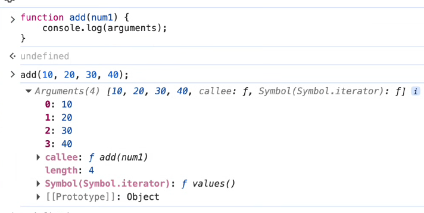

- `arguments` → 전달된 모든 인수를 담는 **유사 배열(Array-like Object)**
- 실제 `Array`는 아님
- 인수 개수를 미리 정하기 어려운 경우 사용
- 주로 ES5에서 사용하던 방식

> 일반 함수에서는 `arguments`를 사용할 수 있지만, **화살표 함수는 자신의 `arguments`를 생성하지 않는다.**

---

#### 1-3. 나머지 매개변수 Rest Parameter — ES6+

현대 JavaScript에서는 가변 인수를 받을 때 `arguments` 대신 Rest Parameter를 사용할 수 있다.

```javascript
function add(...params) {
    console.log(params);
}

add(10, 20, 30); // [10, 20, 30]
```

`...params`는 남은 인수들을 **실제 Array**로 모아준다.

```text
arguments  → ES5  / 유사 배열
...params  → ES6+ / 실제 배열
```

> Python의 `*args`와 비교하면 이해하기 쉽다.

`...`는 위치에 따라 역할이 달라진다.

```text
함수 매개변수 위치
...params
→ Rest Parameter
→ 여러 값을 모음

배열·객체 등을 사용하는 위치
...value
→ Spread Syntax
→ 값을 펼침
```

---

#### 1-4. 구조 분해 할당 Destructuring Assignment

배열이나 객체의 구조를 분해하여 필요한 값을 변수에 할당하는 문법이다.

```javascript
const [a, b] = [10, 20];

const person = {
    name: "김철수",
    age: 20
};

const { name, age } = person;
```

배열에서 필요 없는 위치는 비워서 건너뛸 수 있다.

```javascript
const [first, , third] = [10, 20, 30];
```

> `_`는 JavaScript에서 특별한 건너뛰기 문법이 아니라 일반 변수명이다.  
> 배열 구조 분해에서 실제로 값을 건너뛰려면 `, ,`처럼 자리를 비운다.

[⬆️ 처음으로](#top)

---

<a id="first-class"></a>

### 2. 일급 객체와 Callback

JavaScript의 함수는 **일급 객체(First-class Object)**이므로 다른 값처럼 다룰 수 있다.

#### 일급 객체로서 함수의 3가지 특징

```text
             Function
                │
      ┌─────────┼─────────┐
      ↓         ↓         ↓
 Assignment   Argument   Return
 변수에 할당   인수로 전달   반환값 사용
                │
                ↓
             Callback
```

1. **변수에 할당 (Assignment)**
2. **함수의 인수로 전달 (Argument Passing)**
3. **함수의 반환값으로 사용 (Return Value)**

```javascript
const hello = function () {
    console.log("Hello");
};
```

#### Callback Function

다른 함수에 **인수로 전달되는 함수**를 Callback Function이라고 한다.

```javascript
function execute(callback) {
    callback();
}

execute(function () {
    console.log("실행!");
});
```

> Python의 `map()`, `filter()`에 함수를 전달하는 것과 비교해서 이해할 수 있다.

---

<a id="arrow-function"></a>

### 3. 화살표 함수 Arrow Function `=>`

ES6에서 도입된 간결한 함수 표현 방식이다.

```javascript
// 일반 함수
const add = function (a, b) {
    return a + b;
};

// 화살표 함수
const add2 = (a, b) => a + b;
```

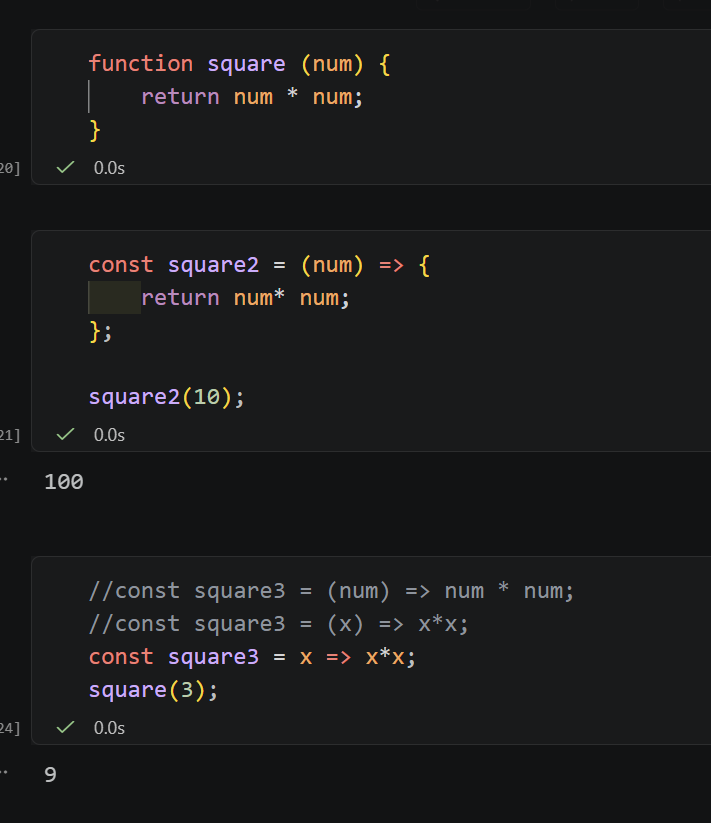

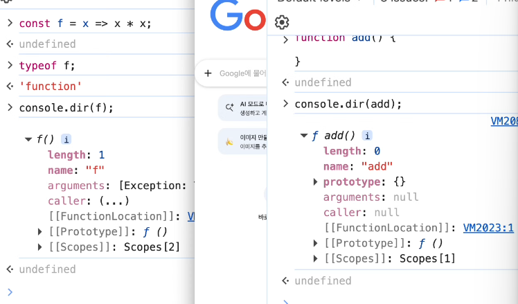

#### 기본 규칙

- `function` 키워드 생략
- 매개변수와 실행부 사이에 `=>`
- 매개변수 1개 → `()` 생략 가능
- 매개변수 0개 또는 2개 이상 → `()` 필요
- 실행 부분이 하나의 표현식이면 `{}`와 `return` 생략 가능

```javascript
const square = x => x * x;
```

> `{}`를 사용했다면 값을 반환하기 위해 `return`을 직접 작성해야 한다.

#### 일반 함수와의 차이

화살표 함수는:

- 자신의 `this`가 없음 → 바깥 Lexical Scope의 `this` 사용
- 자신의 `arguments`가 없음
- 생성자 함수로 사용할 수 없음
- `prototype` Property가 없음

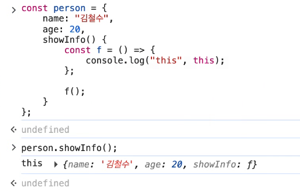

화살표 함수의 `this`는 호출 시 새롭게 바인딩되는 것이 아니라 **자신을 둘러싼 Scope의 `this`를 사용**한다.

#### 고차 함수 Higher-order Function

함수를 인수로 받거나 함수를 반환하는 함수를 **고차 함수**라고 한다.

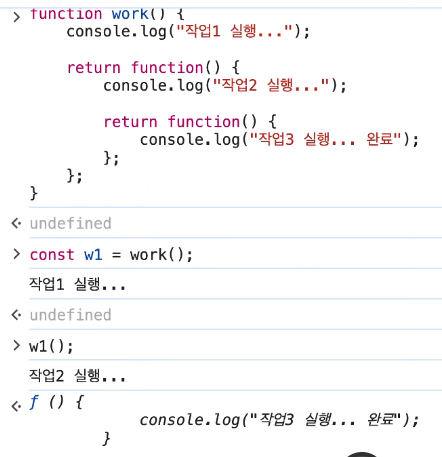

```javascript
const add = x => y => z => x + y + z;

add(10)(20)(30); // 60
```

```text
add(10)
   ↓ 함수 반환
(20)
   ↓ 함수 반환
(30)
   ↓
60
```

---

<a id="this-binding"></a>

### 4. 명시적 `this` 바인딩

일반 함수의 `this`를 개발자가 원하는 객체로 명시적으로 지정할 수 있다.

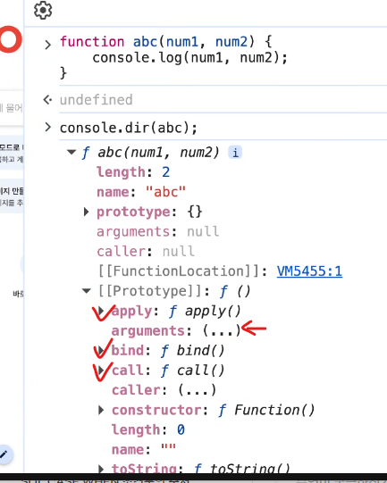

| Method | 실행 | 인수 전달 |
|---|---|---|
| `call()` | 즉시 실행 | 개별 인수 |
| `apply()` | 즉시 실행 | 배열/유사 배열 |
| `bind()` | 실행 X | `this`가 고정된 새 함수 반환 |

```javascript
function introduce(greeting) {
    console.log(greeting, this.name);
}

const person = { name: "김철수" };

introduce.call(person, "Hello");
introduce.apply(person, ["Hello"]);

const bound = introduce.bind(person);
bound("Hello");
```

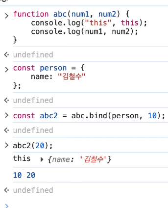

> 문서에서 `[value]`처럼 대괄호로 표시된 매개변수는 일반적으로 **선택적(Optional) 매개변수**를 의미한다.

[⬆️ 처음으로](#top)

---

<a id="js-object"></a>

### 5. JavaScript 객체의 종류

```text
JavaScript Object
│
├─ Native Object
│   └─ JavaScript 자체에서 제공
│
├─ Host Object
│   └─ Browser / Node.js 등 실행 환경에서 제공
│
└─ User-defined Object
    └─ 개발자가 직접 생성
```

#### 5-1. Native Object

JavaScript 언어 자체에서 제공하는 표준 객체.

- `Object`
- `String`✅
- `Number`✅
- `Boolean`✅
- `Function`
- `Date`
- `Error`
- `RegExp`
- `Array` ⭐
- `Symbol`
- `JSON`
- `Math`

#### 5-2. Host Object

Runtime Environment에서 제공하는 객체.

- Browser → `window`, `document`, DOM 등
- Node.js → Node.js 환경에서 제공하는 API 등

#### 5-3. User-defined Object

개발자가 직접 만든 객체.

```javascript
const person = {
    name: "김철수"
};
```

---

<a id="wrapper-object"></a>

### 6. Wrapper Object와 주요 내장 객체 ✅

#### 6-1. Wrapper Object

`String`, `Number`, `Boolean` 등의 원시값은 객체가 아니지만 Property나 Method에 접근할 때 JavaScript가 **일시적으로 대응하는 Wrapper Object처럼 처리**한다.

```javascript
let str = "abc";

str.toUpperCase(); // "ABC"
```

```text
"abc" 원시값
    ↓ Method 사용
일시적으로 Wrapper처럼 처리
    ↓
String 기능 사용
    ↓
결과 반환
```

---

#### 6-2. String

문자열 관련 기능을 제공한다.

```javascript
"hello".toUpperCase(); // "HELLO"
```

---

#### 6-3. Number

```javascript
Number("123");   // 123
Number("hello"); // NaN

parseInt("10.5");   // 10
parseFloat("10.5"); // 10.5
```

`NaN`은 **Not-a-Number**이지만 JavaScript에서는 Number 타입에 속하는 특수값이다.

```javascript
typeof NaN; // "number"
```

전역 `isNaN()`은 먼저 숫자 변환을 시도한다.

```javascript
isNaN("123"); // false
```

실제 값이 `NaN`인지 더 엄격하게 확인할 때는:

```javascript
Number.isNaN(value);
```

---

#### 6-4. Boolean

값을 Boolean으로 변환한다.

```javascript
Boolean(1);  // true
Boolean(0);  // false
Boolean(""); // false
```

---

#### 6-5. JSON

```javascript
JSON.stringify(object); // JS → JSON 문자열
JSON.parse(json);       // JSON 문자열 → JS
```

---

#### 6-6. Math

| Method | 기능 |
|---|---|
| `Math.abs()` | 절댓값 |
| `Math.sqrt()` | 제곱근 |
| `Math.round()` | 반올림 |
| `Math.floor()` | 내림 |
| `Math.ceil()` | 올림 |
| `Math.trunc()` | 소수 부분 제거 |

---

<a id="symbol"></a>

### 7. Symbol

`Symbol()`은 **고유한 Primitive 값**을 생성한다.

```javascript
const id1 = Symbol("id");
const id2 = Symbol("id");

id1 === id2; // false
```

객체의 Property Key가 다른 Key와 충돌하지 않도록 만들 때 활용할 수 있다.

JavaScript에는 언어 내부 동작을 정의하기 위한 **Well-known Symbol**도 있다.

```javascript
Symbol.iterator
```

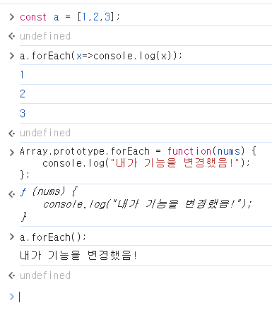

> `Symbol`은 확장 가능한 객체 구조에서 **Property Key의 이름 충돌 위험을 줄이고 특정 내부 동작을 연결하는 Key**로 활용된다.

[⬆️ 처음으로](#top)

---

<a id="array"></a>

## 🔎 Array

### 8. Array 전체 흐름

```text
Array 생성
   ↓
[] / new Array()
   ↓
Array 객체
   ↓
Array.prototype 상속
   ↓
Index + length
   ↓
요소 조작
┌────┼─────┬────┐
추가  삭제   변환  조회
   ↓
Method 사용
   ↓
원본 변경 여부 확인 ⭐
   ↓
Mutator / Accessor / Iteration
   ↓
Iterator → for...of
```

---

### 9. Array 기본 구조

JavaScript의 Array는 **특수한 객체**이며 여러 값을 순서대로 관리하는 Collection이다.

```javascript
const arr = [10, "hello", true, { name: "김철수" }];
```

JavaScript 배열에는 서로 다른 타입의 값을 함께 저장할 수 있다.

> 일반적인 저수준 언어의 **같은 자료형 + 연속된 메모리 공간** 형태의 배열과 JavaScript Array를 완전히 동일하게 이해하면 안 된다.

---

### 10. Array 생성

#### 생성자 함수

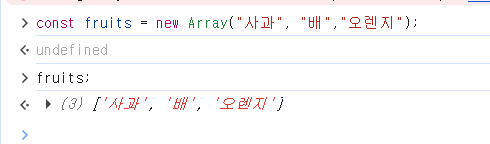

```javascript
new Array();
new Array(3);       // length가 3인 빈 배열
new Array(1, 2, 3); // [1, 2, 3]
```

- 숫자 인수 1개 → 배열의 `length`
- 인수 여러 개 → 각각 배열의 요소

일반적으로는 배열 리터럴 `[]` 사용을 권장한다.

```javascript
const arr = [1, 2, 3];
```

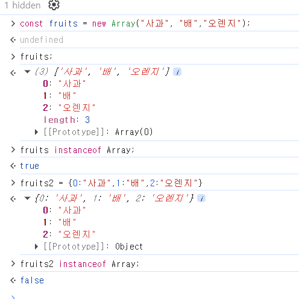

---

### 11. Array와 Prototype

배열 객체는 `Array.prototype`을 상속한다.

```text
Array Instance
      ↓
Array.prototype
      ↓
Object.prototype
      ↓
null
```

`instanceof`는 Prototype Chain에 해당 생성자의 `prototype`이 존재하는지 확인한다.

```javascript
const arr = [];

arr instanceof Array; // true
```

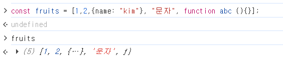

인덱스와 `length`가 있다고 해서 반드시 Array인 것은 아니다.

```javascript
const obj = {
    0: "A",
    1: "B",
    length: 2
};

obj instanceof Array; // false
```

배열 여부 자체를 확인할 때는:

```javascript
Array.isArray(arr); // true
```

---

### 12. Index와 `length`

```javascript
const arr = [10, 20, 30];

arr[0];     // 10
arr.length; // 3
```

배열은 Index를 Property Key처럼 관리하며 `length`라는 특별한 Property를 가진다.

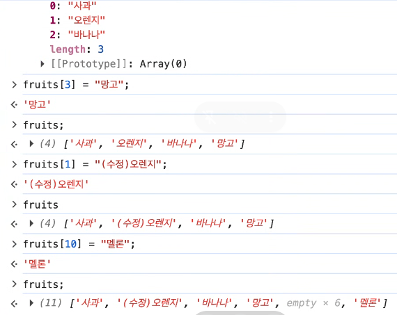

```javascript
const arr = [1, 2, 3];

arr[10] = 100;
```

중간 값을 채우지 않고 먼 Index에 값을 넣으면 **Empty Slot**이 생길 수 있다.

---

### 13. `delete`와 Array

```javascript
const arr = [10, 20, 30];

delete arr[1];
```

`delete`는 Property를 제거하지만 Array의 Index를 재정렬하거나 `length`를 자동으로 줄이지 않는다.

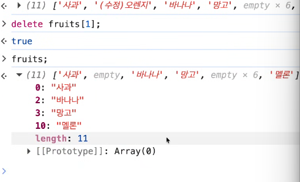

따라서 배열 요소 삭제에는 일반적으로 `delete`보다 `splice()` 등을 사용한다.

---

### 14. Array 주요 Method ⭐

#### 14-1. 추가 · 삭제

| Method | 기능 |
|---|---|
| `push()` | 끝에 추가 |
| `unshift()` | 앞에 추가 |
| `pop()` | 끝 요소 제거 후 반환 |
| `shift()` | 앞 요소 제거 후 반환 |
| `splice()` | 지정 위치에서 삭제·추가 |

```javascript
arr.splice(시작Index, 삭제개수, ...추가요소);
```

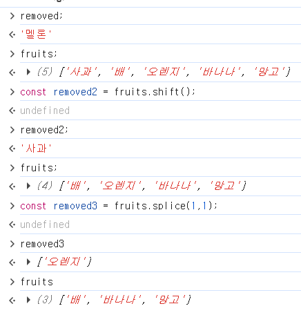

> 위 Method들은 **원본 배열을 직접 변경(Mutation)**한다.

---

#### 14-2. 변환 · 필터링

**`map()`**

각 요소를 Callback으로 변환하여 새로운 배열을 반환한다.

```javascript
const nums = [1, 2, 3];

const doubled = nums.map(x => x * 2);
// [2, 4, 6]
```

**`filter()`**

조건을 만족하는 요소만 모아 새로운 배열을 반환한다.

```javascript
const result = nums.filter(x => x >= 2);
// [2, 3]
```

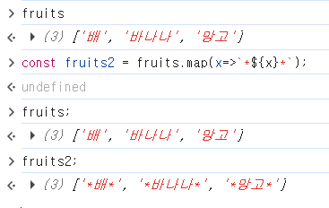

---

#### 14-3. 조회 · 반복

- `forEach()` → 각 요소를 순회하며 Callback 실행
- `indexOf()` → 앞에서부터 값의 Index 검색
- `lastIndexOf()` → 뒤에서부터 검색
- `find()` → 조건을 만족하는 첫 번째 요소
- `findIndex()` → 조건을 만족하는 첫 번째 요소의 Index
- `every()` → 모든 요소가 조건을 만족하는지 확인
- `some()` → 하나 이상의 요소가 조건을 만족하는지 확인

> `every()`는 Python의 `all()`과 비슷한 역할로 이해할 수 있다.

---

### 15. 원본 변경 여부 구분 ⭐

Array Method를 사용할 때는 **원본을 변경하는지** 확인하는 것이 중요하다.

| 원본 변경 | 원본 유지 |
|---|---|
| `push()` | `slice()` |
| `pop()` | `concat()` |
| `shift()` | `map()` |
| `unshift()` | `filter()` |
| `splice()` | `toSpliced()` |
| `sort()` | `toSorted()` |
| `fill()` |  |

교안의 분류 기준:

```text
Array Method
│
├─ Mutator Method
│   └─ 원본 배열 변경
│
├─ Accessor Method
│   └─ 원본을 변경하지 않고 결과 반환
│
└─ Iteration Method
    └─ Callback으로 요소 순회·처리
```

> `map()`과 `filter()`는 원본을 변경하지 않는 **Iteration Method**이며 새로운 배열을 반환한다.

---

### 16. Iterator와 `Symbol.iterator`

Array는 반복 가능한 객체 **Iterable**이다.

```javascript
const arr = [10, 20, 30];

for (const value of arr) {
    console.log(value);
}
```

배열은 다음 기능을 통해 Iterator를 제공한다.

```javascript
arr[Symbol.iterator]()
```

```text
Array
  ↓
Symbol.iterator
  ↓
Iterator
  ↓
next()
  ↓
요소를 순차적으로 접근
  ↓
for...of
```

[⬆️ 처음으로](#top)

---

<a id="additional"></a>

## ➕ 추가 개념

### 17. `in` 연산자

객체에 해당 Property Key가 존재하는지 확인한다.

```javascript
const person = {
    name: "김철수"
};

"name" in person; // true
```

배열에서도 Index는 Property Key이므로 사용할 수 있다.

```javascript
0 in ["A", "B"]; // true
```

---

### 18. 계산된 Property Key

변수의 값을 객체의 Key로 사용할 수 있다.

```javascript
const key = "name";

const person = {
    [key]: "김철수"
};

console.log(person.name); // 김철수
```

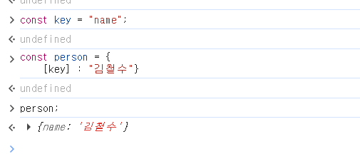

`[]`를 사용하면 변수나 표현식의 **평가 결과를 Property Key로 사용**할 수 있다.

---

### 19. 전역 객체 Global Object

실행 환경에 따라 전역 객체가 다르다.

```text
Browser → window
Node.js → global

공통 접근 → globalThis
```

---

### 20. Map · Set

JavaScript에는 `Map`과 `Set`이라는 Collection도 존재한다.

- `Map` → Key-Value 형태로 데이터 관리
- `Set` → 중복되지 않는 값의 집합

```javascript
const set = new Set([1, 1, 2, 3]);

console.log(set); // Set(3) {1, 2, 3}
```

> JavaScript `Set`은 값의 중복을 허용하지 않으며 **삽입 순서를 유지한다.**

---

## ⭐ 추가로 확인할 것

### String & Array

**Prototype Method**

```javascript
arr.map();
arr.filter();
arr.push();
```

→ 생성된 인스턴스에서 사용

**Static Method**

```javascript
Array.isArray();
Array.of();
```

→ `Array` 생성자 자체에서 사용

### JSON & Math

각 객체에서 제공하는 주요 Method도 추가로 확인하기.

---

<a id="exercise"></a>

## 🧪 EXERCISE & MORE

### 실습

- 프론트엔드 개발 **4장 3강**
- 프론트엔드 개발 **5장 1강**

### DAILY QUEST

1. **원본 배열을 직접 변경하는 Method와 그렇지 않은 Method의 분류는?**  
   → `splice`, `push`, `pop` 등은 **수정 메서드(Mutator Method)**로 원본을 변경한다. `slice`, `concat` 등은 **접근자 메서드(Accessor Method)**이며, `map`, `filter` 등은 원본을 변경하지 않는 **반복 메서드(Iteration Method)**이다.

2. **함수 실행이 끝났는데도 지역 변수가 사라지지 않는 경우는?**  
   → 반환된 내부 함수가 외부 함수의 변수를 계속 참조하면 해당 환경이 유지되는 **Closure**가 발생한다. 이를 이용해 외부에서 직접 접근하기 어려운 상태를 관리할 수 있다.

3. **`call`, `apply`, `bind`는 `this`를 변경할 수 없는가?**  
   → ❌ 아니다. 세 Method 모두 일반 함수의 `this`를 명시적으로 지정할 수 있다.
   - `call()` → 개별 인수 + 즉시 실행
   - `apply()` → 배열/유사 배열 인수 + 즉시 실행
   - `bind()` → `this`를 지정한 새 함수 반환

---

## 🧠 오늘의 핵심 연결

```text
① 함수에 여러 값을 어떻게 받지?
   → Default / arguments / Rest

② 함수 자체를 값처럼 쓸 수 있나?
   → First-class Object

③ 함수를 다른 함수에 넘기면?
   → Callback

④ 더 짧게 함수를 표현하면?
   → Arrow Function

⑤ JavaScript가 기본 제공하는 객체는?
   → Native Object

⑥ 원시값인데 어떻게 Method를 쓰지?
   → Wrapper Object

⑦ 여러 값을 순서대로 관리하려면?
   → Array

⑧ Array의 기능은 어디서 오지?
   → Array.prototype

⑨ Array Method 사용 시 무엇을 확인하지?
   → 원본 변경 여부 ⭐
```

> **오늘의 큰 흐름:**  
> `함수를 유연하게 다루는 방법` → `JavaScript가 제공하는 객체 이해` → `Array를 객체·Prototype 관점에서 이해하고 활용`

[⬆️ 처음으로](#top)