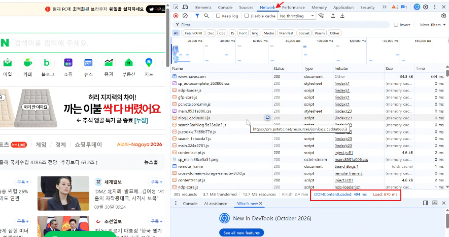
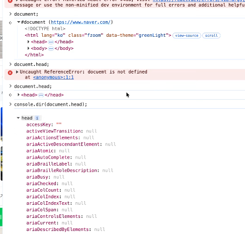
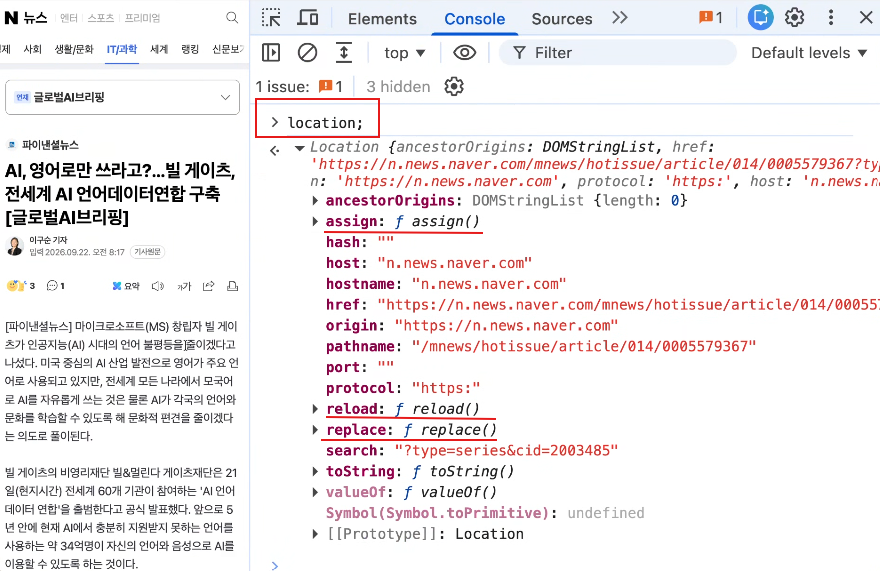
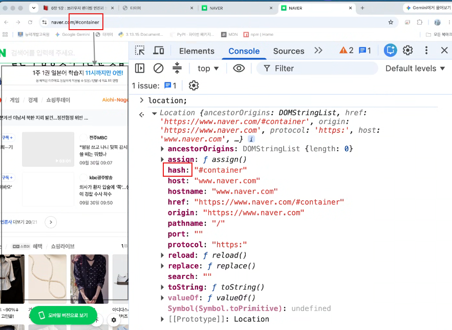
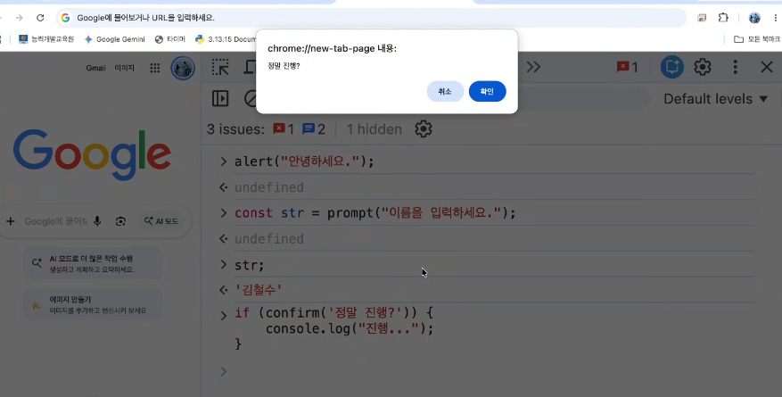
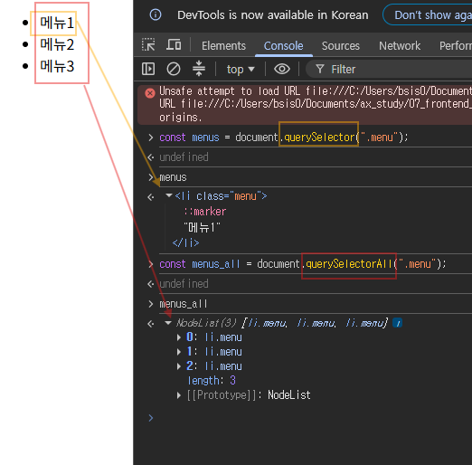
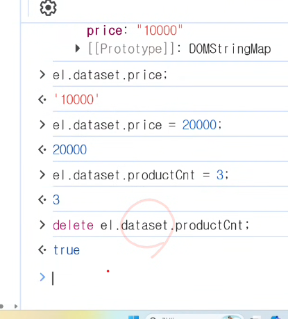
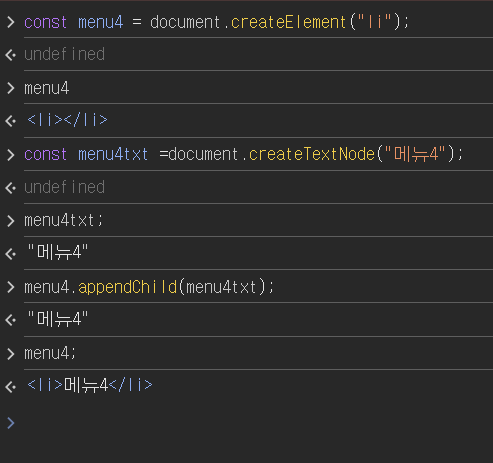
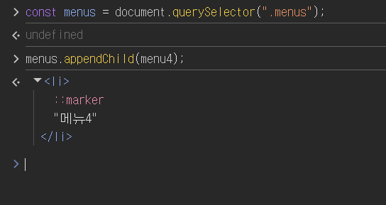

# Frontend - Browser Object Model(BOM) & DOM 제어 ⭐⭐⭐

> 📅 DATE: 2026-09-30 Mittwoch  
> 📖 프론트엔드 개발 6장 1강 · 6장 2강(4번까지)

<a id="top"></a>

## 🗂️ CONTENTS

1. [웹 화면이 만들어지는 과정](#browser-rendering)
2. [브라우저 객체 모델 BOM](#bom)
3. [Document와 DOM Tree](#dom)
4. [DOM 요소 선택과 탐색](#dom-select)
5. [HTML Attribute와 내용 제어](#attribute)
6. [DOMContentLoaded와 Script 실행](#dom-loaded)
7. [Node 생성 · 삽입 · 삭제](#node-control)
8. [Exercise & More - Daily Quest](#exercise)

---

## 🧭 오늘의 전체 흐름

```text
서버의 HTML 응답
      ↓
브라우저가 HTML Parsing
      ↓
Document 객체 + DOM Tree 생성
      ↓
화면 Rendering
      ↓
JavaScript에서 Document 접근
      ↓
DOM 요소 선택
      ↓
Attribute · 내용 · Node 조작
      ↓
사용자가 보는 화면을 동적으로 변경
```

브라우저 자체의 기능은 `window`를 중심으로 여러 객체가 제공한다.

```text
Window
  │
  ├─ document   → HTML 문서 / DOM ⭐
  ├─ location   → 현재 URL / 페이지 이동
  ├─ history    → 방문 기록
  ├─ navigator  → 브라우저·실행 환경
  └─ screen     → 사용자 화면 정보

→ Browser Object Model (BOM)
```

## 😊 SUMMARY

지난 시간의 JavaScript 객체에서 이어서 **Host Object**, 그중 웹 브라우저가 제공하는 객체들을 학습했다. 최상위 `window` 아래의 `location`, `history`, `screen`, `navigator`, `document`를 살펴보고, 서버에서 받은 HTML 텍스트가 브라우저에서 **Document 객체와 DOM Tree**로 구성되는 흐름을 연결했다.

이후 `document`를 통해 원하는 요소를 **선택 → 탐색 → Attribute/내용 변경 → 새로운 Node 생성·삽입**하는 방법을 학습했다.

**Keywords:** `Host Object`, `BOM`, `Window`, `Document`, `DOM`, `DOM Tree`, `Selector`, `Attribute`, `dataset`, `DOMContentLoaded`, `async`, `defer`, `Node`

---

<a id="browser-rendering"></a>

## 📚 LECTURE NOTE

### 1. 웹에서 보는 화면은 어떻게 보여지는 걸까?





기본 과정:

```text
브라우저
   │
   │ 서버에 요청
   │ 예: naver.com
   ↓
서버
   │
   │ HTML 텍스트 응답
   ↓
브라우저
   │
   ├─ HTML Parsing
   ├─ DOM Tree 생성
   ├─ CSS 해석
   └─ Rendering
   ↓
사용자가 보는 웹 화면
```

즉, 서버가 완성된 화면 자체를 보내는 것이 아니라 **HTML 등의 데이터를 보내고 브라우저가 이를 해석하여 화면을 구성**한다.

### 브라우저의 주요 실행 흐름

1. `Window` 객체 생성
2. `Document` 객체 생성 → `readyState = "loading"`
3. HTML Parsing → DOM Tree 구축
4. Script 실행
5. DOM Tree 구축 완료 → `readyState = "interactive"`
6. `DOMContentLoaded` 발생
7. 이미지 등 외부 Resource 로딩
8. `readyState = "complete"`
9. `window`의 `load` Event 발생

```text
HTML Parsing
     ↓
DOM Tree 완성
     ↓
DOMContentLoaded ⭐
     ↓
이미지 등 외부 Resource까지 완료
     ↓
load
```

### 화면 Rendering

```text
HTML → DOM Tree ─┐
                 ├→ Render Tree
CSS  → Style ────┘
                      ↓
                   Layout
                      ↓
                    Paint
                      ↓
                     화면
```

- **DOM Tree** → HTML 문서 구조
- **Render Tree** → 실제 화면에 표시할 요소와 Style
- **Layout** → 크기와 위치 계산
- **Paint** → 실제 화면에 그림

[⬆️ 처음으로](#top)

---

<a id="bom"></a>

### 2. JavaScript 객체 - Host Object

지난 시간의 JavaScript 객체에서 이어진다.

```text
JavaScript Object
│
├─ Native Object
│   └─ JavaScript 자체 제공
│      → 9월 29일 TIL
│
├─ Host Object ⭐ 오늘
│   └─ Runtime Environment가 제공
│
└─ User-defined Object
    └─ 개발자가 직접 생성
```

**Host Object**는 실행 환경(Runtime)에 따라 다르게 제공되는 특화 객체이다.

웹 브라우저 환경에서는 브라우저의 기능과 밀접하게 관련된 객체들이 제공된다.

---

### 3. Window 객체

웹 브라우저 JavaScript 환경의 최상위 전역 객체이다.

```text
Window
│
├─ document
├─ location
├─ history
├─ navigator
└─ screen
```

---

#### 3-1. `location` 객체

웹 브라우저의 **현재 URL과 페이지 이동**에 관련된 정보와 기능을 제공한다.



```javascript
location.href;
location.search;
location.hash;
```

주소 관련 값을 변경하면 실제 브라우저의 주소에도 반영될 수 있다.

##### 주요 Method

| Method | 기능 | 방문 기록 |
|---|---|---|
| `assign(url)` | 지정된 주소로 이동 | 이전 주소 유지 O |
| `reload()` | 현재 페이지 새로고침 | - |
| `replace(url)` | 지정된 주소로 이동 | 현재 기록 대체 |

> ⭐ `assign()`은 이동 전 페이지가 History에 남기 때문에 **뒤로 가기 가능**, `replace()`는 현재 History 항목을 대체한다.

##### Hash `#`

검색 기준으로 `id` Attribute를 사용할 수 있다.



```text
example.com/page#section1
                 └───────┘
                    hash
```

HTML 요소의 `id`와 연결하여 특정 위치로 이동하는 데 활용할 수 있다.

---

#### 3-2. `history` 객체

현재 탭의 **방문 기록**과 관련된 정보와 기능을 제공한다.

- `history.length` → History 항목 수
- `history.back()` → 한 단계 뒤로
- `history.forward()` → 한 단계 앞으로
- `history.go(n)` → 입력한 숫자만큼 앞뒤로 이동

```javascript
history.go(-1); // 한 단계 뒤
history.go(1);  // 한 단계 앞
```

##### `scrollRestoration`

- `auto` → Scroll 위치 자동 복원
- `manual` → 자동 복원하지 않음

> ⭐ **`location` = 어디로 이동할까?**  
> ⭐ **`history` = 어디를 다녀왔지?**

---

#### 3-3. `screen` 객체

사용자의 화면 장치와 관련된 정보를 제공한다.

```javascript
screen.width;
screen.height;
screen.availWidth;
screen.availHeight;
```

---

#### 3-4. `navigator` 객체

브라우저 및 사용자 실행 환경과 관련된 정보와 API를 제공한다.

```javascript
navigator.language;
```

카메라·마이크 등 Browser API의 진입점으로도 사용된다.

```javascript
navigator.mediaDevices.getUserMedia(...)
```

---

#### 3-5. `document` 객체 ⭐

현재 브라우저에 로드된 **HTML 문서**와 관련된 정보와 기능을 제공한다.

```javascript
window.document;
document;
```

두 표현은 같은 Document 객체를 가리킨다.

```javascript
window.document === document; // true
window === document;          // false
```

즉, `document`는 `window` 자체가 아니라 **`window`의 하위 Property가 참조하는 별개의 Document 객체**이다.

---

### 4. `window` · `this` · `parent` · `top`

각 브라우저 Window나 Frame에는 Window 객체가 존재한다.

- `window` → 현재 Window
- `parent` → 현재 Frame의 부모 Window
- `top` → 가장 최상위 Window

일반적인 독립된 최상위 창에서는:

```javascript
window === parent; // true
window === top;    // true
```

전통적인 일반 Script의 전역 실행 문맥에서는 전역 `this`도 `window`를 가리킨다.

```text
일반 독립 창

window ──┐
parent ──┼──→ 같은 Window
top ─────┘

document ───→ 별도의 Document 객체
```

> `iframe` 내부에서는 `parent`가 부모 Window를, `top`이 가장 바깥 Window를 가리킨다.

---

### 5. Window 기본 Method



```javascript
alert("안녕하세요");
```

→ 알림

```javascript
const value = prompt("값을 입력하세요.");
```

→ 사용자 입력

```javascript
const result = confirm("계속하시겠습니까?");
```

→ 확인 / 취소

> ⚠️ BOM의 자세한 내용은 **6장 1강 다시 읽어보기!**

[⬆️ 처음으로](#top)

---

<a id="dom"></a>

## 6장 2강 - DOM 객체 트리 탐색 및 문서 요소 동적 제어

### 6. Document 객체와 DOM Tree

**DOM(Document Object Model)**은 HTML 문서를 JavaScript에서 접근하고 조작할 수 있도록 **객체와 Node의 Tree 구조로 표현한 모델**이다.

```html
<html>
    <body>
        <h1>Hello</h1>
        <p>JavaScript</p>
    </body>
</html>
```

브라우저에서는 개념적으로:

```text
Document
   ↓
 html
   ↓
 body
 ┌─┴─┐
 h1   p
```

와 같은 **DOM Tree**가 구성된다.

```text
HTML 텍스트
    ↓ Parsing
DOM Tree
    ↓
JavaScript에서 객체로 접근
```

DOM Tree를 통해 JavaScript는 원하는 요소를 탐색하고 동적으로 변경할 수 있다.

> DOM 구조가 변경되면 필요한 Rendering 작업이 다시 발생할 수 있으므로 DOM을 지나치게 자주 변경하면 성능에 영향을 줄 수 있다.

---

<a id="dom-select"></a>

### 7. DOM 요소 선택 방법 ⭐

DOM을 조작하려면 먼저 **어떤 요소를 조작할 것인지 선택**해야 한다.

| 기준 | Method | 결과 |
|---|---|---|
| ID | `getElementById()` | 요소 하나 |
| Class | `getElementsByClassName()` | 여러 요소 |
| Tag | `getElementsByTagName()` | 여러 요소 |
| `name` | `getElementsByName()` | 여러 요소 |
| CSS Selector | `querySelector()` | 첫 번째 요소 |
| CSS Selector | `querySelectorAll()` | 모든 요소 |

#### ID

```javascript
document.getElementById("아이디명");
```

#### Class

```javascript
document.getElementsByClassName("클래스명");
```

> `Elements`가 **복수형**이라는 점 기억하기.

#### Tag

```javascript
document.getElementsByTagName("태그이름");
```

#### `name`

```javascript
document.getElementsByName("name값");
```

#### CSS Selector ⭐

```javascript
document.querySelector("CSS 선택자");
document.querySelectorAll("CSS 선택자");
```



```javascript
document.querySelector("#title");
document.querySelector(".menu");
document.querySelectorAll(".menu li");
```

> HTML/CSS에서 배운 Selector를 그대로 DOM 요소 선택에 사용할 수 있다.

---

### 8. 문서 · Form · 상대적 요소 접근

#### 문서 전체

```javascript
document.documentElement; // html
document.head;
document.body;
```

#### Form

```html
<form name="frmNIDLogin">
    <input name="id">
    <input name="pw">
</form>
```

```javascript
document.forms.frmNIDLogin;
document.forms.frmNIDLogin.elements.id;
document.forms.frmNIDLogin.elements.pw;
```

Form에서 `name`은 데이터 전송 및 요소 식별에 활용된다.

#### 상대적 요소 탐색

| Property | 의미 |
|---|---|
| `parentElement` | 부모 요소 |
| `children` | 자식 요소들 |
| `firstElementChild` | 첫 번째 자식 |
| `lastElementChild` | 마지막 자식 |
| `nextElementSibling` | 다음 형제 |
| `previousElementSibling` | 이전 형제 |

```text
             parentElement
                  ↑
previous ← 현재 요소 → next
                  ↓
               children
```

[⬆️ 처음으로](#top)

---

<a id="attribute"></a>

### 9. HTML Attribute 제어

```html
<input type="text">
```

```text
input       → Tag
type="text" → Attribute
```

요소를 먼저 선택한 뒤 해당 Element에서 Attribute 관련 Method를 호출한다.

```javascript
const input = document.querySelector("input");

input.getAttribute("type");
input.setAttribute("type", "password");
input.hasAttribute("type");
input.removeAttribute("type");
```

| Method | 기능 |
|---|---|
| `getAttribute(name)` | Attribute 조회 |
| `setAttribute(name, value)` | 추가 / 변경 |
| `hasAttribute(name)` | 존재 여부 |
| `removeAttribute(name)` | 제거 |

자주 사용하는 Attribute는 DOM Property로 직접 접근할 수도 있다.

```javascript
element.id;
element.className;
element.src;
element.href;
element.target;
element.style;
```

---

### 10. `classList` ⭐

CSS Class를 문자열 전체로 직접 다루지 않고 목록 형태로 제어할 수 있다.

```javascript
const element = document.querySelector(".box");

element.classList.add("active");
element.classList.remove("active");
element.classList.toggle("active");
element.classList.contains("active");
```

| Method | 기능 |
|---|---|
| `add()` | Class 추가 |
| `remove()` | Class 제거 |
| `toggle()` | 있으면 제거 / 없으면 추가 |
| `contains()` | Class 존재 여부 확인 |

> `classList`는 **`DOMTokenList` 객체**를 반환한다.

---

### 11. HTML 내용 제어

#### `textContent`

HTML을 해석하지 않고 Text로 처리한다.

```javascript
element.textContent = "<strong>Hello</strong>";
```

#### `innerHTML`

문자열을 HTML 구조로 해석한다.

```javascript
element.innerHTML = "<strong>Hello</strong>";
```

```text
textContent → Text 자체
innerHTML   → HTML로 Parsing
```

---

### 12. `hidden`과 `data-*`

#### `hidden`

요소를 숨기는 데 사용할 수 있는 Boolean Attribute이다.

```html
<div hidden>숨겨진 내용</div>
```

#### `data-*` ⭐⭐

HTML 요소에 사용자 정의 데이터를 저장한다.

```html
<div data-user-id="100" data-role="admin"></div>
```

JavaScript에서는 `dataset`으로 접근한다.

```javascript
element.dataset.userId;
element.dataset.role;
```



```text
HTML
data-user-id
     ↓
JavaScript
dataset.userId
```

---

<a id="dom-loaded"></a>

### 13. DOMContentLoaded ⭐

`DOMContentLoaded`는 **HTML Parsing이 끝나 DOM Tree 구축이 완료된 직후 발생하는 Event**이다.

```javascript
document.addEventListener("DOMContentLoaded", () => {
    const inputEl = document.querySelector("#input");

    console.log("DOM Tree 완성");
});
```

이미지 등 외부 Resource가 모두 로드될 때까지 기다리지 않는다.

```text
HTML Parsing
    ↓
DOM Tree 완성
    ↓
DOMContentLoaded ⭐
    ↓
이미지 등 Resource 로딩 완료
    ↓
load
```

#### `DOMContentLoaded` vs `load`

| 구분 | `DOMContentLoaded` | `load` |
|---|---|---|
| 기준 | DOM Tree 구축 완료 | 외부 Resource까지 로딩 완료 |
| 대상 | `document` | `window` |
| 발생 | 상대적으로 빠름 | 상대적으로 늦음 |

> `readyState`는 Event가 아니라 **현재 문서의 Loading 상태를 나타내는 Property**이다.

---

### 14. `<script>`의 `async` · `defer` ⭐

둘 다 외부 JavaScript를 HTML Parsing과 **병렬로 다운로드**할 수 있다.

#### `async`

```html
<script async src="app.js"></script>
```

```text
HTML Parsing ──────────────→

Script Download ───→ 완료
                     ↓
                  즉시 실행
                     ↓
              Parsing 잠시 중단
```

- 다운로드 완료 즉시 실행
- 실행 시 HTML Parsing을 중단할 수 있음
- 여러 Script 간 실행 순서 보장 X

#### `defer`

```html
<script defer src="app.js"></script>
```

```text
HTML Parsing ─────────→ 완료
Script Download ───→ 대기
                       ↓
                순서대로 실행
                       ↓
               DOMContentLoaded
```

- Parsing을 막지 않고 다운로드
- HTML Parsing 완료 후 실행
- 여러 `defer` Script는 문서 순서 유지
- `DOMContentLoaded` 전에 실행 완료

> ⭐ **`async` = 받으면 바로 실행 / 순서 X**  
> ⭐ **`defer` = DOM Parsing까지 기다림 / 순서 O**

[⬆️ 처음으로](#top)

---

<a id="node-control"></a>

### 15. Node 생성 · 삽입 · 삭제

새로운 Element를 생성하여 DOM Tree에 넣을 수도 있다.

#### Node 생성

```javascript
const newElement = document.createElement("div");
const text = document.createTextNode("새로운 내용");
```

- `createElement()` → Element Node 생성
- `createTextNode()` → Text Node 생성

생성 직후에는 객체만 만들어졌을 뿐 **아직 화면의 DOM Tree에는 연결되지 않는다.**



```text
createElement()
      ↓
Node 생성
      ↓
아직 화면에는 없음
      ↓
기존 DOM에 삽입
      ↓
DOM Tree 연결
      ↓
화면에서 확인
```

#### 기존 Node 제어 Method

```javascript
parent.appendChild(child);
parent.insertBefore(newNode, referenceNode);
parent.removeChild(child);
parent.replaceChild(newNode, oldNode);
```

#### 간편한 Node 제어

```javascript
element.append(node);
element.prepend(node);
element.remove();
```



```text
요소 선택
   ↓
새 Node 생성
   ↓
내용 / Attribute 설정
   ↓
DOM Tree에 삽입
   ↓
화면 변경
```

---

<a id="exercise"></a>

## 📝 EXERCISE & MORE

### DAILY QUEST

1. **DOM Tree 구축 완료를 알리는 Event는?**  
   → ✅ **`DOMContentLoaded`**  
   HTML Parsing이 완료되어 DOM Tree가 구축된 직후 발생한다. 이미지 등 외부 Resource의 완료 여부와는 무관하다.

2. **Parsing과 병렬로 다운로드하지만, 다운로드가 끝나는 즉시 실행되어 Parsing을 중단할 수 있고 실행 순서도 보장되지 않는 것은?**  
   → ❌ `defer` → ✅ **`async`**  
   `defer`는 DOM Parsing 후 순서대로 실행되고, `async`는 **다운로드 완료 즉시 실행**한다.

3. **이전 페이지를 History에 남긴 채 새로운 URL로 이동하는 Location Method는?**  
   → ❌ `back` → ✅ **`location.assign()`**  
   `history.back()`은 이미 존재하는 방문 기록에서 뒤로 이동하는 기능이다.

4. **일반 독립 창에서 `window`와 동일한 객체가 아닌 것은?**  
   → ❌ `parent` → ✅ **`document`**

   ```javascript
   window.document === document; // true
   window === document;          // false
   ```

   `document`는 `window`가 가지고 있는 **별도의 Document 객체**이다.

5. **CSS Class를 편리하게 추가·삭제·전환·확인할 수 있는 Property는?**  
   → ✅ **`classList`**

   ```javascript
   element.classList.add("active");
   element.classList.remove("active");
   element.classList.toggle("active");
   element.classList.contains("active");
   ```

### 💡 오늘의 오답 포인트

| 헷갈린 개념 | 기억할 기준 |
|---|---|
| `async` | **다운로드 완료 → 바로 실행**, 순서 X |
| `defer` | **DOM Parsing 완료 → 순서대로 실행** |
| `location.assign()` | 새로운 주소로 이동 + 이전 History 유지 |
| `location.replace()` | 새로운 주소로 이동 + 현재 History 대체 |
| `history.back()` | 기존 방문 기록에서 한 단계 뒤로 |
| `window` | Browser의 전역 객체 |
| `document` | `window`가 참조하는 별도의 Document 객체 |

> ⭐ **`location` = "어디로 갈까?" / `history` = "어디를 다녀왔지?"**

---

## 🧠 오늘의 핵심 연결

```text
① 서버에서 무엇을 받지?
   → HTML 등의 데이터

② 브라우저가 HTML을 받으면?
   → Parsing → DOM Tree 생성

③ JavaScript가 HTML에 어떻게 접근하지?
   → document

④ document는 어디에 있지?
   → window의 하위 객체

⑤ window에는 또 무엇이 있지?
   → location / history / navigator / screen

⑥ 원하는 HTML 요소를 어떻게 찾지?
   → getElement... / querySelector...

⑦ 찾은 요소를 어떻게 바꾸지?
   → Attribute / classList / textContent / innerHTML

⑧ 새로운 요소도 만들 수 있나?
   → createElement()

⑨ 만든 순간 화면에 나오나?
   → X
   → append / appendChild 등으로 DOM에 연결

결론
JavaScript → DOM 접근·조작 → 화면을 동적으로 변경
```

> **오늘의 큰 흐름:**  
> `서버의 HTML 응답` → `브라우저 Parsing` → `Window / Document` → `DOM Tree` → `요소 탐색` → `Attribute·Class·내용 제어` → `Node 생성·삽입` → **웹 화면 동적 제어**

[⬆️ 처음으로](#top)