# JavaScript : DOM, 이벤트 처리, 비동기 프로그래밍 ⭐⭐⭐

> 📅 DATE: 2026-10-01 Donnerstag  
> 📖 프론트엔드 개발 6장 2강 이어서 · 7장 1강 · 7장 2강

<a id="top"></a>

## 🗂️ CONTENTS

1. [Review - DOMContentLoaded / defer / async](#review)
2. [DOM 탐색 · 조작](#dom)
3. [Event와 Event Handler](#event)
4. [JavaScript 실행 구조와 Timer](#runtime)
5. [Event 등록과 전파](#propagation)
6. [Event 객체](#event-object)
7. [동기와 비동기](#async)
8. [Promise · async/await](#promise)
9. [AJAX · Fetch API](#fetch)
10. [Exercise & More](#exercise)

---

## 🧭 오늘의 전체 흐름

```text
[ DOM ]
HTML
 ↓
DOM Tree
 ↓
요소 탐색
 ↓
내용 · Node 조작

        ↓

[ EVENT ]
사용자 행동 발생
 ↓
Event
 ↓
Event Handler
 ↓
Event 객체
 ↓
화면 동작 처리

        ↓

[ 비동기 ]
오래 기다리는 작업
 ↓
Browser 환경에 위임
 ↓
Callback / Task Queue
 ↓
Event Loop
 ↓
Promise
 ↓
async / await
 ↓
Fetch API
 ↓
서버 데이터 → DOM 반영
```

## 😊 SUMMARY

지난 시간의 **DOM 탐색과 조작**을 이어서 학습하고, JavaScript가 사용자의 행동을 처리하는 **Event**로 넘어갔다. 이벤트를 이해하기 위해 **싱글 스레드 → Call Stack → Browser 환경 → Task Queue → Event Loop**의 실행 흐름을 살펴보고, `addEventListener()`와 이벤트 전파 및 Event 객체를 학습했다.

이후 **동기와 비동기 → Callback → Promise → async/await**의 발전 흐름을 배우고, Promise 기반의 **Fetch API**를 통해 서버에서 데이터를 받아 DOM에 반영하는 전체 흐름까지 연결했다. :chatgpt-content-reference{index="0"}

**Keywords:** `DOM`, `Event`, `Event Handler`, `Call Stack`, `Task Queue`, `Event Loop`, `Capturing`, `Bubbling`, `target`, `currentTarget`, `Synchronous`, `Asynchronous`, `Callback`, `Promise`, `async/await`, `AJAX`, `Fetch API`

---

<a id="review"></a>

## 🔄 REVIEW (DQ)

### 1. `DOMContentLoaded` · `defer` · `async`

DOM을 조작하려면 **필요한 DOM 요소가 먼저 생성되어 있어야 한다.**

```javascript
window.addEventListener("DOMContentLoaded", function () {
    const buttonEl = document.querySelector("button");
    console.log("buttonEl", buttonEl);
});
```

매번 `DOMContentLoaded` Event를 등록하지 않고 외부 Script를 DOM Parsing 이후 실행하고 싶다면 `defer`를 사용할 수 있다.

```html
<script defer src="common.js"></script>
```

- `defer` → HTML Parsing과 병렬 다운로드 → Parsing 완료 후 실행 → DOM 조작에 적합
- `async` → HTML Parsing과 병렬 다운로드 → 다운로드 완료 즉시 실행 → 다른 Script나 DOM에 의존하지 않는 독립적인 Script에 적합 :chatgpt-content-reference{index="1"}

> ⭐ `defer`는 **DOMContentLoaded 이후 실행되는 것이 아니라, DOM Parsing이 완료된 뒤 실행되고 defer Script 실행이 끝난 후 `DOMContentLoaded`가 발생**한다.

### 2. 지난 Daily Quest 핵심

- `location.assign()` → 새 주소 이동 + 이전 방문 기록 유지
- `location.replace()` → 새 주소 이동 + 현재 방문 기록 대체
- `classList` → Class 추가·삭제·토글·확인
- `dataset` → HTML의 `data-*` 속성 접근

```javascript
element.classList.add("active");
element.classList.remove("active");
element.classList.toggle("active");

element.dataset.userId;
```

> 일반 독립 창에서는 `this`, `parent`, `top`, `globalThis` 등이 `window`와 같은 객체를 참조하는 것처럼 보일 수 있지만, 실행 환경과 `iframe` 여부에 따라 달라질 수 있다. :chatgpt-content-reference{index="2"}

[⬆️ 처음으로](#top)

---

<a id="dom"></a>

## 📚 LECTURE NOTE

## 6장 2강 이어서 - DOM

### 1. HTML 요소 노드 탐색

공백 Text Node 처리 등에 차이가 생길 수 있으므로, 실제 DOM 탐색에서는 **HTML 요소 노드만 골라 탐색하는 Property**를 자주 사용한다.

| Property | 의미 |
|---|---|
| `parentElement` | 부모 HTML 요소 |
| `children` | 자식 HTML 요소 목록 |
| `firstElementChild` | 첫 번째 자식 요소 |
| `lastElementChild` | 마지막 자식 요소 |
| `nextElementSibling` | 다음 형제 요소 |
| `previousElementSibling` | 이전 형제 요소 |

CSS Selector를 이용한 탐색도 자주 사용한다.

```javascript
document.querySelector(".class");
document.querySelectorAll(".class");
```

> ⭐ **속성 기준 노드 탐색 + CSS Selector 기반 탐색은 기억하기!** :chatgpt-content-reference{index="3"}

---

### 2. Node 생성 · 삽입 · 삭제

```text
Node 생성
createElement() / createTextNode()
        ↓
Node 삽입
appendChild() / append() / prepend()
        ↓
Node 삭제
removeChild() / remove()
```

#### `insertAdjacentHTML()`

HTML 문자열을 기준 요소의 원하는 위치에 삽입한다.

```javascript
element.insertAdjacentHTML(position, text);
```

```html
<!-- beforebegin -->
<div id="target">
    <!-- afterbegin -->

    기존 내용

    <!-- beforeend -->
</div>
<!-- afterend -->
```

- `beforebegin` → 요소 **밖의 앞**
- `afterbegin` → 요소 **안의 앞**
- `beforeend` → 요소 **안의 뒤**
- `afterend` → 요소 **밖의 뒤**

> 🧠 **밖의 앞 → 안의 앞 → 안의 뒤 → 밖의 뒤** :chatgpt-content-reference{index="4"}

---

### 3. DOM 요소 내부 내용 조작

#### `innerHTML`

내부 문자열을 **HTML 코드로 해석**한다.

```javascript
element.innerHTML = "<strong>안녕하세요</strong>";
```

→ `<strong>`이 실제 HTML 요소로 생성됨.

#### `innerText`

화면에 보이는 Text를 중심으로 다룬다.

#### `textContent`

HTML로 해석하지 않고 순수 Text로 다룬다.

```javascript
element.textContent = "<strong>안녕하세요</strong>";
```

화면:

```text
<strong>안녕하세요</strong>
```

> ⚠️ 사용자 입력을 `innerHTML`에 직접 삽입하면 **XSS 보안 문제**가 발생할 수 있으므로 주의한다. :chatgpt-content-reference{index="5"}

---

<a id="event"></a>

## 7장 1강 - Event

### 4. 이벤트(Event)

**Event**는 웹페이지에서 발생하는 사용자의 행동이나 브라우저에서 발생하는 사건이다.

```text
Click
Keyboard
Mouse
Submit
Focus
Scroll
...
   ↓
 Event 발생
   ↓
Event Handler 실행
```

**Event Handler Function**은 Event가 발생했을 때 실행할 함수이다. :chatgpt-content-reference{index="6"}

---

<a id="runtime"></a>

### 5. Timer와 JavaScript 실행 구조 ⭐

#### `setTimeout()`

일정 시간이 지난 후 함수를 **한 번 실행**한다.

```javascript
setTimeout(이벤트핸들러, 지연시간);
```

```javascript
const timerId = setTimeout(() => {
    console.log("실행");
}, 1000);
```

`1000ms = 1초`

`setTimeout()` 자체가 시간을 기다리면서 Call Stack을 막는 것이 아니다.

```text
setTimeout() 호출
       ↓
Browser 환경에서 Timer 대기
       ↓
시간 완료
       ↓
Task Queue에서 Callback 대기
       ↓
Event Loop가
Call Stack이 비었는지 확인
       ↓
Callback 실행
```

### 싱글 스레드 모델

브라우저 JavaScript의 기본 실행 흐름은 **싱글 스레드**이다.

```text
JavaScript
   ↓
Main Thread 1개
   ↓
Call Stack 1개
   ↓
한 번에 하나의 함수 실행
```

하지만 Timer처럼 기다리는 작업은 브라우저 환경의 기능에 맡기고, 완료된 Callback을 나중에 실행할 수 있다. :chatgpt-content-reference{index="7"}

> ⭐ **JavaScript가 싱글 스레드라는 것과 브라우저 전체가 하나의 스레드라는 것은 다르다.**

#### Timer 취소

`setTimeout()`은 Timer를 식별할 값을 반환한다.

```javascript
const timerId = setTimeout(callback, 1000);

clearTimeout(timerId);
```

#### `setInterval()`

일정 시간 간격으로 반복 실행한다.

```javascript
const intervalId = setInterval(callback, 1000);

clearInterval(intervalId);
```

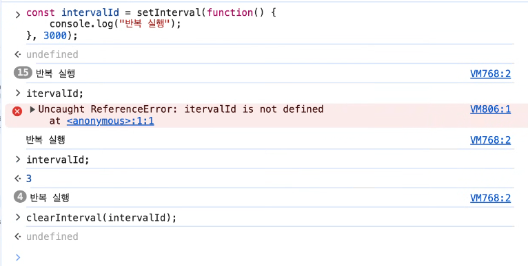

[⬆️ 처음으로](#top)

---

<a id="propagation"></a>

### 6. 이벤트 등록 방법

#### 방법 1. `on이벤트명`

```javascript
element.onclick = function () {
    console.log("click");
};
```

하나의 Property에 하나의 함수 참조가 저장되므로 다시 대입하면 기존 Handler가 덮어써진다.

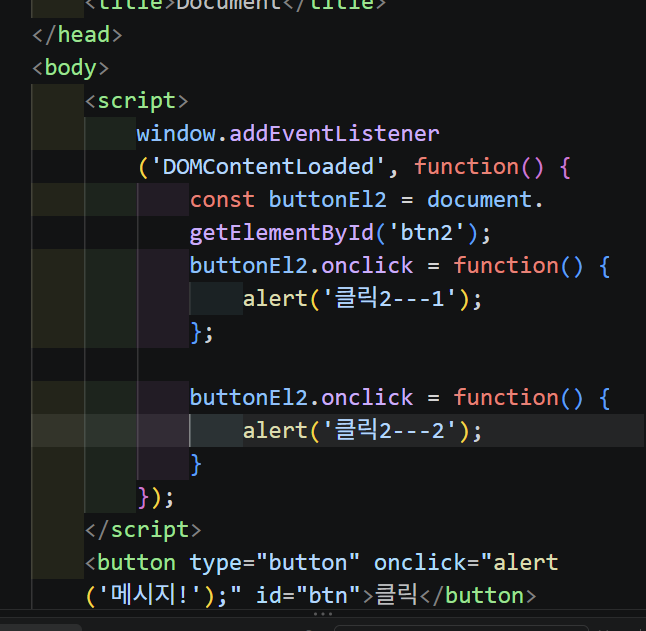

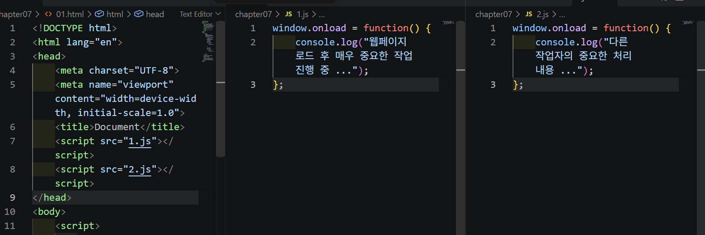

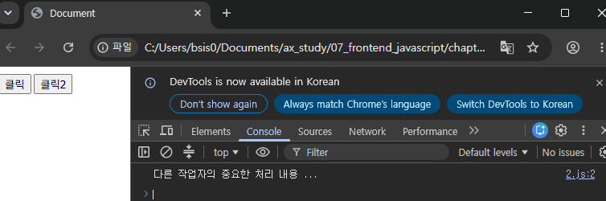

> ⚠️ 두 Script가 같은 `onclick`에 서로 다른 함수를 대입하면 나중 함수가 기존 참조를 덮어쓸 수 있다.

#### 방법 2. `addEventListener()` ⭐

```javascript
element.addEventListener(
    "이벤트명",
    이벤트핸들러함수,
    캡처링여부
);
```

세 번째 `capture` 값은 선택 사항이며 기본값은 `false`이다.

`addEventListener()`를 사용하면 **같은 Event에 여러 Handler를 등록할 수 있다.**

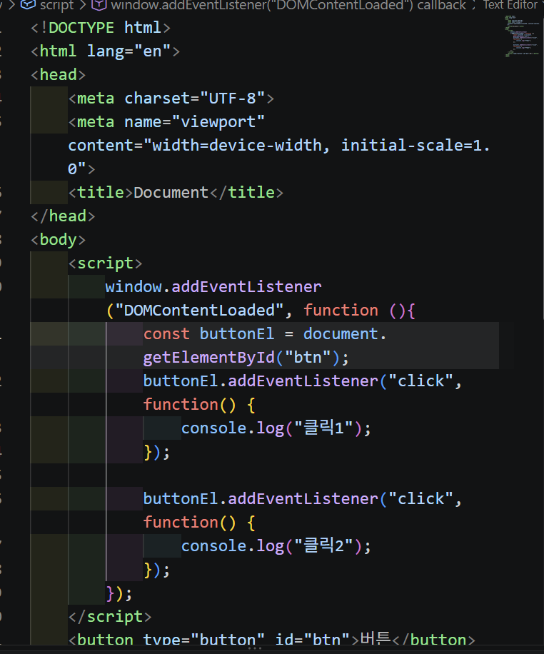

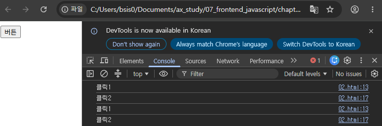

---

### 7. 이벤트 전파(Event Propagation) ⭐


```text
상위 요소
   ↓
Capturing
(찾아 들어가기)
   ↓
 Target
(실제 대상)
   ↑
Bubbling
(다시 올라가기)
   ↑
상위 요소
```

1. **Capturing** → 상위 요소에서 Target을 향해 내려감
2. **Target** → 실제 Event 대상에 도달
3. **Bubbling** → Target에서 상위 요소 방향으로 올라감

`capture` 옵션을 `true`로 설정하면 Capturing 단계에서 Listener가 동작한다.

```javascript
element.addEventListener("click", handler, true);
```

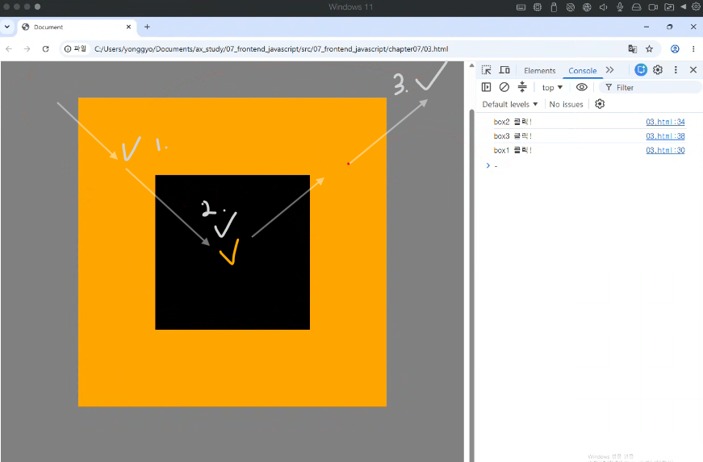

> 🔎 `document` 객체를 Console에서 확인하면 다양한 `on이벤트` Property를 확인할 수 있다.

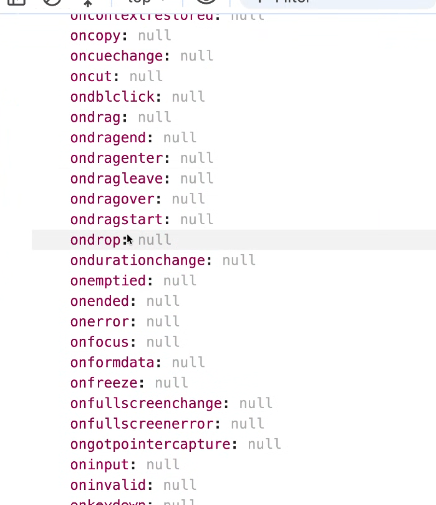

:chatgpt-content-reference{index="8"}

---

<a id="event-object"></a>

### 8. Event 객체

Event Handler의 첫 번째 매개변수에는 **발생한 Event에 대한 정보를 담은 Event 객체**가 전달된다.

```javascript
element.addEventListener("click", function (e) {
    console.log(e);
});
```

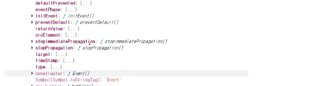

#### Event 통제 Method

| Method | 기능 |
|---|---|
| `stopPropagation()` | Event 전파 중단 |
| `stopImmediatePropagation()` | 전파 + 같은 요소의 뒤쪽 Listener 실행 중단 |
| `preventDefault()` | HTML 요소의 기본 동작 차단 |

`preventDefault()` 예:

```text
<a>    → 링크 이동 방지
<form> → 기본 Submit 방지
```

> 수업 중 실습 코드: `ax_study/07_frontend_javascript/chapter07/03.html`

---

### 9. `this` · `currentTarget` · `target` ⭐

일반 함수로 등록한 Event Handler에서 `this`는 **Listener가 등록된 요소**를 참조할 수 있다.

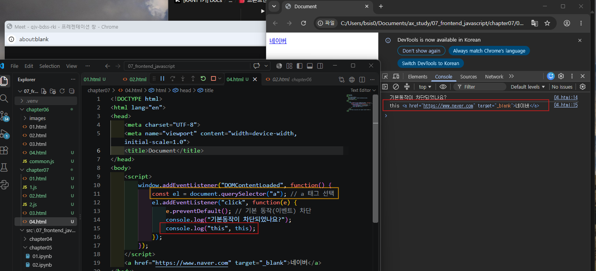

- `e.currentTarget` → 현재 Event Handler가 등록된 요소
- `e.target` → 실제 Event가 발생한 가장 안쪽 요소

```text
<div> ← Listener 등록 (currentTarget)
  <button> ← 실제 Click (target)
</div>
```

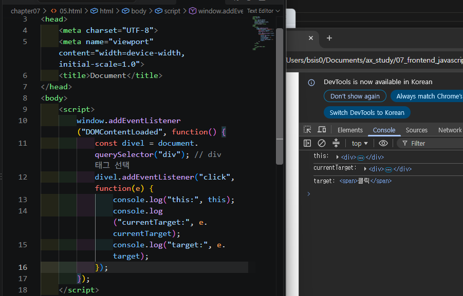

> 일반 함수 Handler에서는 `this`와 `currentTarget`이 보통 같은 요소를 가리킨다. :chatgpt-content-reference{index="9"}

---

### 10. 대표적인 Event

#### 마우스 Event

- `click`
- `dblclick`
- `mousemove`
- `mousedown`
- `mouseup`
- `scroll`

##### 마우스 좌표

| Property | 기준 |
|---|---|
| `clientX`, `clientY` | 현재 Viewport |
| `pageX`, `pageY` | 전체 Document |
| `offsetX`, `offsetY` | Event 대상 요소 |

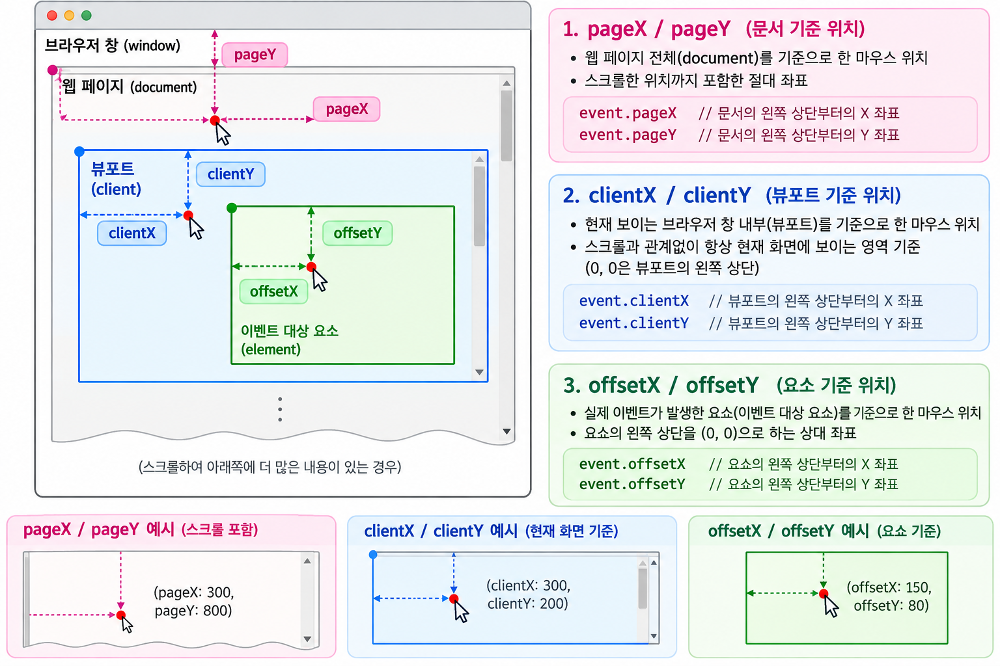

#### 키보드 Event

- `keydown` → 키를 누를 때
- `keyup` → 키를 뗄 때
- `keypress` → 과거 문자 입력에 사용, 현재 Deprecated

주요 정보:

- `key` → 실제 입력된 키
- `code` → 물리적인 키 위치
- `keyCode` → 과거 숫자 코드, 현재 Deprecated

#### 기타

- `submit`
- `focus`
- `blur`

[⬆️ 처음으로](#top)

---

<a id="async"></a>

## 7장 2강 - 비동기 프로그래밍

### 11. 동기와 비동기

#### 동기(Synchronous)

앞의 작업이 끝난 후 다음 작업을 실행한다.

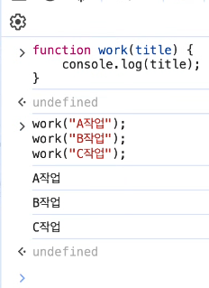

```text
A 시작 → A 완료
           ↓
        B 시작 → B 완료
                   ↓
                C 시작
```

#### 비동기(Asynchronous)

기다리는 동안 다른 코드를 계속 실행하고, 작업이 완료되면 결과를 나중에 처리한다.

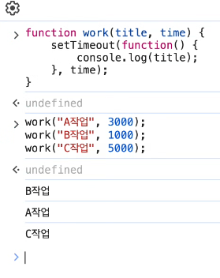

```text
작업 요청
   ↓
기다리는 동안
다른 코드 실행
   ↓
작업 완료
   ↓
결과 처리
```

---

### 12. 비동기에서도 순서가 필요하다

비동기라고 해서 항상 순서가 필요 없는 것은 아니다.

```text
A 완료
 ↓
B 실행
 ↓
B 완료
 ↓
C 실행
```

과거에는 Callback을 중첩하여 이런 순서를 표현할 수 있었다.

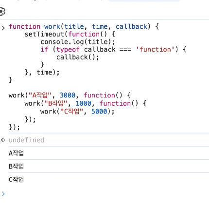

하지만 계속 중첩하면 코드가 깊어져 읽기 어려워진다.

```text
Callback 중첩
     ↓
Callback Hell
     ↓
Promise
     ↓
.then()으로 연결
     ↓
async / await
     ↓
위에서 아래로 읽기 쉽게 표현
```

:chatgpt-content-reference{index="10"}

---

<a id="promise"></a>

### 13. Promise ⭐

**Promise**는 비동기 작업의 **성공 또는 실패 결과를 다루기 위한 객체**이다.

```javascript
function work(title, time) {
    return new Promise((resolve, reject) => {
        if (!title) {
            reject("실패!");
            return;
        }

        setTimeout(() => {
            resolve(title);
        }, time);
    });
}
```

```text
성공 → resolve() → .then()
실패 → reject()  → .catch()
```

#### Promise Chaining

```javascript
work("A작업", 3000)
    .then((data) => {
        console.log(data);
        return work("B작업", 1000);
    })
    .then((data) => {
        console.log(data);
    })
    .catch((err) => {
        console.error(err);
    });
```

앞의 Promise에서 다음 Promise를 `return`하여 **비동기 작업의 순서를 연결**할 수 있다. :chatgpt-content-reference{index="11"}

---

### 14. `async / await` ⭐

Promise 기반의 비동기 흐름을 더 읽기 쉽게 작성하는 문법이다.

> ⚠️ `async`는 객체가 아니라 **Keyword**이다.

```javascript
async function run() {
    try {
        const a = await work("A작업", 3000);
        console.log(a);

        const b = await work("B작업", 1000);
        console.log(b);
    } catch (err) {
        console.error(err);
    }
}
```

```text
Callback
"끝나면 이 함수 실행"
      ↓
Promise
"끝나면 .then()으로 연결"
      ↓
async / await
"Promise 결과를 기다린 후 다음 줄"
```

> ⭐ `async / await`은 Promise를 없앤 새로운 시스템이 아니라 **Promise 기반 코드를 읽기 쉽게 표현하는 문법**이다. :chatgpt-content-reference{index="12"}

[⬆️ 처음으로](#top)

---

<a id="fetch"></a>

### 15. AJAX와 Fetch API

#### AJAX

**AJAX = Asynchronous JavaScript And XML**

페이지 전체를 새로고침하지 않고 JavaScript로 서버와 데이터를 주고받아 **필요한 부분만 변경하는 방식**이다.

예: 지도에서 위치를 이동했을 때 페이지 전체를 새로고침하지 않고 새로운 지도 데이터만 받아오기.

> 이름에는 XML이 있지만 JSON 등 다른 데이터 형식도 사용할 수 있다.

```text
AJAX
"새로고침 없이 서버와 통신"
        │
        ├─ 과거 → XMLHttpRequest
        │
        └─ 현대 → Fetch API
                     ↓
                  Promise
                     ↓
             .then() / await
```

AJAX는 특정 함수가 아니라 **통신 방식/개념**이고, `XMLHttpRequest`와 `Fetch API`는 이를 구현할 수 있는 API이다. :chatgpt-content-reference{index="13"}

---

### 16. Fetch API ⭐

Fetch API는 Promise 기반으로 Network 요청을 처리한다.

```javascript
fetch(requestUrl)
    .then((res) => res.json())
    .then((data) => console.log(data));
```

```text
fetch()
   ↓
서버에 Request
   ↓
Promise 반환
   ↓
Response
   ↓
res.json()
   ↓
JavaScript Data
   ↓
.then(data)
```

받은 데이터를 DOM에 반영하면:

```javascript
const containerEl = document.getElementById("container");

fetch(requestUrl)
    .then((res) => res.text())
    .then((data) => {
        containerEl.innerHTML = data;
    });
```

```text
Fetch
서버 데이터 요청
     ↓
Promise
비동기 응답 처리
     ↓
.then() / await
     ↓
DOM 조작
     ↓
화면 일부 변경
     ↓
페이지 전체 새로고침 X
```

:chatgpt-content-reference{index="14"}

---

<a id="exercise"></a>

## 🧪 EXERCISE & MORE

### Todo 구현

- Todo 프로젝트 **Tailwind CSS로 구현하기**

### 오늘 꼭 기억할 것 ⭐

1. **DOM 조작** → 요소 탐색 → 내용/Node 변경
2. **Event 처리** → `addEventListener()` + Event 객체
3. **Event 전파** → Capturing → Target → Bubbling
4. **JavaScript 실행** → Call Stack + Browser 환경 + Queue + Event Loop
5. **비동기 발전 흐름** → Callback → Promise → `async / await`
6. **Fetch** → Promise 기반으로 서버 데이터 요청 → 결과를 DOM에 반영

---

## 🧠 오늘 수업 한 줄 연결

```text
DOM
"화면의 요소를 어떻게 다룰까?"
        ↓
Event
"사용자의 행동을 어떻게 감지할까?"
        ↓
Event Loop
"기다리는 작업을 어떻게 처리할까?"
        ↓
Async
"기다리면서 다른 일을 어떻게 할까?"
        ↓
Promise / async-await
"비동기 작업의 결과와 순서를 어떻게 관리할까?"
        ↓
Fetch
"서버 데이터를 비동기로 어떻게 가져올까?"
        ↓
DOM
"받은 데이터로 화면을 어떻게 바꿀까?"
```

> **오늘의 큰 흐름:**  
> `DOM으로 화면 제어` → `Event로 사용자 행동 감지` → `Event Loop로 비동기 실행 이해` → `Promise · async/await으로 비동기 흐름 관리` → `Fetch로 서버와 통신` → **다시 DOM에 반영**

[⬆️ 처음으로](#top)