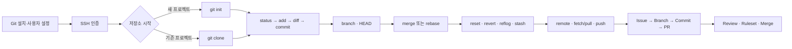

# Git·GitHub 기초부터 협업까지

> 수업 기간: 2026.08.03~2026.08.06  
> 원본 필기의 설치 → Git 구조 → 버전 관리 → 브랜치 → 원격 저장소 → 협업 흐름을 유지하고, Git·GitHub 공식 문서로 사실관계를 보완했다.



| 단계 | 핵심 질문 | 대표 명령·기능 |
|---|---|---|
| 설치·인증 | 누가 어떤 컴퓨터에서 GitHub에 연결하는가? | `git config`, SSH key |
| 저장소 | 새로 시작할까, 기존 저장소를 받을까? | `git init`, `git clone` |
| 기록 | 무엇을 다음 버전으로 남길까? | `status`, `add`, `diff`, `commit` |
| 분기·통합 | 작업을 어떻게 나누고 다시 합칠까? | branch, `HEAD`, merge, rebase |
| 복구·보관 | 실수나 미완성 작업을 어떻게 다룰까? | reset, revert, reflog, stash |
| 원격 협업 | 변경을 어떻게 주고받고 검토할까? | remote, push, pull, Issue, PR, Ruleset |

> **핵심 팩트 수정**
>
> - Git은 GitHub가 아니라 로컬에서도 동작하는 **분산 버전 관리 시스템**이다. GitHub는 Git 저장소를 호스팅하고 Issue·PR·Ruleset 등의 협업 기능을 제공하는 서비스다.
> - Git은 각 커밋을 프로젝트 상태의 스냅샷처럼 다룬다. 변경되지 않은 파일 내용을 매번 통째로 중복 저장한다는 뜻은 아니다.
> - `git add`만으로는 `git log`에 기록되지 않는다. `add`는 다음 커밋의 내용을 준비하고, `commit`이 기록을 만든다.
> - 브랜치는 별도의 폴더가 아니라 **커밋을 가리키며 이동하는 이름(포인터)** 이고, `HEAD`는 보통 현재 체크아웃한 브랜치를 가리킨다.
> - `git pull`은 단순 다운로드가 아니라 보통 **fetch 후 merge**하며, 설정이나 옵션에 따라 rebase할 수도 있다.
> - `reflog`는 로컬 참조 이동 기록이며 영구 백업이 아니다. 추적·커밋하지 않은 파일을 자동 복구해 주는 기능도 아니다.

## 설치, 사용자 설정, SSH 인증

공식 설치 페이지에서 운영체제에 맞는 Git을 설치한다.

- Windows: [Git for Windows](https://git-scm.com/downloads/win)를 설치하고 **Git Bash** 또는 PowerShell에서 실행
- macOS: [Git for macOS](https://git-scm.com/downloads/mac) 안내에 따라 Xcode Command Line Tools, Homebrew 또는 설치 프로그램 사용

```bash
git --version
```

커밋 작성자 정보를 설정하고 실제 적용값과 출처를 확인한다.

```bash
git config --global user.name "사용자명"
git config --global user.email "GitHub에 등록한 이메일"
git config --global init.defaultBranch main
git config --global core.editor "code --wait"  # VS Code 사용 시

git config --list --show-origin
```

설정 범위는 `local`(현재 저장소) > `global`(현재 사용자) > `system`(컴퓨터 전체) 순으로 더 구체적인 값이 우선한다. `user.name`과 `user.email`은 GitHub 로그인 정보가 아니라 **커밋에 기록될 작성자 정보**다.

SSH는 로컬의 개인 키로 GitHub에 인증하는 방식이다. 개인 키는 공유하거나 Git에 커밋하지 않는다. 자세한 절차는 [GitHub SSH 안내](https://docs.github.com/en/authentication/connecting-to-github-with-ssh/about-ssh)를 따른다.

```bash
# Windows Git Bash / macOS Terminal 공통
ssh-keygen -t ed25519 -C "your_email@example.com"
```

macOS:

```bash
eval "$(ssh-agent -s)"
ssh-add --apple-use-keychain ~/.ssh/id_ed25519
pbcopy < ~/.ssh/id_ed25519.pub
```

Windows Git Bash:

```bash
eval "$(ssh-agent -s)"
ssh-add ~/.ssh/id_ed25519
clip < ~/.ssh/id_ed25519.pub
```

복사한 **공개 키**를 GitHub의 `Settings → SSH and GPG keys → New SSH key`에 등록한 후 연결을 확인한다. 운영체제별 세부 내용은 [키 생성·ssh-agent 등록](https://docs.github.com/en/authentication/connecting-to-github-with-ssh/generating-a-new-ssh-key-and-adding-it-to-the-ssh-agent)과 [공개 키 등록](https://docs.github.com/en/authentication/connecting-to-github-with-ssh/adding-a-new-ssh-key-to-your-github-account)을 참고한다.

```bash
ssh -T git@github.com
```

첫 연결에서는 GitHub 호스트 지문이 공식 값과 같은지 확인한 뒤 승인한다. 성공 메시지에 사용자명이 표시되면 인증된 것이다. GitHub는 SSH 셸을 제공하지 않으므로 테스트 명령의 종료 코드가 `1`이어도 성공 메시지가 나왔다면 정상이다.

## 저장소 시작과 Git의 기록 구조

Git의 기본 흐름은 게임의 세이브 포인트와 비슷하지만, 파일을 수정하는 즉시 버전이 생기지는 않는다.

```text
Working Tree         Index(Staging Area)        Repository
파일을 수정     →     다음 기록을 준비     →     Commit으로 기록
                  git add                 git commit
```

새 프로젝트를 Git 저장소로 만들 때:

```bash
mkdir my-project
cd my-project
git init
git status
```

이미 GitHub에 있는 저장소로 시작할 때:

```bash
git clone git@github.com:OWNER/REPOSITORY.git
cd REPOSITORY
git remote -v
```

`clone`은 파일과 Git 객체·이력을 내려받고, 기본 브랜치를 체크아웃하며 보통 `origin` 원격과 추적 관계도 설정한다. 원격 브랜치 정보도 내려받지만 모든 원격 브랜치가 각각 작업 가능한 로컬 브랜치로 자동 생성된다고 이해하면 부정확하다. ZIP 다운로드에는 `.git` 이력이 없다는 점도 다르다.

## 상태 확인, 스테이징, 비교, 커밋

```bash
git status
git add README.md       # 특정 파일
git add -p              # 변경 덩어리를 골라 추가
git add .               # 현재 디렉터리 아래 변경을 추가
git commit -m "docs: Git 학습 내용 정리"
git log --oneline --graph --decorate --all
```

`git add .`에는 수정·신규·삭제가 포함될 수 있으므로 먼저 `status`와 `diff`를 확인한다. 커밋은 파일 단위보다 하나의 목적을 가진 작은 기능 단위로 나누면 검토와 복구가 쉽다. `feat`, `fix`, `docs`, `refactor`, `test`, `chore` 같은 접두어는 유용한 팀 규칙이지 Git 자체의 필수 문법은 아니다.

| 명령 | 비교 대상 | 무엇을 확인하는가 |
|---|---|---|
| `git diff` | Working Tree ↔ Index | 아직 스테이징하지 않은 변경 |
| `git diff --staged` | Index ↔ `HEAD` | 다음 커밋에 들어갈 변경 |
| `git diff HEAD` | Working Tree+Index ↔ `HEAD` | 마지막 커밋 이후 전체 변경 |

```bash
git diff
git diff --staged       # --cached와 같은 의미
git diff HEAD
```

> **수정:** `git add` 후 `git log`에 안 보이는 직접적인 이유는 현재 폴더 문제라기보다 아직 커밋하지 않았기 때문이다. 다만 다른 저장소에서 명령을 실행했을 가능성도 있으므로 `pwd`(macOS/Git Bash), `cd`(PowerShell), `git status`로 위치를 함께 확인한다.

## Branch, HEAD, merge, rebase

커밋이 `A─B─C`라면 `main`은 보통 `C`를 가리키는 브랜치 이름이고, `HEAD`는 현재 작업 중인 브랜치를 가리킨다.

```text
A ─ B ─ C
        ↑
      main
        ↑
       HEAD
```

```bash
git branch
git switch -c feature/login  # 생성과 이동
git switch main              # 이동
git branch -d feature/login  # 병합된 로컬 브랜치 삭제
```

특정 커밋을 직접 체크아웃하면 `HEAD`가 브랜치가 아닌 커밋을 직접 가리키는 detached HEAD 상태가 될 수 있다. 과거를 확인만 할 때는 가능하지만, 작업을 남길 계획이라면 새 브랜치를 만든다.

```bash
git switch --detach <commit-id>
git switch -c recovery-work
```

Merge는 현재 브랜치에 다른 브랜치의 이력을 합친다.

```bash
git switch main
git merge feature/login
```

```text
# fast-forward: main에 별도 새 커밋이 없으면 포인터만 앞으로 이동 가능
A ─ B ─ C
    ↑   ↑
   main feature

# divergent history: 공통 조상을 기준으로 merge commit이 생길 수 있음
      C ─ D  feature
     /     \
A ─ B ─ E ─ M  main
```

충돌은 단순히 “같은 줄”에만 한정되지 않는다. Git이 두 변경을 자동 통합하지 못할 때 발생한다.

```bash
# 충돌 파일을 직접 수정한 뒤
git add <파일명>
git merge --continue    # 또는 git commit

# 병합 시작 전 상태로 취소
git merge --abort
```

Rebase는 현재 브랜치의 커밋을 새 기준 위에 하나씩 다시 적용하여 새로운 커밋을 만든다.

```bash
git switch feature/login
git rebase main
```

```text
전: A ─ B ─ C        main
         └─ D ─ E    feature

후: A ─ B ─ C ─ D' ─ E'  feature
```

```bash
# 충돌을 수정한 뒤
git add <파일명>
git rebase --continue

git rebase --abort     # 전체 취소
```

| Merge | Rebase |
|---|---|
| 두 이력을 그대로 통합 | 커밋을 새 기준 위에 재작성 |
| merge commit이 생길 수 있음 | 직선형 이력을 만들 수 있음 |
| 기존 커밋 ID 유지 | 다시 적용된 커밋 ID 변경 |
| 공유 이력 통합에 일반적으로 안전 | 아직 공유하지 않은 개인 브랜치 정리에 적합 |

> **보충:** “공유된 커밋은 절대 rebase 금지”는 안전한 입문 원칙이다. 실제 팀에서는 합의된 정책 아래 공유 브랜치를 rebase하기도 하지만, 이력 변경과 강제 push의 영향을 이해해야 한다.

## reset, revert, reflog, stash

`reset`은 현재 브랜치 끝을 지정한 커밋으로 옮기며 모드에 따라 Index와 Working Tree도 바꾼다. 공식 설명은 [`git reset`](https://git-scm.com/docs/git-reset)을 참고한다.

| 명령 | 브랜치 끝 | Index | Working Tree |
|---|---|---|---|
| `git reset --soft HEAD~1` | 이동 | 유지 | 유지 |
| `git reset --mixed HEAD~1` | 이동 | 대상 커밋에 맞춤 | 유지 |
| `git reset --hard HEAD~1` | 이동 | 대상 커밋에 맞춤 | 대상 커밋에 맞춤 |

```bash
git reset --soft HEAD~1
git reset HEAD~1        # --mixed가 기본
git reset --hard HEAD~1 # 추적 중인 작업을 잃을 수 있으므로 주의
```

공유한 커밋을 취소할 때는 기존 이력을 지우기보다 반대 변경의 새 커밋을 만드는 `revert`가 일반적으로 안전하다.

```bash
git revert <commit-id>
```

`reflog`는 로컬에서 `HEAD`와 브랜치 같은 참조가 가리킨 위치의 변화를 기록한다. `HEAD~2`는 부모 관계로 두 단계 전, `HEAD@{2}`는 reflog에서 HEAD가 두 번 이동하기 전이라는 뜻이다. 기록은 만료될 수 있다. 자세한 정의는 [`git reflog`](https://git-scm.com/docs/git-reflog)를 참고한다.

```bash
git reflog
git branch recovery <복구할-commit-id>  # 먼저 안전한 이름을 붙이는 방법
```

`stash`는 커밋하기 애매한 작업을 임시 보관한다. 기본 `git stash`는 추적 중인 파일의 수정과 스테이징 내용을 대상으로 하며, 새로 만든 미추적 파일은 `-u`가 필요하다.

```bash
git stash push -m "로그인 화면 작업 중"
git stash push -u -m "미추적 파일 포함"
git stash list
git stash show -p stash@{0}
git stash apply stash@{0}  # 적용 후 목록에 유지
git stash pop              # 적용 성공 시 해당 항목 제거
```

> **수정:** `stash pop`은 “항상 복원 후 삭제”가 아니다. 충돌 등으로 적용에 실패하면 stash 항목이 남을 수 있다.

## 원격 저장소, push, fetch, pull

GitHub는 대표적인 원격 저장소 서비스지만, Git의 `remote`는 꼭 인터넷이나 GitHub만 뜻하지 않고 다른 위치의 Git 저장소를 뜻한다. 원격 작업의 공식 흐름은 [Pro Git: Working with Remotes](https://git-scm.com/book/en/v2/Git-Basics-Working-with-Remotes.html)에서 확인할 수 있다.

로컬에서 만든 저장소를 빈 GitHub 저장소에 연결할 때:

```bash
git remote add origin git@github.com:OWNER/REPOSITORY.git
git remote -v
git push -u origin main
```

`origin`은 관례적인 원격 이름일 뿐 필수 고정어가 아니다. `-u`는 로컬 브랜치의 upstream 추적 관계를 설정하여 이후 `git push`, `git pull`을 짧게 쓸 수 있게 한다.

```bash
git fetch origin        # 원격 정보를 내려받되 현재 작업 브랜치에 통합하지 않음
git status
git log --oneline --graph --all

git pull                # 보통 fetch 후 merge
git pull --rebase       # fetch 후 rebase를 명시
git push                # 로컬 커밋을 upstream 원격 브랜치로 전송
```

| 명령 | 핵심 역할 |
|---|---|
| `clone` | 기존 저장소를 처음 복제하고 로컬 작업 폴더 구성 |
| `fetch` | 원격 객체와 원격 추적 브랜치 갱신, 현재 작업에는 미통합 |
| `pull` | 원격 변경을 가져와 현재 브랜치에 통합 |
| `push` | 로컬 커밋과 참조를 원격에 전송 |

팀 작업 전에는 먼저 최신 변경을 확인하고, 충돌을 해결·테스트한 뒤 push한다. 원격에 새 커밋이 있어 push가 거절되면 상황을 확인하지 않고 강제 push부터 하지 않는다.

## GitHub Issue, Pull Request, Ruleset 협업

전체 협업 흐름은 다음과 같다.

```text
Issue 작성·담당자 지정
        ↓
main 최신화 → 작업 Branch 생성
        ↓
수정 → status/diff → add → commit
        ↓
원격 Branch로 push
        ↓
Pull Request: base=main, compare=작업 Branch
        ↓
자동 검사·Review·수정
        ↓
Merge / Squash and merge / Rebase and merge
        ↓
Issue 종료·Branch 정리
```

Issue는 버그·기능·할 일을 추적하고 담당자, label, milestone 등으로 맥락을 관리한다. [GitHub Issues 안내](https://docs.github.com/en/issues/tracking-your-work-with-issues/using-issues)에 따라 Issue에서 브랜치를 연결할 수도 있다.

```bash
git switch main
git pull --ff-only
git switch -c feature/42-login

# 작업 후
git status
git diff
git add -p
git diff --staged
git commit -m "feat: 로그인 검증 추가"
git push -u origin feature/42-login
```

GitHub에서 PR을 만들 때 `base`는 변경을 받을 브랜치, `compare` 또는 head는 작업 커밋이 있는 브랜치다. PR은 변경 제안과 검토 공간이며 merge 그 자체와 동일하지 않다. 공식 절차는 [Pull Request 만들기](https://docs.github.com/en/pull-requests/how-tos/create-pull-requests/creating-a-pull-request)를 참고한다.

PR 본문에 다음처럼 쓰면 기본 브랜치에 병합될 때 연결된 Issue가 자동 종료될 수 있다.

```markdown
Closes #42

## 변경 내용
- 로그인 입력값 검증 추가

## 확인 방법
- 빈 이메일 입력 시 오류 메시지 확인
```

지원 키워드와 조건은 [Issue와 PR 연결](https://docs.github.com/en/issues/tracking-your-work-with-issues/using-issues/linking-a-pull-request-to-an-issue)을 확인한다.

GitHub 병합 방식은 저장소 설정과 팀 정책에 따라 선택한다.

- **Merge pull request**: 분기 이력을 보존하며 merge commit을 만들 수 있음
- **Squash and merge**: PR의 여러 커밋을 하나로 합쳐 대상 브랜치에 새 커밋 생성
- **Rebase and merge**: PR 커밋들을 대상 브랜치 위에 재작성하여 선형 이력 구성

Ruleset은 특정 브랜치·태그 등에 저장소 정책을 적용한다. 예를 들어 `main`에 직접 push하지 못하게 하고 PR, 승인 리뷰, 통과한 상태 검사, 선형 이력, 서명된 커밋을 요구하거나 force push와 삭제를 막을 수 있다. 사용 가능한 규칙과 플랜별 차이는 [GitHub Ruleset 공식 문서](https://docs.github.com/en/repositories/configuring-branches-and-merges-in-your-repository/managing-rulesets/available-rules-for-rulesets)를 확인한다.

입문용 `main` Ruleset 예시:

```text
Target: default branch (main)
Require a pull request before merging: On
Required approvals: 1
Require status checks to pass: On (CI가 있을 때)
Block force pushes: On
Restrict deletions: On
```

Ruleset을 만들 권한과 비공개 저장소에서의 제공 범위는 GitHub 플랜에 따라 다를 수 있다. 관리자 우회 권한도 설정 가능하므로 “Ruleset이 있으면 누구도 예외가 없다”라고 단정하면 안 된다.

## 한 번에 재현하는 최소 실습

아래 실습은 Windows Git Bash와 macOS Terminal에서 동일하게 실행할 수 있다. `<OWNER>`와 저장소 이름은 본인 환경에 맞게 바꾼다.

```bash
# 1) 설치·설정 확인
git --version
git config --global user.name
git config --global user.email
ssh -T git@github.com

# 2-A) 새 저장소
mkdir git-practice
cd git-practice
git init
echo "# Git Practice" > README.md
git status
git add README.md
git diff --staged
git commit -m "docs: add README"

# 2-B) 또는 기존 저장소 복제
# git clone git@github.com:<OWNER>/git-practice.git
# cd git-practice

# 3) Branch 작업
git switch -c feature/note
echo "Git workflow practice" >> README.md
git diff
git add README.md
git commit -m "docs: add workflow note"

# 4) 원격에 올리기
git remote add origin git@github.com:<OWNER>/git-practice.git  # clone했다면 불필요
git push -u origin feature/note

# 5) GitHub에서 PR 생성·리뷰·병합 후
git switch main
git pull --ff-only
git branch -d feature/note
```

`echo`의 출력·인코딩 동작은 셸에 따라 차이가 있을 수 있지만 Git 명령의 의미는 같다. PowerShell에서 활성 셸 문법이 다를 때는 파일을 편집기로 작성해도 된다.

## 공식 문서와 대조해 기억할 문장

- `add`는 저장이 아니라 **다음 커밋의 구성 선택**, `commit`이 로컬 이력 기록이다.
- Branch는 독립 폴더가 아니라 **커밋을 가리키는 이동 가능한 이름**, `HEAD`는 현재 위치 표지다.
- Merge는 이력을 합치고, rebase는 커밋을 새 기준 위에 다시 만들어 배치한다.
- Reset은 참조와 상태를 되돌릴 수 있어 로컬 정리에 유용하지만 `--hard`는 작업 손실 위험이 있다.
- Revert는 기존 이력을 유지하며 취소 커밋을 추가하므로 공유 이력에 적합하다.
- Reflog는 강력한 로컬 복구 단서지만 백업은 아니다.
- Fetch는 가져오기, pull은 가져와 통합하기, push는 로컬 커밋을 원격으로 보내기다.
- PR은 변경 제안·검토 과정이며, Ruleset은 그 과정에 필요한 조건을 강제하는 정책이다.

### 참고한 공식 자료

- [Pro Git 공식 온라인 책](https://git-scm.com/book/en/v2)
- [Git 명령어 공식 문서](https://git-scm.com/docs)
- [GitHub SSH 연결](https://docs.github.com/en/authentication/connecting-to-github-with-ssh)
- [GitHub Branch와 보호 규칙](https://docs.github.com/en/pull-requests/reference/branches)
- [GitHub Pull Request 빠른 시작](https://docs.github.com/en/pull-requests/get-started/pull-request-quickstart)
- [GitHub Ruleset에서 사용할 수 있는 규칙](https://docs.github.com/en/repositories/configuring-branches-and-merges-in-your-repository/managing-rulesets/available-rules-for-rulesets)
