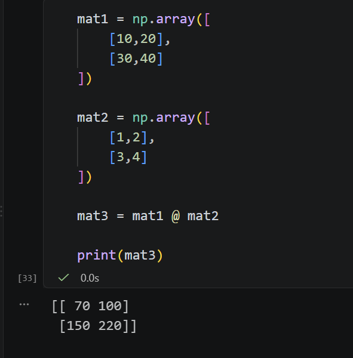

# ML - 기초: numpy & pandas

> 📅 2026.08.24

## 😊 SUMMARY (w/ Keywords)

## REVIEW
- 제어권(= 함수 실행 권한)을 양보, 다시 자기 차례가 되면 멈췄던 지점부터 이어서 작업 수행하는 파이썬 특수 함수 종류: `코루틴(coroutine)`
- AI Literacy는 기초 배경 지식, 후반부에서 더 깊이 다룰 예정

## LECTURE NOTE
> 수업 자료: `프롬프트.pdf`, `RTCCF.pdf` (ref.: slack/ 질문잡담방/ 8월 21일)

### 프롬프트
1. Zero-shot Prompting
2. Few-shot Prompting
3. Role Prompting
4. Zero-shot CoT (Chain-of-Thought)
5. Few-shot CoT

    **CoT 특성을 나타내는 부분**
    * `Think step by step`
    * `단계별로 차근차근 생각해서 최종 답을 도출해 주세요.`
6. Step-Back Prompting
    사용자의 질의 &rarr; 질의에서 필요한 배경 지식 도출 질문 (LLM) &rarr; 배경지식 도출 (LLM)
    &rarr;
       
        질문: ...?

        [배경지식]
        ---
        --- (위에서 도출했던 배경지식 반영)
        ```


### RTCCF
> 프롬프트 5대 요소
1. Role : 역할
2. Task : 과업
3. Context : 배경/지식
4. Constraints : 제약 조건
5. Format : 형식

#### 직접 작성해보기
**<나의 프롬프트>**

Role: Professional travel route developer and tour guide.

Task: Organise a tour of Europe for me and my friends for next summer.

Context:
- Minimum of 2 members, maximum of 4
- Vehicle: public transport
- Average age: over 25
- Preference: hotels with more than four stars.
- Possible schedule: maximum one week, including weekends.

Contracts:
- Find activities and, at the same time, add some rest spots.
Consider the cost of public transport and tickets.
- Add some fine restaurants, cafés and dessert places.
- Do not add war-region.

Format:
- Organise the timeline for each day (Days 1–7) into a Markdown-formatted table broken down into morning, lunch, afternoon and dinner.
- Include travel tips for each item, limited to two lines or fewer.
- Include at least one destination that Koreans don’t often visit.

---

**<튜터님 프롬프트>**

[Role]
당신은 20년차 동남아 여행 전문가 입니다.
[Task]
여름에 가족들과 함께 조용한 휴식을 취할 수 있는 3박 4일 필리핀 여행 일정을 작성해 주세요.
[Context]

여행 인원: 4인 가족(초등학생 1명, 유아 1명)
이동 수단: 렌터카 이용
호텔: 최소 4성급 이상
참고 사항: 초등학생과 유아가 할만한 액티비티 참여
[Contraints]

가족 여행이므로 가족이 함께 참여할 수 있는 장소로 선택을 할 것
지역은 필리핀 세부로 한정 할 것
초등학생과 유아가 포함되어 있으므로 이동시간이 길지 않은 장소로 선택할 것
[Format]

1~4일차 별로 [오전/점심/오후/저녁]으로 타임라인을 Markdown 형식의 표로 정리할 것
각 항목들에는 참고할 여행팁을 2줄 이내로 포함 시켜 줄 것

---
#### Loveralbe
>구글드라이브>KANT폴더>Prompts스프레드시트>loverable 프롬프트(by 이용교 튜터님)

---
### [특강] Numpy, Pandas, Matplotlib
> import numpy as np
#### [Numpy] 리스트와 배열
**Python 리스트 List**
- 여러 개의 서로 다른 "주소 표지판"을 모아둔 것      
    - 자료형 자유로움
    - 주소 찾느라 느림

**Numpy 배열 Array**
- 같은 크기의 상자들이 일렬로 쭉 놓여있는 것 
    - 같은 자료형; 숫자만 - int, float
    - 주소 찾을 필요 없어 매우 빠름
    - **메모리상 연속된 구조**

**방의 크기**
 - 비트(bit) 0과 1
 - 바이트(byte) = 비트 *8 (1byte = 8bit)

 - 부호버튼 (음수/양수)
  - 8비트 중 맨 앞 1비트가 부호 역할
  ```
  [부호비트][나머지 7비트]
   ↓
  0 = 양수(+)
  1 = 음수(-)
  ```
  - 0 = 양수(+), 1 = 음수(-)
  - 범위: (-2^7 ~ -2^7-1) -128 ~ +127

왜 배우나? 💨
> 머신러닝은 **수십만 개의 숫자를 엄청 빠르게 계산**해야 하는데, 일반 리스트로는 느려요. 그래서 배열이 필요해요!

- 배열은 같은 자료형만 저장하므로, **문자열이 하나라도 섞이면 배열 전체가 문자열로 강제 변환된다.** 따라서 머신러닝처럼 숫자 연산이 많은 작업에서는 배열에 숫자만 넣어야 성능을 발휘할 수 있다.
- C언어로 개발(직접 메모리 접근)
- dtype 자료형 명시 (예: np.int64, np.float64)
    ```
    nums = np.array([10,20,30], dtype=np.float64)
    ```
    - 출력값: array([10., 20., 30.])

**배열의 차원**
- 1차원 배열 (선)
    ```
    nums = np.array([10,20,30]) 
    
    # 1차원 배열 (vertor)
    ```
- 2차원 배열 (행,열 &rarr; 면)
    ```
    matrix = np.array([
        [10,20,30],
        [40,50,60],
        [70,80,90]
    ]) 
    
    # 2차원 배열 (matrix)
    ```

    ```
        0   1   2
    0 [10][20][30] -> 첫번째 칸 인덱스: [0,0]
    1 [40][50][60] -> 첫번째 칸 인덱스: [0,1]
    ```
- 3차원 이상의 배열 (Tensor)

#### [Numpy] 배열 선택, 슬라이싱
- matrix[행,열]
- matrix[0:2, 1:3] : 행은 0에서 1까지, 열은 1에서 2까지
- matrix[:,0]: 모든 행의 0번째 열
- matrix[1:,:2]: 행은 1번부터 전체, 열은 1번 인덱스 이하

#### [Numpy] 차원 변경
1. reshape(행,열) - 1차원 배열 -> 지정된 행과 열 구조로 차원수를 변경, -1: 자동결정
2. arange(시작, 종료, 증감 단위) -> 시작 이상 종료 미만으로 숫자를 생성

3. flatten() - 2차원 배열 -> 1차원으로 평탄화 (메서드)

축 (axis)
- 2차원 배열에서 연산의 방향을 설정할때 사용
    - axis = 0 : 행기준에서 연산
    - axis = 1 : 열기준에서 연산

<메모>
* 행 column 새로
* 열 row 가로

4. 브로드캐스팅(Broadcasting) - **한번에 계산되는 것**
5. 행렬 전치 (Transpose)
6. 행렬곱 (@)
    - 행렬 A = 입력 데이터 (학생들의 원점수)
    ```
    학생별 시험 점수:
            수학  영어
    학생A  [ 80   90 ]
    학생B  [ 70   85 ]  → 행렬 A (3×2)
    학생C  [ 95   88 ]


    가중치:
            중간고사  기말고사
    수학   [  0.4      0.6  ]  → 행렬 B (2×2)
    영어   [  0.3      0.7  ]
    ```
    - 행렬 B = 가중치 (얼마나 중요한지)
    ```
    A(3×2) × B(2×2) = C(3×2)

    ┌─────────────────────────────────────┐
    │ 학생A 최종점수 계산:                │
    │                                     │
    │ 중간고사: (80×0.4) + (90×0.3)      │
    │        = 32 + 27 = 59              │
    │                                     │
    │ 기말고사: (80×0.6) + (90×0.7)      │
    │        = 48 + 63 = 111             │
    └─────────────────────────────────────┘
    ```
    - 행렬 C = 예측 결과 (최종 점수)
    ```
            중간고사  기말고사
    학생A  [  59      111  ]
    학생B  [  53.5    107.5 ]  ← 행렬 C (3×2)
    학생C  [  64.5    119.5 ]
    ```


> import pandas as pd

#### [Pandas] 기본구조: Series와 DataFrame
- 엑셀과 비슷한 기능
- 빠른 연산을 위해 기본적으로 내부에 numpy가 함께 들어있음

1. DataFrame (행과 열)
- Series (1차원 구조체)
- 여러개의 시리즈로 구성된 것이 데이터프래임
- index 함께 생성

#### [Pandas] 데이터 탐색 속성과 진단
- 탐색적 데이터 분석 (EDA, Exploratory Data Analysis)
- 진단 : info(), describe()
    1. info(): 자료형 정보
        - 누락치 확인(Non-Null Count)
        - dtype: 통계가 가능한 자료형인지 확인 (잘못된 데이터가 있는지 여부 확인 -> 치환 -> 자료형 변환)
    2. describe(): 기술통계치
        - 평균, 중앙값, 최댓값, 최솟값을 통해 이상치(극단치)를 확인
- 속성 : shpae, dtypes

- set_index(), reset_index()
> ❓질문: reset_index()는 어느 시점까지 가능? 시점 조절이 가능?

#### [Pandas] Series & df 브로드캐스팅 연산
- **한번에 계산되는 것**
- axis : 0 -> 행의 인덱스 기준
- axis : 1 -> 컬럼 기준
> 외우기 - 열은 `한 일`자 방향(1) / 행은 길게 아래로 동그라미 (0)


## EXERCISE & More
### Daily Quests
1. random
    - random.randint(a,b) : a 이상 b 이하 범위의 정수 난수 반환 함수
    - random.random(): 인자를 받지 않음. 0.0이상 1.0 미만의 실수 반환 함수
    - random.sample()
    - random.choice()
        - sample과 choice는 시퀀스(리스트 등)를 첫 인자로 받아야 함

2. 패킹과 언패킹
- 여러 값을 하나의 변수에 튜플 형태로 묶어 담는 것: '패킹'
- 반대로 시퀀스 자료구조의 요소들을 각각 독립된 변수에 순서대로 대입하여 분해하는 기술: '언패킹'
    - 자료구조의 요소 개수와 변수의 개수가 일치해야 정상적으로 분해됨

3. 슬라이싱
    ```
    numbers = [0, 1, 2, 3, 4, 5] 
    print(numbers[::2])

    >>> [0, 2, 4]
    ```
- 슬라이싱의 세 번째 자리는 증감폭(Step)을 의미
- 2를 지정하면 처음부터 2칸 간격으로 요소를 추출
- 홀수 인덱스만 뽑으려면 1부터 시작해서 2씩 증감 
    > print(numbers[1::2])  ← 1번 인덱스부터 시작, 2칸씩 이동
- 전체 리스트 출력은 슬라이싱 생략 [::1] or [:]
- 역순 정렬은 step에 -1 지정 : [::-1]

4. `메서드 오버라이딩`: 부모 클래스로부터 물려받은 메서드를 자식 클래스의 요구사항에 맞게 새롭게 재정의하여, 호출 시 부모의 원본 메서드 대신 실행되도록 하는 객체지향 기법

5. 구문 오류와 런타임 예외
- 콜론 누락, 들여쓰기 불일치, 괄호 미매칭은 모두 실행 전 단계에서 인터프리터가 걸러내는 구문 오류(Syntax Error)입니다. 
- 반면 0으로 나누는 연산은 문법적으로는 문제가 없으나 실행 중에 ZeroDivisionError라는 런타임 예외(Exception)를 발생시킵니다.

### 파이썬 기초 과제 1
#### 1. 샘플 데이터를 객체로 변환하는 과정에서 자료구조가 헷갈림
- **문제:** 기존 샘플 데이터를 `List[Dictionary]`로 관리하다가, ISBN을 key로 사용하는 중첩 딕셔너리 구조로 변경하면서 `for data in book_info`와 `for isbn, data in book_info.items()`의 차이가 헷갈렸다.
- **분석 및 수정 시도:** `book_info.items()`를 사용하면 `isbn`에는 key가, `data`에는 해당 도서의 상세 정보 딕셔너리가 들어온다는 것을 확인했다. 이후 `"유형"` 값에 따라 `PaperBook` 또는 `EBook` 객체를 생성하도록 수정하였다.
- **해결:** 샘플 데이터 4권을 `PaperBook` / `EBook` 객체로 변환한 뒤 `books` 리스트에 저장하고, ISBN은 별도의 `isbn_set`으로 관리하도록 구성하였다. **(해결)**
- **헷갈렸던 점 / 배운 점:** 딕셔너리의 `key:value` 구조와 `.items()`의 반환 형태를 다시 이해했다. 또한 샘플 데이터는 단순한 정보이고, 클래스에 실제 값을 넣어 생성한 객체는 `display_info()`, Getter/Setter 등의 메서드를 사용할 수 있다는 차이를 이해했다.

#### 2. 함수에서 여러 값을 반환했더니 `books`가 tuple이 되는 문제
- **문제:** `sample_data_to_object()`에서 `return books, isbn_set`으로 두 값을 반환했는데, `main()`에서 하나의 변수로 받아 `books.append()`를 실행하자 `'tuple' object has no attribute 'append'` 오류가 발생했다.
- **분석 및 수정 시도:** 함수가 여러 값을 반환하면 하나의 변수로 받을 경우 `(books, isbn_set)` 형태의 tuple이 된다는 것을 확인하였다. 이후 반환값을 각각의 변수로 나누어 받도록 수정했다.
- **해결:** `books`는 list, `isbn_set`은 set으로 각각 정상 초기화되었으며 샘플 도서 4권과 ISBN 4개가 정상적으로 생성되는 것을 확인하였다. **(해결)**
- **헷갈렸던 점 / 배운 점:** `return A, B`는 실제로 여러 값을 tuple 형태로 반환하며, 이를 각각 사용하려면 변수 두 개로 unpacking해야 한다는 것을 이해했다.

#### 3. 클래스와 객체를 혼동해 `display_info()` 호출 오류 발생
- **문제:** 전체 도서 조회에서 `PaperBook.display_info()`와 `EBook.display_info()`를 직접 호출하자 `missing 1 required positional argument: 'self'` 오류가 발생했다.
- **분석 및 수정 시도:** `PaperBook`과 `EBook`은 클래스 자체이고, `display_info()`는 실제 생성된 객체에서 호출해야 하는 메서드라는 점을 다시 확인하였다.
- **해결:** `books` 리스트를 `for`문으로 순회하면서 각 객체의 `book.display_info()`를 호출하도록 수정했고, 일반도서와 전자도서 정보가 각각 정상적으로 출력되었다. **(해결)**
- **헷갈렸던 점 / 배운 점:** 클래스는 객체를 만드는 설계도이고, `PaperBook(...)`, `EBook(...)`으로 생성된 각각의 도서가 객체/인스턴스라는 점을 실제 코드로 다시 이해했다. 또한 오버라이딩된 `display_info()`가 객체 유형에 따라 자동으로 실행된다는 것도 확인했다.

#### 4. ISBN 검색에서 객체를 딕셔너리처럼 접근한 문제
- **문제:** 검색 기능에서 `book['isbn']` 형태로 접근하자 `'PaperBook' object is not subscriptable` 오류가 발생했고, 이후 `get_isbn()`만 단독 호출하자 `NameError`가 발생했다.
- **분석 및 수정 시도:** `books` 안에는 딕셔너리가 아니라 `PaperBook` / `EBook` 객체가 들어 있으므로 `[]` key 접근을 사용할 수 없다는 점을 확인하였다. 또한 `get_isbn()`은 독립 함수가 아니라 객체의 메서드이므로 `book.get_isbn()` 형태로 호출해야 했다.
- **해결:** `for book in books:`로 객체를 하나씩 순회하고 `book.get_isbn() == isbn` 조건으로 대상 도서를 찾은 뒤 `book.display_info()`를 출력하도록 수정하였다. **(해결)**
- **헷갈렸던 점 / 배운 점:** 딕셔너리는 `data["ISBN"]`처럼 key로 접근하지만, 객체는 `book.get_isbn()`처럼 클래스에 정의된 메서드를 통해 값을 가져온다는 차이를 이해했다.

#### 5. 신규 도서 등록 후 프로그램이 종료되는 문제
- **문제:** 도서 등록 완료 후 메인 메뉴로 돌아오지 않고 프로그램 자체가 종료되었다.
- **분석 및 수정 시도:** 등록 완료 메시지를 `return "전자 도서 등록이 완료되었습니다."`처럼 작성해둔 것이 원인이었다. `return`은 현재 함수인 `main()` 전체를 종료한다는 점을 확인하였다.
- **해결:** `return` 대신 `print()`로 등록 완료 메시지만 출력하도록 수정하였고, 등록 후 다시 `while True`의 메인 메뉴로 정상 복귀하였다. **(해결)**
- **헷갈렸던 점 / 배운 점:** `return`은 단순히 값을 보여주는 것이 아니라 현재 함수를 즉시 종료한다는 점을 실제 흐름 제어 과정에서 다시 이해했다.

#### 6. 대여/반납 기능에서 ISBN 문자열을 리스트 인덱스로 사용하려 한 문제
- **문제:** `books[target_isbn]` 형태로 특정 도서를 가져오려 했지만, `books`는 리스트이고 `target_isbn`은 문자열이기 때문에 직접 접근할 수 없었다.
- **분석 및 수정 시도:** `isbn_set`은 ISBN 존재 여부 확인용이고, 실제 도서 객체는 `books` 리스트를 순회하면서 `book.get_isbn()`으로 찾아야 한다는 역할 차이를 정리하였다.
- **해결:** ISBN 존재 여부는 `isbn_set`에서 먼저 확인하고, 이후 `books`를 순회하면서 동일 ISBN을 가진 실제 객체를 찾는 구조로 수정 중이다. **(해결중)**
- **헷갈렸던 점 / 배운 점:** `set`은 빠른 존재 여부 확인, `list`는 실제 객체 저장, 객체의 Getter는 개별 정보 확인에 사용하는 식으로 자료구조와 객체의 역할을 분리해서 생각해야 한다는 점을 이해했다.


