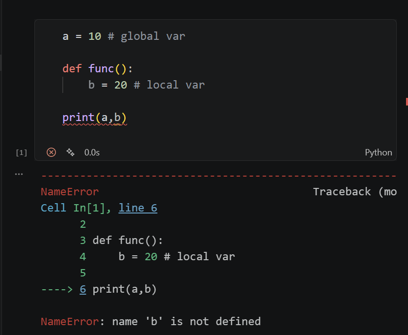
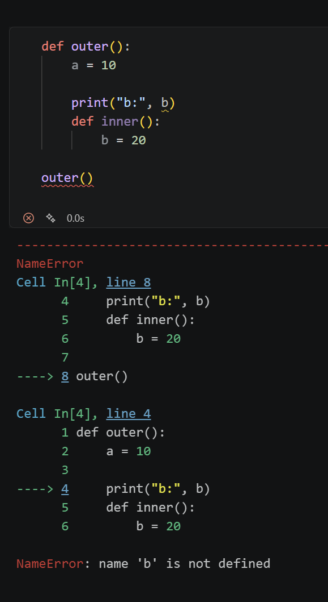
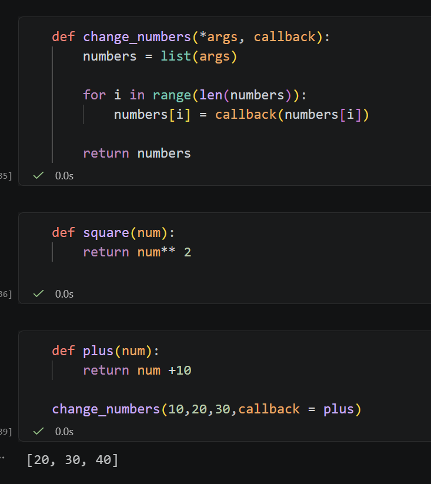
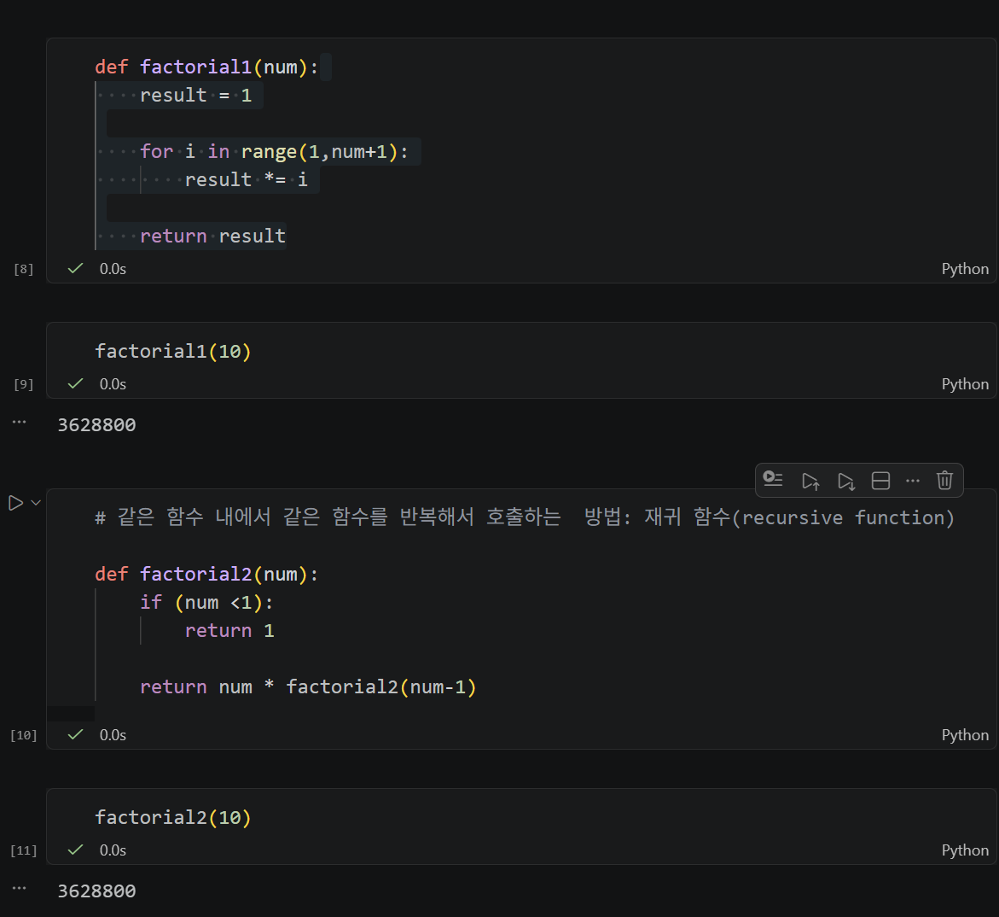
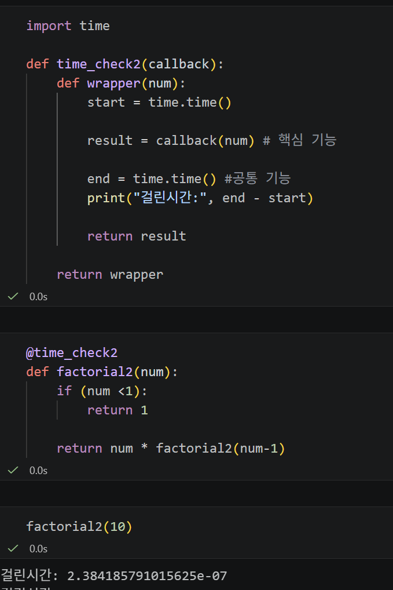

# Python 변수 스코프와 함수, 클로져와 데코레이터

> 📅 2026.08.13

-오늘 정리 예정
- 함수와 변수의 적용범위와 우선순위 등
- closure

## REVIEW
- *매개변수 : 위치기반 가변인수
- **매개변수 : 키워드 기반 가변인수
    
    &rarr; 매개변수, *args, **kwargs 순서로 배치
- `pass`에 대한 사용 예시 

    &rarr; 파이썬은 코드를 비워둘 수 없음. (오류)
```
def add():
    # 함수를  나중에 사용하려고 그냥 비워두는 경우
    pass # 비워두지 않고 채워두는 용도로도 사용됨
```
```
def add(): pass #한 줄로 작성해도 됨.
```

## LECTURE NOTE
### **keyword** : 
`scope, global vs. local, LEGB Scope, closrue, callback function, factory fuction, lambda fuction, higher order function and closure, recursive function, decorator, map(), filter()`

---
### Error Cases
- 11일 실습에서 오류가 났던 이유 중 하나: 로컬과 글로벌 변수 구분을 못함. 아래 코드는 함수호출을 하지 않아서 b라는 지역변수는 존재하지 않음을 보여줌 (NameError)
    

- 파이썬은 넓은 범위에서 좁은 범위로 접근할 수 없는 구조.
- 내장 함수의 경우 외부 함수명으로 호출하여도 내부 함수에서 정의한 변수에 접근 할 수 없으나 (NameError), 반대로 내부 함수명에서는 외부 함수에서 정의한 변수에 접근이 가능하다.
    

---
### Scope
- 변수 스코프(Scope) : 변수를 접근할 수 있는 범위

- 접근 우선순위: 좁은 범위가 우선순위가 높다!

- L(local - 지역변수) > E(enclosing > 외부 함수 변수) > G(global - 전역변수) > B(builtin - 내장 함수)

- 전역 변수(global)와 지역 변수(local)
    - 전역변수(global): 함수 외부에 정의 변수, 코드 전역에서 접근 가능
    - 지역변수(local): 함수 내부에 정의된 변수, 함수가 실행될때만 유효한 변수
----
### 일급 함수 (firat-class func)
- 변수와 함수를 동일하게 취급!
#### 1. **closure**: 함수의 변환값으로 함수를 사용할 수 있다!
- 펙토리 함수 (factory function)
- 바깥 함수가 종료된 뒤에도 내부 함수가 자신이 사용하던 바깥 함수의 값을 기억하는 구조

#### 2. **callback**: 함수의 매개변수로 함수를 사용할 수 있다!
- 콜백 함수(callback function)
    
- **"내맘대로 함수"**

---

### lambda function
- 간단하게 일회용으로 사용하는 경우 한줄의 식으로 간단하게 함수 정의
```
def square(num):
    return num** 2
```
&darr;&darr;&darr;
```
square = lambda num : num ** 2
```
* 별표 연산자 (*): 펼쳐서 하나씩 볼 수 있도록 하는 것?

---

### 클로저(Closure)

클로저는 **외부 함수의 실행이 끝난 후에도 내부 함수가 외부 함수의 변수(환경)를 기억하고 사용할 수 있는 구조**이다.

```python
def outer(num1):
    def inner(num2):
        return num1 + num2

    return inner


add_10 = outer(10)
print(add_10(20))  # 30
```

실행 흐름:

1. `outer(10)`을 호출하면 `num1 = 10`이 만들어진다.
2. `outer()` 내부에서 `inner()` 함수가 정의된다.
3. `return inner`를 통해 내부 함수 자체를 반환한다.
4. `outer()`의 실행은 종료되지만, 반환된 `inner()`가 `num1`을 참조하고 있기 때문에 `num1 = 10`은 계속 유지된다.
5. `add_10(20)`을 호출하면 기억하고 있던 `num1 = 10`과 새로 전달된 `num2 = 20`을 사용하여 `30`을 반환한다.

```text
outer(10)
   │
   ├─ num1 = 10
   │
   └─ inner 함수
         │
         └─ num1을 참조
              ↓
        outer 종료 후에도 기억
              ↓
        add_10(20) → 10 + 20 → 30
```

즉, 핵심 흐름은 다음과 같다.

> **외부 함수 종료 → 내부 함수는 반환되어 계속 사용 가능 → 내부 함수가 참조하는 외부 변수도 함께 유지**

클로저를 사용하면 필요한 값을 전역 변수로 만들지 않고 함수 내부에 유지할 수 있어 **상태 유지, 변수 은닉, 전역 네임스페이스 오염 방지** 등에 활용할 수 있다.

> **주의:** 외부 함수의 모든 변수를 무조건 저장하는 것이 아니라, 내부 함수가 실제로 참조하는 외부 변수가 클로저와 연결되어 유지된다고 이해하는 것이 정확하다.

또한 `map()`이나 `filter()`처럼 **함수를 다른 함수에 전달하는 것 자체가 클로저는 아니다.** 클로저의 핵심은 **내부 함수가 자신을 둘러싼 외부 함수의 환경을 기억한다는 것**이다.

* map(): 변환 작업
* filter(): 특정 조건에서 데이터를 선별

### 데코레이터 (Decorator) 
(= framework; 내가 원하는 기능만 정해주면 큰 틀은 쉽게 사용하도록 미리 만들어두는 것)
- 디자인 패턴 중 하나
- FOR문과 재귀함수(recursive function) 중 어떤게 더 효율적인가?
    

    &rarr; 함수가 돌아가면 콜스택에 쌓임. for문은 전체 한 번 돌아가서 하나의 스택만 쌓이지만, 재귀 함수는 계속 새롭게 돌아가서 스택이 10번 쌓임. 
    - 결론적으로 메모리 차지 + 시간 미세한 차이로 for문을 사용한 1번 방법이 더 효율적임.

* 코드 돌리는데 걸리는 시간 측정 기능 코드: 
```
import time

start = time.time() #공통기능

result = factorial1(10) #핵심기능
print(result)

end = time.time()#= #공통기능

print("걸린시간:", end - start)
```
* 공통기능: 카페모카의 우유랑 초콜릿 같은거
* 핵심기능: 카페모카의 에스프레소

    &darr;&darr;&darr;
```
# 공통기능 중복 => 함수화 하기!

def time_checker(callback, num):
    start = time.time() # 공통기능
    
    result = callback(num) # 핵심기능 - (수업내용기준) 팩토리얼 연산 함수 (factorial1, factorial2)

    end = time.time() #공통기능
    print("걸린 시간:", end - start)

    return result

```
> 데코레이터 활용 방법 예제
    

* wrapper의 매개변수를 유동적으로 사용할 수 있도록 다음으로 변경: *args (이름은 상관 없음. 별표시가 중요!)

```
import time

def time_check2(callback): 
    def wrapper(*args): # 가변적인 매개변수
        start = time.time()

        result = callback(*args) # 자료를 하나씩 펼쳐서 넣어주는 역할

        end = time.time() 
        print("걸린시간:", end - start)

        return result
    
    return wrapper
```
* *args 옆에 **kwargs -> 범용적!

## EXERCISE & MORE
### 데일리 퀘스트 리뷰
```
counter = 0 
 
def increase(): 
    global counter 
    counter += 1 
    
def local_increase():
    counter = 100 
    

increase() 
increase() 
local_increase() 

print(counter)
```
- 선택 답안: 100
- 예상 답안: 2
- 실제 출력: 2

**Logic**
1. `increase()` 함수가 한 번 호출된다.
2. 내부 변수가 전역변수로 선언된다.
3. `0`에 `1`이 더해진다.
   - 전역변수 `counter`의 값이 변경되어 `counter = 1`이 된다.
4. `increase()`가 다시 실행된다.
   - `counter = 2`가 된다.
5. 마지막으로 `local_increase()` 함수가 실행되고 `counter = 100`이 할당된다.
   - 여기서 `counter`는 **지역변수**이므로 전역변수 `counter`와는 별개이다.

→ 따라서 최종 전역변수 `counter`의 값은 **2**이다.

&rarr; **scope** 개념을 잘 이해하고, **전역 변수 오염**에 주의하자.

### 실습 문제
- 보완 예정

