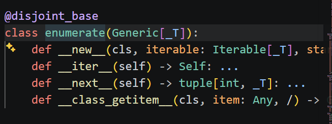
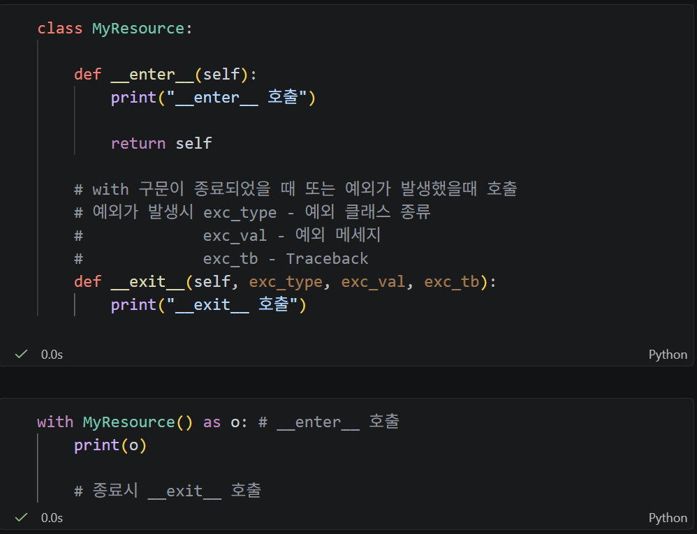
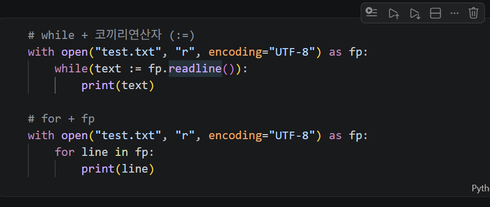

# Python - 내장 함수 · 표준 라이브러리 · 파일 I/O · 비동기

> 📅 2026.08.20

## 😊 SUMMARY (w/ Keywords)

- **Built-in Functions**: `map()`, `filter()`, `enumerate()`, `zip()`, `sorted()`
- **Standard Library**: `datetime`, `math`, `json`, `random`, `os`, `sys`
- **File I/O**: `with`, `read()`, `readline()`, `readlines()`, CSV, JSON
- **Serialization**: Python 객체 ↔ JSON
- **Sync / Async**: 순차 처리 vs 대기 시간 중첩
- **Efficiency**: Generator → 메모리 효율 / Async → 대기 시간 효율

---

## REVIEW

### Runtime Exception: ValueError vs TypeError

1. **ValueError**
   - 타입은 적절하지만 **값이 부적절**할 때 발생
   - 예: `'abc'`를 `int()`로 변환

2. **TypeError**
   - 연산 등에 사용된 **타입 자체가 부적절**할 때 발생
   - 예: 정수 + 문자열

### Name Mangling 이름 변형 규칙

1. `__변수명`으로 정의하여 외부에서 직접 접근하지 말라는 **접근 제한 의도**를 나타냄
2. 내부적으로 `_클래스명__변수명` 형태로 이름이 변형됨

```text
__변수명
    ↓
_클래스명__변수명
```

### 내장 함수 all() & any()

1. `all()` : **"모든 조건을 만족하나?"**
   - 모두 참이면 `True`
   - 빈 Iterable은 **True**
   - 이유: False인 요소가 하나도 없기 때문

2. `any()` : **"하나라도 조건을 만족하나?"**
   - 하나라도 참이면 `True`
   - 빈 Iterable은 **False**
   - 이유: True인 요소가 하나도 없기 때문

> **구분 주의:** 빈 것은 값이 없는 것. 공백 `" "`은 `space`라는 값이 존재하는 문자열이다.

---

## LECTURE NOTE

### 9장 1강: 내장 함수

> 코드 선택 + `F12` → 정의 및 설명 참조

#### 1. isinstance()

객체가 특정 타입인지 확인한다.

#### 2. all(), any()

여러 조건이 모두 참인지 또는 하나라도 참인지 확인한다.

#### 3. len(), sum(), round()

- `len()` : 길이
- `sum()` : 합계
- `round()` : 반올림

#### 4. mean(), median()

`statistics` 모듈에 있는 **표준 라이브러리 함수**로, 공식 내장 함수는 아니다.

- `mean()` : 평균
- `median()` : 중앙값

#### 5. map(), filter()

- `map()` : Iterable의 각 요소에 동일한 함수를 적용하여 **변환**
- `filter()` : 조건을 만족하는 요소만 **선별**
- 간단한 경우 리스트 컴프리헨션으로 대체 가능

##### `*` 별표의 역할

| 상황 | 별표의 역할 | 예시 |
|---|---|---|
| 리스트/데이터 펼칠 때 | Unpacking | `[*range(1, 11)]` |
| 함수 정의할 때 | Variable Args | `def func(*args)` |

#### 6. enumerate()

Iterable의 요소와 순서 번호(index)를 함께 얻는다.

```python
for item in enumerate(fruits):
    print(item)
```

→ `(index, value)` 형태의 튜플로 출력

```python
for i, fruit in enumerate(fruits):
    print(i, fruit)
```

→ 튜플을 `i`, `fruit`에 **언패킹**하여 출력

> `enumerate + F12`



시작 번호를 지정할 수도 있다.

```python
for i, fruit in enumerate(fruits, start=1):  # (순서 번호, 요소)
    print(i, fruit)
```

출력:

```text
1 사과
2 오렌지
3 멜론
4 망고
```

#### 7. zip()

여러 Iterable의 요소를 **같은 위치끼리 묶는다.**

```python
persons = ['김철수', '김영희', '김민수']
fruits = ['사과', '오렌지', '멜론']

# 1. 반복문으로 만들기
items = []

for i, person in enumerate(persons):
    items.append((person, fruits[i]))

print(items)
```

`zip()`을 사용하면 더 간단하게 만들 수 있다.

```python
# 2. zip 함수로 만들기
items = zip(persons, fruits)

print(list(items))
```

#### 8. sorted()

- `리스트.sort()` : **원본 리스트 자체를 정렬**
- `sorted(iterable)` : 원본은 유지하고 **정렬된 새로운 리스트 반환**
- `random.shuffle(object)` : 요소의 순서를 무작위로 섞음

#### 9. min(), max()

- `min()` : 가장 작은 값
- `max()` : 가장 큰 값

---

### 9장 2강: 표준 라이브러리

#### 1. datetime & time

날짜와 시간을 처리한다.

- `strftime()` : 날짜/시간을 지정한 문자열 형식으로 표현

#### 2. math

수학 관련 기능을 제공한다.

#### 3. json

**JSON = JavaScript Object Notation**

서로 다른 플랫폼(Python, Java, C# 등) 간 데이터를 주고받기 위해 널리 사용하는 **텍스트 기반 데이터 교환 형식**이다.

자바스크립트의 객체 표기법에서 유래했지만 **JavaScript 프로그램 자체는 아니다.**

기본 형태:

```json
{
    "이름": "값",
    "이름": "값"
}
```

#### 4. random

무작위 값을 생성하거나 데이터의 순서를 무작위로 변경할 때 사용한다.

#### 5. os & sys

운영체제 및 Python 실행 환경과 관련된 기능을 제공한다.

##### sys.argv

터미널에서 Python 프로그램을 실행할 때 전달한 인수를 받을 수 있다.

터미널 명령:

```text
uv run 03.py 100 200
```

출력:

```text
['03.py', '100', '200']
```

---

### 10장 1강: 파일 입출력과 구조화된 데이터

#### 1. 입출력 (I/O)

- **입력(Input)** : 데이터 읽기
- **출력(Output)** : 데이터 쓰기

##### Buffer

파이썬에서 버퍼(Buffer)란 데이터 처리 속도가 서로 다른 두 장치나 프로그램 사이에서 데이터를 **임시로 저장하는 메모리 공간**을 뜻한다.

입출력(I/O) 성능을 높이거나 데이터를 효율적으로 처리할 때 사용한다.

##### 파일 열기

1. `open()`, `close()` 개별 사용
2. `with` 구문 사용

`with` 구문은 파일과 같은 **자원의 해제를 자동화**한다.

아래는 `with` 구문의 원리를 `MyResource`로 구현한 예제이다.



- 열린 파일 객체를 `fp`와 같은 이름으로 참조
- 기본 형식: `("파일경로/파일명", "모드명", "인코딩")`

주요 모드:

| 모드 | 의미 | 특징 |
|---|---|---|
| `r` | read | 파일 읽기 |
| `w` | write | 기존 내용을 지우고 새로 작성 |
| `a` | append | 기존 내용 뒤에 이어서 작성 |

```python
with open("test.txt", "w", encoding="UTF-8") as fp:
    fp.write("Hello!")
```

#### 2. 텍스트 파일 읽기 함수

| 함수 | 읽는 방식 | 특징 |
|---|---|---|
| `read()` | 전체 텍스트를 한 번에 읽음 | 큰 파일은 메모리 부담 증가 |
| `readline()` | 호출할 때마다 한 줄씩 읽음 | 한 줄씩 처리 가능 |
| `readlines()` | 모든 줄을 리스트로 반환 | 큰 파일은 메모리 사용량 증가 |

대용량 파일에서는 파일 객체를 한 줄씩 순회하는 방식도 사용할 수 있다.



> **with = 자원 관리**  
> **한 줄씩 순회 = 전체 파일을 한꺼번에 메모리에 올리지 않는 처리 방식**

#### 3. CSV 형식

**CSV = Comma-Separated Values**

쉼표 등을 기준으로 값을 구분하여 저장하는 데이터 형식이다.

주요 기능:

- `writer()`
- `writerow()`
- `reader()`

#### 4. JSON 형식

```python
import json

# dict → JSON 파일
user = {
    "name": "김영희",
    "age": "20",
    "mobile": "010-7000-1000"
}

with open("user.json", "w", encoding="UTF-8") as fp:
    json.dump(user, fp, indent=4, ensure_ascii=False)
```

##### 직렬화 / 역직렬화

```text
Python 객체
    ↓
직렬화 (Serialize)
    ↓
JSON
    ↓
저장 / 전송
    ↓
역직렬화 (Deserialize)
    ↓
Python 객체
```

- **직렬화(Serialize)** : Python 객체 → 저장·전송 가능한 JSON 형식으로 변환
- **역직렬화(Deserialize)** : JSON 데이터 → Python 객체로 변환

---

### 11장 1강: 동기(Sync) vs 비동기(Async)

| 구분 | 핵심 동작 방식 | 소요 시간 관점 | 대표 예시 |
|---|---|---|---|
| **동기식 (Sync)** | 하나의 작업이 끝난 후 다음 작업을 순차 처리 | `A + B + C` | `time.sleep()` |
| **비동기식 (Async)** | 한 작업의 대기 시간 동안 다른 작업 처리 | 대기 시간을 중첩하여 활용 | `asyncio.gather()` |

#### 동기식 처리 (Synchronous)

작업을 **순서대로 하나씩 처리**한다.

```text
작업 A ─── 완료
           ↓
        작업 B ─── 완료
                    ↓
                 작업 C ─── 완료
```

예를 들어 각 작업이 2초, 3초, 5초라면:

```text
전체 시간 ≈ 2 + 3 + 5 = 10초
```

앞의 작업이 끝난 후 다음 작업으로 넘어간다.

#### 비동기식 처리 (Asynchronous)

한 작업에서 **대기 시간이 발생하면 그 시간 동안 다른 작업을 처리**할 수 있다.

```text
작업 A ─────────────
작업 B ─────────
작업 C ───────────────────
       ↑ 대기 시간을 중첩하여 활용
```

서로 독립적인 대기 작업이 각각 2초, 3초, 5초라면 이상적으로:

```text
전체 시간 ≈ 가장 오래 걸리는 작업인 5초
```

에 가까워질 수 있다.

Python에서는 주로 다음을 사용한다.

- `async`
- `await`
- `asyncio.gather()`

> **비동기는 모든 작업 자체를 빠르게 만드는 것이 아니라, 대기 시간을 효율적으로 활용하는 방식이다.**

#### 관련 개념

| 용어 | 의미 |
|---|---|
| **Blocking** | 현재 작업을 기다리는 동안 다음 처리가 진행되지 않는 상태 |
| **Non-Blocking** | 현재 작업의 완료를 기다리는 동안 다른 처리가 가능한 방식 |
| **Sub-routine** | 일반적인 함수처럼 호출되어 실행되는 실행 단위 |
| **Coroutine** | 실행 도중 멈췄다가 다시 이어서 실행할 수 있는 실행 단위 |

> `Sync = Blocking`, `Async = Non-Blocking`처럼 완전히 동일한 개념으로 외우지는 않는다.

#### Generator vs Async

둘 다 프로그램의 효율과 관련되어 있지만 **주요 목적이 다르다.**

```text
프로그램 성능 최적화
│
├─ 메모리 효율 ← Generator
│                 필요한 값을 필요할 때 생성
│
└─ 시간 효율   ← Async
                  대기 시간 동안 다른 작업 수행
```

| 구분 | Generator | Async |
|---|---|---|
| 주요 목적 | 메모리 효율 | 대기 시간 활용 |
| 핵심 아이디어 | 값을 한꺼번에 만들지 않음 | 기다리는 동안 다른 작업 수행 |
| 주요 문법 | `yield` | `async`, `await` |
| 활용 예 | 대용량 데이터 처리 | API, 네트워크 등 I/O 대기 |

> **Generator = 필요할 때 하나씩 → 메모리 효율**  
> **Async = 기다리는 동안 다른 일 → 시간 효율**

### [확장: 5장 4강 참조] 지연 평가(Lazy Evaluation)와 코루틴(Coroutine)

- **지연 평가(Lazy Evaluation)**: 값을 미리 모두 계산하지 않고 **실제로 필요한 시점에 계산하는 방식**이다.
  - 제너레이터는 `next()`가 호출될 때 필요한 값을 하나씩 생성하므로 메모리를 효율적으로 사용할 수 있다.
  - `Generator → 필요할 때 계산 → 메모리 효율`

- **제너레이터와 코루틴의 연결**
  - 제너레이터는 `yield`를 만나면 **현재 실행 상태를 유지한 채 일시 정지**하고, 이후 다시 실행을 이어갈 수 있다.
  - 이러한 **실행 중단과 재개** 개념은 코루틴(Coroutine)을 이해하는 데 연결된다.
  - 코루틴은 실행 도중 제어권을 양보하고 다시 돌려받으며 여러 작업이 **협력적으로 실행 흐름을 주고받을 수 있는 구조**이다.
  - Python에서는 `async def`로 코루틴 함수를 정의하고, `await`를 통해 대기하는 동안 다른 작업이 실행될 수 있도록 제어권을 양보할 수 있다.

> **Generator** = 필요한 값을 필요할 때 생성 → 메모리 효율  
> **Coroutine** = 실행을 중단·재개하며 제어권을 주고받음 → 비동기 처리

---

## EXERCISE & More

### Daily Quest

#### 1. 반복 가능한 객체(Iterable)의 모든 요소에 동일한 규칙을 적용하여 새로운 형태로 변환할 때 사용하는 함수는?

**`map()`**

`map()`은 반복 가능한 객체의 모든 요소에 동일한 함수를 적용하여 새로운 값으로 **변환**한다.

반면 `filter()`는 조건에 맞는 요소만 **선별**한다.

```text
map()    → 변환
filter() → 선별
```

#### 2. 대용량 파일을 한 번에 메모리에 올리지 않고, 호출할 때마다 한 줄씩 읽어오는 파일 읽기 함수는?

**`readline()`**

```text
read()      → 전체를 한 번에 문자열로 읽음
readline()  → 호출할 때마다 한 줄씩 읽음
readlines() → 모든 줄을 리스트로 읽음
```

---

### 실습

#### 1. 텍스트 파일 저장 및 읽기

`with open()`을 사용하여 텍스트를 파일에 저장하고 다시 읽어보았다.

```python
with open("diary.txt", "w", encoding="UTF-8") as fp:
    fp.write(
        """오늘은 현실에 집중할 수 있는 날이었다.
        잘 자고 나와서 수업도 잘 듣고 피곤하지만 잘 보냈다.
        내일은 좀 더 웃을 수 있었으면 좋겠다."""
    )
```

저장한 파일을 다시 읽는다.

```python
with open("diary.txt", "r", encoding="UTF-8") as fp:
    tt = fp.read()
    print(tt)
```

→ `w` 모드로 파일을 작성하고, `r` 모드와 `read()`를 이용해 전체 내용을 다시 읽어오는 흐름을 실습했다.

---

#### 2. CSV 파일 저장 및 복원

과일 재고 데이터를 CSV 파일로 저장했다.

```python
import csv

fruits_data = [
    ["사과", 5000, 87, "빨간색"],
    ["바나나", 2000, 102, "노란색"],
    ["키위", 15000, 35, "초록색"],
    ["딸기", 12000, 300, "빨간색"],
]

with open("fruit_inventory.csv", "w", encoding="UTF-8", newline="") as file:
    writer = csv.writer(file)
    writer.writerow(["과일", "가격", "재고", "색상"])
    writer.writerows(fruits_data)
```

저장된 CSV를 다시 읽는다.

```python
with open("fruit_inventory.csv", "r", encoding="UTF-8") as file:
    reader = list(csv.reader(file))
    print(reader)
```

##### CSV 빈 줄 문제

처음 CSV를 읽었을 때 데이터 사이에 불필요한 빈 리스트(`[]`)가 나타나는 문제가 있었다.

```text
[['과일', '가격', '재고', '색상'],
 [],
 ['사과', '5000', '87', '빨간색'],
 ...]
```

**원인**

특히 Windows 환경에서 CSV 파일 작성 시 `newline=""`을 지정하지 않으면 개행 처리가 중복되어 빈 줄이 생길 수 있다.

**해결**

```python
with open(
    "fruit_inventory.csv",
    "w",
    encoding="UTF-8",
    newline=""
) as file:
```

이미 빈 줄이 포함된 파일이라면 읽는 과정에서 빈 행을 제외할 수도 있다.

```python
with open("fruit_inventory.csv", "r", encoding="UTF-8") as file:
    reader = csv.reader(file)
    data = [row for row in reader if row]
```

**배운점**

- CSV 작성 시 `newline=""`을 지정해 불필요한 개행 문제를 방지할 수 있다.
- 파일을 **쓸 때 원인을 해결하는 것**과 이미 저장된 데이터를 **읽을 때 정제하는 것**은 별개의 처리이다.

---

#### 3. JSON 파일 저장 및 복원

Python Dictionary를 JSON 파일로 저장했다.

```python
import json

character = {
    "name": "도라에몽",
    "level": 890,
    "관리자 권한": True
}

with open("character_profile.json", "w", encoding="utf-8") as profile:
    json.dump(character, profile, indent=4)
```

다시 읽으면 Python의 Dictionary로 복원된다.

```python
with open("character_profile.json", "r", encoding="utf-8") as profile:
    parsed_json = json.load(profile)

    print(parsed_json)
    print(f"데이터 타입: {type(parsed_json)}")
```

```text
Python dict
   ↓ json.dump()
JSON 파일
   ↓ json.load()
Python dict
```

→ JSON의 **직렬화와 역직렬화** 흐름을 직접 확인했다.

---

#### 4. 동기식 데이터 수집

먼저 `time.sleep()`을 사용해 두 개의 다운로드 작업을 순차적으로 실행했다.

```python
import time

def download_page(name, delay):
    print(f"시작 {name} 다운로드 ... ")
    time.sleep(delay)
    print(f"완료 {name} 다운로드 완료 !")

start = time.time()

download_page("메인 페이지 데이터", 2)
download_page("상세 페이지 데이터", 2)

end = time.time()
print(f"총 소요 시간: {end - start:.2f}초")
```

실행 결과:

```text
메인 페이지 2초
        ↓
상세 페이지 2초
        ↓
총 소요 시간 ≈ 4초
```

앞 작업이 끝날 때까지 다음 작업이 시작되지 않기 때문에 두 작업의 대기 시간이 더해졌다.

---

#### 5. 비동기식 데이터 수집

같은 작업을 `async`, `await`, `asyncio.gather()`를 이용해 비동기로 실행했다.

```python
import asyncio
import time

async def download_page_async(name, delay):
    print(f"시작 {name} 다운로드 ... ")

    await asyncio.sleep(delay)

    print(f"완료 {name} 다운로드 완료 !")

async def main():
    start = time.time()

    await asyncio.gather(
        download_page_async("메인 페이지 데이터", 2),
        download_page_async("상세 페이지 데이터", 2)
    )

    end = time.time()
    print(f"총 소요 시간: {end - start:.2f}초")

await main()
```

실제 실습 결과:

```text
동기식   ≈ 4.00초
비동기식 ≈ 2.01초
```

두 작업이 각각 2초씩 기다려야 하지만, 비동기에서는 **대기 시간을 겹쳐 사용할 수 있기 때문에** 전체 시간은 약 2초가 되었다.

```text
동기
A ── 2초 ── 완료
             B ── 2초 ── 완료
총 ≈ 4초

비동기
A ── 2초 ── 완료
B ── 2초 ── 완료
총 ≈ 2초
```

---

#### 6. 여러 작업의 비동기 처리

서울, 뉴욕, 런던의 데이터 수집 시간을 각각 다르게 두고 동시에 실행했다.

```python
import asyncio
import time

async def fetch_weather(region, delay):
    await asyncio.sleep(delay)
    print(f"{region} 지역 데이터 수집 완료 !")

async def main():
    start = time.time()

    await asyncio.gather(
        fetch_weather("서울", 1.5),
        fetch_weather("뉴욕", 2.5),
        fetch_weather("런던", 1.0)
    )

    end = time.time()
    print(f"총 소요 시간: {end - start:.2f}초")

await main()
```

실제 결과:

```text
런던 1.0초 → 먼저 완료
서울 1.5초 → 다음 완료
뉴욕 2.5초 → 마지막 완료

총 소요 시간 ≈ 2.50초
```

→ 비동기 작업의 전체 시간은 각 작업 시간을 모두 더한 값이 아니라, **동시에 진행 가능한 대기 작업이라면 가장 오래 걸리는 작업 시간에 가까워질 수 있다.**

**배운점**

- 동기식: 하나의 작업이 끝난 뒤 다음 작업 진행
- 비동기식: 한 작업이 기다리는 동안 다른 작업 진행
- `async def` : 코루틴 함수 정의
- `await` : 비동기 작업을 기다리면서 실행권을 양보
- `asyncio.gather()` : 여러 코루틴을 함께 실행
- 비동기는 계산 자체를 빠르게 만드는 것이 아니라 **I/O 대기 시간을 효율적으로 사용하는 방식**