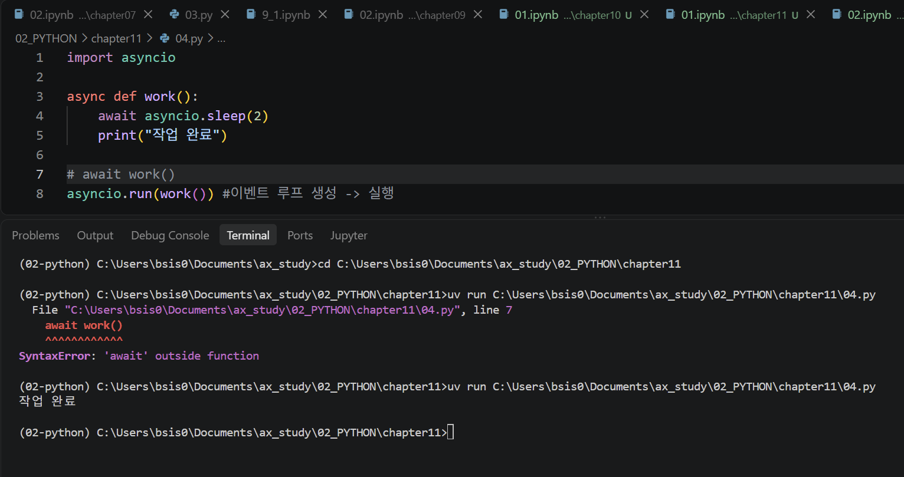

# Python - 비동기 · 제어권 · Coroutine · Event Loop

> 📅 2026.08.21

## 😊 SUMMARY (w/ Keywords)

- **Sync / Async**: 동기 처리와 비동기 처리
- **Control Flow**: 실행 흐름과 제어권
- **Blocking / Non-Blocking**: 작업 대기 방식
- **Subroutine / Coroutine**: 일반 함수와 중단·재개 가능한 실행 방식
- **CPU Bound / I/O Bound**: 연산 중심 작업과 대기 중심 작업
- **Event Loop**: 비동기 작업의 실행 흐름 관리
- **`async` / `await` / `asyncio.gather()`**: Python 비동기 처리

---

## REVIEW

### 동기(Synchronous)

- 동기 처리는 작업을 **순차적으로 실행**하는 방식
- 작업 A가 완료된 후 다음 작업 B를 실행
- 일반적인 함수는 호출되면 작업을 수행한 뒤 호출한 곳으로 돌아오는 **Subroutine** 방식으로 동작
- 작업이 끝날 때까지 다음 처리가 진행되지 않고 기다리는 상태를 **Blocking**이라고 함

```text
작업 A 실행 → 완료 → 작업 B 실행 → 완료
```

### 비동기(Asynchronous)

- 비동기는 작업을 수행하다 **기다려야 하는 시점에 제어권을 양보하여 다른 작업을 진행할 수 있는 방식**
- `async def`로 코루틴 함수를 정의
- `await`에서 실제로 대기가 필요한 경우 다른 작업이 실행될 수 있도록 제어권을 양보
- 기다리던 작업이 준비되면 멈췄던 지점부터 다시 실행
- 여러 작업의 **대기 시간을 겹쳐 활용**할 수 있어 I/O 작업에서 효과적

```text
작업 A → 대기(await)
           ↓ 제어권 양보
        작업 B 실행
           ↓
작업 A 실행 재개
```

> **주의:** `동기 = Blocking`, `비동기 = Non-Blocking`은 서로 관련은 있지만 완전히 동일한 개념은 아니다.

---

## LECTURE NOTE

### 11장 1강: 동기 vs 비동기의 이해

#### 1. CPU Bound vs I/O Bound

1. **CPU Bound (연산 중심 작업)**
   - CPU가 많은 연산을 직접 수행하는 작업
   - 처리 속도가 CPU의 연산 성능에 크게 영향을 받음
   - 예: 이미지 처리, 암호화, 복잡한 계산

2. **I/O Bound (입출력 중심 작업)**
   - 네트워크, 파일, 데이터베이스 등 외부 작업의 응답을 기다리는 시간이 전체 처리 속도에 큰 영향을 미치는 작업
   - 비동기는 이러한 **대기 시간을 다른 작업에 활용**하는 데 효과적

3. **Event Loop**
   - 여러 비동기 작업의 상태를 확인하면서 **실행 가능한 코루틴을 실행하도록 관리하는 핵심 구조**
   - 코루틴이 `await`에서 대기하면 다른 실행 가능한 작업을 진행하고, 기다리던 작업이 준비되면 다시 실행을 이어가도록 관리

---

### 11장 2강: Python 비동기 실행

#### 1. `.ipynb`

Jupyter Notebook 환경에는 일반적으로 이미 실행 중인 이벤트 루프가 있으므로 다음과 같이 실행할 수 있다.

```python
await main()
```

#### 2. `.py`

일반적인 Python 스크립트에서는 `asyncio.run()`을 이용해 최상위 코루틴을 실행한다.

```python
asyncio.run(main())
```



#### 3. 비동기 요청 실습

```python
import httpx
import asyncio

async def get_post(num):

    async with httpx.AsyncClient() as client:
        url = f"https://jsonplaceholder.typicode.com/posts/{num}"

        res = await client.get(url)
        result = res.json()

        return result['id'], result['title']


# async def main():
#     for i in range(1, 11):
#         result = await get_post(i)
#         print(result)

async def main():

    get_posts = [get_post(i) for i in range(1, 11)]

    results = await asyncio.gather(*get_posts)

    print(results)


asyncio.run(main())
```

첫 번째 주석 처리된 방식은 반복하면서 하나씩 `await`하기 때문에 각 요청을 순서대로 기다린다.

반면,

```python
get_posts = [get_post(i) for i in range(1, 11)]
results = await asyncio.gather(*get_posts)
```

에서는 여러 코루틴을 준비한 뒤 `asyncio.gather()`를 통해 함께 실행하고 결과를 모은다.

따라서 네트워크 응답을 기다리는 시간을 서로 겹쳐 활용할 수 있다.

> **비동기 = 작업 자체를 빠르게 만드는 것 X**  
> **비동기 = 기다리는 시간을 다른 작업에 활용 O**

---

## EXERCISE & More

### Daily Quest

#### 1. Coroutine

> **문제:** 실행 도중 필요한 경우 제어권을 잠시 양보하고, 다시 자기 차례가 되면 멈췄던 지점부터 이어서 작업을 수행할 수 있는 Python의 특수 함수를 무엇이라고 하는가?

**정답: Coroutine**

- **Coroutine Function**: `async def`를 사용하여 정의하는 함수 유형
- **Subroutine**: 특정 작업을 하나의 단위로 묶어 호출하고 실행하는 일반적인 프로그래밍 개념
- Python의 일반 함수도 Subroutine 방식으로 이해할 수 있음

> 코루틴은 일반 함수(Subroutine)와 달리 실행 중간에 멈췄다가 다시 이어서 실행할 수 있는 협력적인 실행 방식이며, Python에서는 `async def`와 `await`를 통해 이러한 비동기 흐름을 구현할 수 있다.

##### 💬 Tutor Q&A: Coroutine은 함수인가, 객체인가?

문제에서 Coroutine을 **"특수 함수"**라고 표현하여, Coroutine을 정확히 함수명으로 이해해야 하는지 질문했다.

**질문**

> 코루틴과 서브루틴을 찾아보면 함수로서의 정의도 있고 객체라고 나오는 경우도 있는데, 정확히 함수명으로 알고 있어도 되는지? 보통 어떻게 부르는지?

**Tutor Feedback**

> **Coroutine은 함수명이라기보다 함수의 유형으로 이해하는 것이 더 정확하다.**

Python 인터프리터는 작성된 구문을 해석하여 일반 함수와 비동기 함수를 다르게 처리한다.

```text
async def로 정의
→ Coroutine Function

Coroutine Function 호출
→ Coroutine Object
```

따라서 자료를 찾아볼 때 Coroutine을 **함수**라고도 하고 **객체**라고도 하는 이유는 서로 다른 단계를 설명하기 때문이다.

**핵심 정리**

- Coroutine은 특정 함수의 **이름**이 아니라 함수의 **유형 및 동작 방식**에 대한 개념
- `async def` → 코루틴 함수를 정의
- 코루틴 함수를 호출 → 코루틴 객체가 만들어짐
- `await` → Coroutine의 이름이 아니라, 비동기 실행 과정에서 다른 awaitable을 기다릴 때 사용하는 **키워드**

> **Coroutine Function → 호출 → Coroutine Object**

#### 2. CPU Bound vs I/O Bound

**I/O Bound**는 외부에 요청을 보내고 응답을 기다리는 **지연 시간**이 전체 처리 속도에 큰 영향을 미치는 작업이다.

반면 그래픽 렌더링, 파일 암호화, 이미지 압축처럼 CPU 연산량이 많은 작업은 대표적으로 **CPU Bound**에 해당할 수 있다.

```text
CPU Bound → 계산하는 시간이 중요
I/O Bound → 기다리는 시간이 중요
```

### 실습
#### 실습에서 배운 점

- **Event Loop**: 여러 코루틴이 언제 실행되고 다시 이어질지 조율하는 실행 관리자
- **`asyncio.gather()`**: 여러 코루틴을 함께 실행하고 결과를 모을 때 사용
- **`main()`**: 여러 비동기 작업을 하나의 흐름으로 묶어 관리하기 위해 대표 코루틴으로 자주 사용

실습하면서 단일 비동기 작업은 바로 실행하기도 하지만, 여러 작업을 `gather()` 등으로 묶을 때는 `main()` 안에서 전체 비동기 흐름을 구성하는 방식이 자주 사용된다는 것을 알게 되었다.

또한 실행 환경에 따라 Event Loop를 다루는 방법이 달랐다.

- Jupyter Notebook(`.ipynb`) → 이미 Event Loop가 실행 중이므로 `await main()`
- 일반 Python 파일(`.py`) → `asyncio.run(main())`으로 Event Loop를 생성·실행·종료

> **정리:** `main()`은 여러 작업을 관리하기 위한 대표 코루틴으로 자주 사용하며, 실행 방법은 환경에 따라 `await main()` 또는 `asyncio.run(main())`으로 달라질 수 있다.